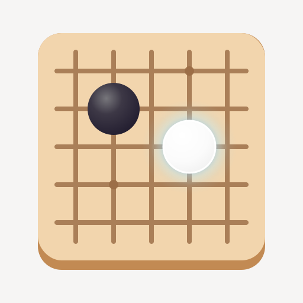

# mirai

A KataGo analysis and playing GUI for the Linux desktop, plus a purpose-built protocol for
driving KataGo over a network.



Point it at a local KataGo and it analyses positions, reviews SGF files and plays games
against you. Point it at `mirai-server` on the machine with the GPU and it behaves
identically from a laptop that has none.

---

## What it does

**Analysis.** Live pondering of the position under the cursor. Candidates show win rate, score
lead and visits. Colour is how much the move loses against the engine's pick; visits say how
much to trust that reading. Ownership and policy are one overlay at a time. Hover a candidate
to preview its variation without changing the record. The win-rate graph is always Black's,
with a blunder strip; the sidebar reads the side to move.

**Review and editing.** Open, paste and save SGF, including multi-game collections, keeping
properties mirai does not draw. Navigate the current line and its variations. Editing tools
stay collapsed until you open them. Whole-game analysis fills a blunder list that jumps to
the move.

**Playing.** Play KataGo by visits, time per move, or a human-like profile when the model has
one, on boards from 2×2 to 19×19, with handicap and any of nine rulesets. Byo-yomi, Fischer
or absolute time; clocks sit in the play bar under the board. Two passes open scoring from
KataGo's ownership map, and clicking a group toggles it locally. You can also play both sides
on this device, with no engine.

**Fox.** Browse a Fox Go player's latest public games by exact nickname or UID, then download
and open one for review.

**Remote.** `mirai-server` shares one or more KataGo instances. Clients authenticate with a
token and pin the server certificate on first use. A later certificate that does not match is
refused.

---

## Requirements

- Rust 1.92 or newer (edition 2024). `rust-toolchain.toml` selects the current stable.
- GTK 4.22+, libadwaita 1.9+, and Blueprint Compiler 0.22+ with their development packages.
- A KataGo binary and a network model. Any recent KataGo works; mirai uses the JSON analysis
  engine (`katago analysis`), never GTP, and writes the analysis config itself unless you
  supply one. mirai does not download KataGo.

On Arch: `pacman -S gtk4 libadwaita blueprint-compiler`. On Debian/Ubuntu, install
`libgtk-4-dev`, `libadwaita-1-dev`, and `blueprint-compiler`.

```
cargo build --release --workspace
```

---

## Getting started

```
cargo run -p mirai
cargo run -p mirai -- game.sgf
```

On first run mirai looks for `katago` on `PATH` and a network in the usual model directories.
A find becomes the `local-default` profile and starts. If nothing is found, the Analysis page
shows **No Engine Configured** and a **Preferences** button. Preferences does not open by
itself; the board and its navigation still work.

Add the binary and model, open a record, then press <kbd>Space</kbd> for live analysis. A
file that already stores analysis shows those numbers even when no engine is configured.

The window, keys, Fox, settings and a remote engine are in the
[user guide](docs/user/GUIDE.md).

---

## Running over a network

On the machine with the GPU:

```
mirai-server --generate-token
mirai-server --config server.toml
```

The server prints its certificate fingerprint at boot (`--print-fingerprint` prints it
alone). Compare that string with the one the client shows before you trust the server. A
different certificate afterwards is a hard connection failure, not a warning.

The token, the UDP port and the annotated server file are in the
[user guide](docs/user/GUIDE.md#7-using-a-remote-engine).

---

## Documentation

- Users: [docs/user/GUIDE.md](docs/user/GUIDE.md) — first run, the window, analysis, Fox,
  playing, remote engines, settings and keys.
- Contributors and agents: [AGENTS.md](AGENTS.md).

---

## License

GNU General Public License, version 3 or later ([`LICENSE`](LICENSE)).

mirai is free software: you can redistribute it and/or modify it under the terms of the GNU
General Public License as published by the Free Software Foundation, either version 3 of the
License, or (at your option) any later version. It is distributed in the hope that it will be
useful, but WITHOUT ANY WARRANTY; without even the implied warranty of MERCHANTABILITY or
FITNESS FOR A PARTICULAR PURPOSE. See the GNU General Public License for more details.
