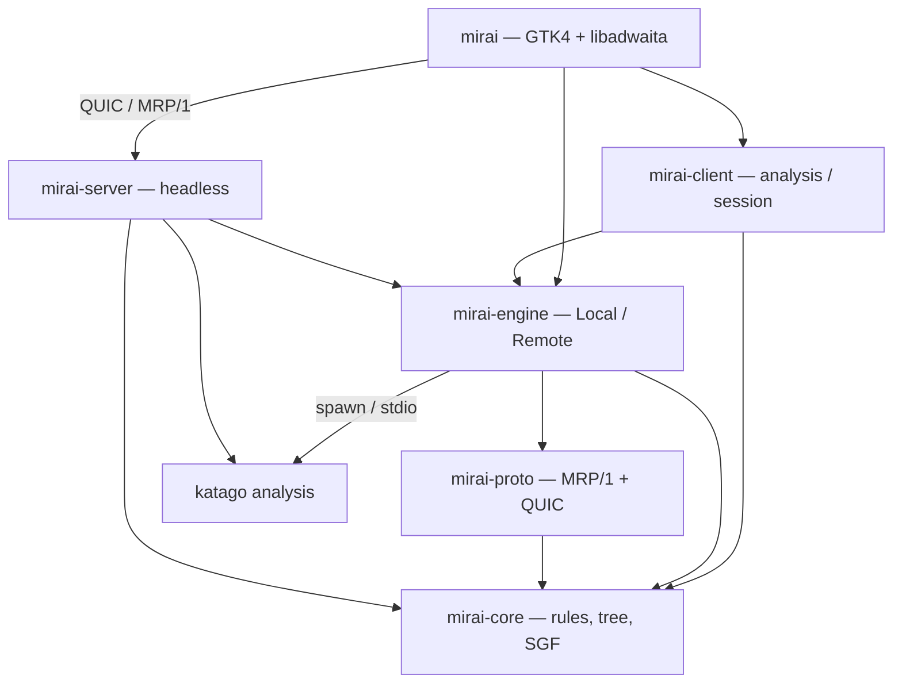
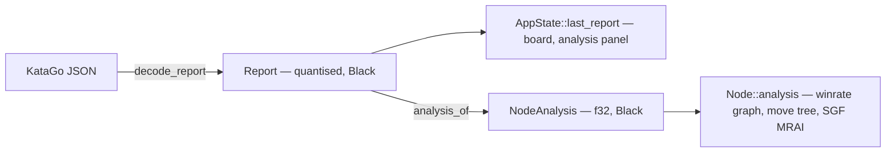
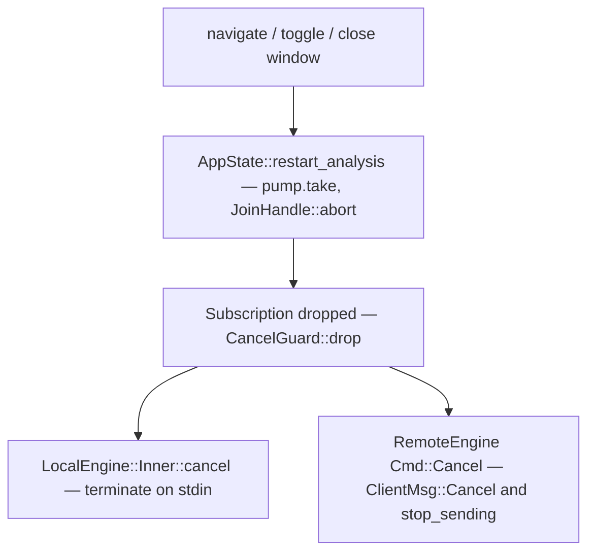
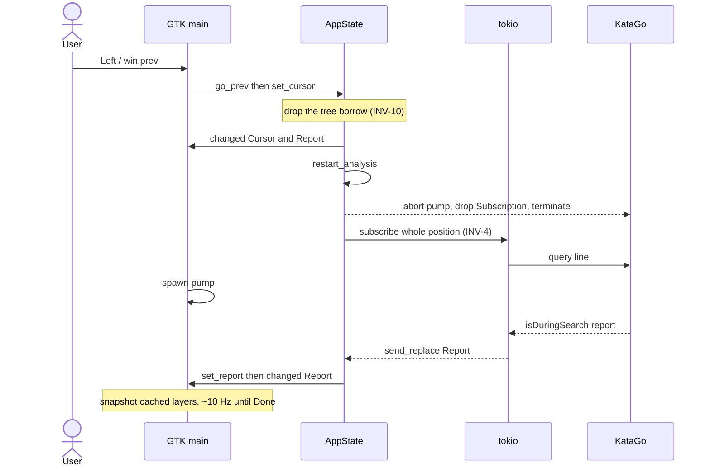

# mirai — system architecture

Contributor entry point is [`../../AGENTS.md`](../../AGENTS.md). The wire format is specified
normatively in [`PROTOCOL.md`](PROTOCOL.md); how to prove a change works is
[`TESTING.md`](TESTING.md); why the design is what it is, with the history, is
[`../archive/RETROSPECTIVE.md`](../archive/RETROSPECTIVE.md); the user's view is
[`../user/GUIDE.md`](../user/GUIDE.md).

Citations are file plus symbol. Signatures and field lists are deliberately not repeated here —
run `cargo doc --workspace --open` for those. `[INFERENCE]` marks anything reasoned rather than
read.

---

## 1. The system

mirai analyses and plays Go with KataGo. The GTK4/libadwaita application holds a game record in
memory and, for whatever position the cursor sits on, asks an *engine* for a stream of analysis
reports. An engine is anything implementing `Engine` (one method that matters, `subscribe`):
`LocalEngine` drives a `katago analysis` subprocess over its JSON stdio protocol, `RemoteEngine`
forwards the same request to a `mirai-server` over QUIC. Both yield the identical `Report` type,
so the GUI has one code path and never knows which kind of engine it holds. Every request carries
its whole position, so nothing anywhere holds engine-side session state and cancelling an
analysis is just dropping a handle.



| crate | owns | depends on | may **not** depend on |
|---|---|---|---|
| `mirai-core` | geometry, rulesets, legality, superko, scoring, game tree, SGF, time control | serde, smallvec, arrayvec, encoding_rs, base64, zstd, postcard | any workspace crate; GTK; tokio; anything doing real I/O |
| `mirai-proto` | MRP/1 value types, messages, frame codec, QUIC transport, SHA-256 for cert pins | `mirai-core`, quinn, rustls, rcgen, postcard, zstd, bitflags, tokio | `mirai-engine`, `mirai`, serde_json, **anything KataGo-specific** |
| `mirai-engine` | the `Engine` trait and its two implementations; KataGo query building and response decoding | `mirai-core`, `mirai-proto`, tokio, serde_json, dashmap, quinn | GTK/glib/adw, `mirai`, `mirai-server` |
| `mirai-client` | shared application layer: analysis requests, sweep planning, play, Fox, TOFU session | `mirai-core`, `mirai-engine` (`remote` only), tokio, serde_json | GTK/glib/adw, `mirai`, `mirai-server`, KataGo JSON |
| `mirai-server` | headless host: one KataGo per configured engine, multiplexed across clients, token auth | `mirai-core`, `mirai-engine`, `mirai-proto`, clap, toml, subtle, quinn | GTK, `mirai` |
| `mirai` | `AppState`, window, custom `gsk` widgets, GTK adapters over `mirai-client`, preferences, config | all four libraries, gtk4, libadwaita, glib, tokio, toml, directories | — |

Versions are pinned once in the root `[workspace.dependencies]`; members use
`dep.workspace = true`. `mirai` and `mirai-server` are binaries; nothing depends on either.

**The layering rule** — a rule, not an observation:

- **`mirai-core` has no I/O and no GUI.** SGF reading takes a byte slice, writing returns a
  `String`; nothing in the crate opens a file or socket.
- **`mirai-proto` knows nothing about KataGo.** It defines what a `Report` *is*, never where one
  came from. The single place KataGo JSON becomes a `Report` is `decode_report` in
  `mirai-engine/src/decode.rs`.
- **`mirai-engine` knows nothing about GTK.** tokio only, `Send + Sync`, so a server, a CLI
  example and a GUI can all drive it. `mirai-engine/examples/probe.rs` runs both backends with
  no GUI at all, which is how the two paths get compared.
- **`mirai-client` has no GTK and does not open files.** Frontends supply I/O and drawing. It
  takes `mirai-engine` with `remote` only. A `use gtk::` here is the same design break.
- **Only `mirai` links GTK.** A `use gtk::` elsewhere is a design break; fix the design.

---

## 2. Design decisions that shape everything

### 2.1 The KataGo JSON analysis engine, never GTP — and stateless queries (INV-4)

One engine interface; requests are whole positions (stones, moves, rules, komi, caps). KataGo's
`analyzeTurns` is never emitted, so one request is exactly one position and exactly one report
stream.

- **Rationale.** GTP is a stateful command channel (`play`/`undo`/`clear_board`) whose board a
  client must mirror or diverge from. Analysis queries have no state to mirror.
- **Buys.** No replay/undo machinery. Arbitrary tree navigation is one new request, not a diff.
  The remote protocol is a pure request/stream forwarder, so the server keeps no per-client
  board state and can multiplex clients onto one KataGo. Cancellation is a drop.
- **Costs.** Every request re-sends the position (a 200-move `Open` frames to 500 bytes) and
  KataGo re-walks the move list; its NN cache absorbs most of that. Anything genuinely stateful
  — pondering that persists across cursor moves — is out of reach by construction.

### 2.2 mirai generates KataGo's analysis config

`katago analysis` refuses to start without a `-config` file, so a local profile that names none
gets one written for it by `EngineTuning` (`mirai-engine/src/tuning.rs`); naming a file still
uses that file as it stands.

- **Rationale.** Only three keys in that file are required — `numAnalysisThreads`,
  `numSearchThreadsPerAnalysisThread`, `nnMaxBatchSize`; drop any one and KataGo aborts with
  `Could not find key`. Everything else either travels on the query (rules, komi, board size,
  search limits, which outputs to include), is forced through `-override-config` (INV-2 and
  logging), or is better left at KataGo's own default, so an upstream improvement to those
  defaults arrives without mirai having to track it.
- **Buys.** A working local engine needs two paths, the binary and the model — no config file
  to find, write or keep in step with the query builder. The fallback is one fixed set of
  constants: 4 analysis threads, 16 search threads each, `nnMaxBatchSize` 64 and
  `nnCacheSizePowerOfTwo` 20 (about 3 GiB).
- **Measured calibration.** A managed local profile can replace the first three values by
  explicitly running **Automatic tuning** in its editor; it never runs at startup or merely
  because hardware changed. `mirai-engine::calibrate` starts an isolated KataGo for each
  candidate against the profile's real binary and model. At one analysis thread it measures
  search-thread counts 2, 4, 8, 16, 32 and 64 with fixed-visit, ownership-producing queries
  and takes the first point before a doubling buys less than 10%. It then measures 1, 2 and 4
  concurrent positions at that search width and takes the highest aggregate visits/second.
  Each process gets a short warm-up, measurement starts only after the startup handshake,
  every candidate starts with an empty NN cache, and `nnMaxBatchSize` is raised to cover the
  winning thread product. The cache size is deliberately not calibrated. On a Radeon RX 6800,
  1 → 4 analysis threads takes the cost of moving the cursor to another node from
  112 ms to 2.4 ms with no loss of single-position speed; 8 → 16 search threads is worth 14%
  on a single position, where 16 → 32 adds only 8% and worsens in-tree contention. The cache
  is the one value set for a reason beyond being required: KataGo's analysis default of 2^23
  is sized for the batch server the engine was written for, and settles near 24 GiB with
  ownership for 128 MiB of pointers up front. 2^20 — KataGo's GTP default — settles near
  3 GiB for 16 MiB, and a miss only costs a re-evaluation.
  `nnMutexPoolSizePowerOfTwo` is *not* set: its cost is a few MiB either way, so there is
  nothing to gain by disagreeing with KataGo about it.
- **Costs.** Calibration temporarily releases the window's normal engine, refuses to start
  during engine startup or whole-game analysis, requires other mirai windows to be closed and
  aborts if one opens. A second model or active search therefore cannot skew the result or exhaust
  VRAM. Dropping/aborting it still follows INV-3: the in-flight `Subscription` is dropped, then
  the temporary engine exits. mirai also owns a config file on disk, in the
  profile's log directory. Its name carries the
  four values (`katago-analysis-a4-s16-b64-c20.cfg`), so profiles tuned differently cannot race
  each other through one path — engines start concurrently, one per window — while an identical
  tuning resolves to a byte-identical file that is left alone, keeping a shared config from
  being churned under a running KataGo. And the local-engine editor has two modes: with a
  custom file the generated values are meaningless, so Preferences hides the batching and
  cache rows and only the two thread values are still passed as overrides.

### 2.3 KataGo's own point encoding (INV-1)

`index = y * width + x`, `y = 0` the top row, `PASS` as the maximum `u16`.

- **Rationale.** KataGo emits `ownership` and `policy` in exactly this order. Any other
  convention means writing a remap, and remaps are where transposed heat maps come from.
- **Buys.** `report.ownership[i]` and `board.stones()[i]` are the same intersection, so overlays
  are a straight texture blit with no index arithmetic. SGF is also top-left-origin, so
  `Size::to_sgf`/`from_sgf` need no flip.
- **Costs.** GTP is bottom-left-origin and 1-based, so display coordinates flip
  (`row = h - y`). Two conventions exist; the GTP one is confined to `Size::to_gtp`/`from_gtp`.

### 2.4 Everything is stored Black-perspective (INV-2)

KataGo runs with `reportAnalysisWinratesAs=BLACK`; every stored, cached and transmitted value is
Black's. Conversion happens only at display time via `winrate_for` / `score_lead_for`.

- **Rationale.** A side-to-move value is only interpretable together with the node it came from.
  Black-perspective values are sign-stable, so a cached series can be plotted across a whole game
  without asking whose turn each node was.
- **Buys.** Blunder detection is a subtraction after one flip each side
  (`blunder_severity` in `widgets/winrate.rs`, `blunders` in `batch.rs`). SGF-persisted analysis
  needs no perspective metadata. `Color::sign()` is also KataGo's ownership sign.
- **Costs.** A double conversion is nearly invisible on screen — 45% looks as plausible as 55%.
  Every new display site must be checked; that is why no call site hand-rolls `1.0 - x`.

### 2.5 `tokio::sync::watch` for subscriptions — a lagging consumer *should* skip

A `Subscription` wraps a `watch::Receiver`; producers use `send_replace`, so an unread report is
overwritten rather than queued.

- **Rationale.** Reports arrive at ~10 Hz and each supersedes the previous one for the same
  position. A GUI busy laying out a `ColumnView` must never accumulate obsolete reports, and must
  never be the reason the engine stalls.
- **Buys.** Coalescing for free: no bounded queue, no drop policy, no backpressure design.
  `current()` is always the newest state, so a consumer that just woke up is immediately correct.
  Terminal events are safe under the same rule *because one query is one position* — the last
  value written is always the final report.
- **Costs.** Intermediate reports are genuinely lost; nothing may treat the stream as a log.
  Anything needing every value (there is nothing in-tree) needs a different channel.

### 2.6 Quantised wire values (INV-6)

Quantisation is part of the type: a candidate's win rate *is* a `u16`. Scales live only in
`mirai-proto/src/types.rs`; `*_f32` accessors are the only way back to floats.

- **Rationale.** The equivalent KataGo JSON for a 50-candidate report with ownership is ~45 KB.
  At 10 Hz per client that is the difference between a protocol that works on a LAN and one that
  does not.
- **Buys.** 2622 bytes framed for that worst case (`mirai-proto/tests/wire_size.rs`). The local
  and remote paths quantise with the same functions, so the two engines produce bit-identical
  reports — which is what permits one GUI code path. Ownership is one byte per point.
- **Costs.** A tested error budget (winrate ≤ 1e-4, lead ≤ 0.02 pt, ownership ≤ 0.005). Changing
  a scale is a protocol change: bump `PROTO_VERSION` and update `wire_size.rs`. `POLICY_ILLEGAL`
  burns one sentinel value because KataGo reports illegal moves as `-1`.

### 2.7 Custom `gsk` widgets, not `DrawingArea` + cairo (INV-9)

Board, win-rate graph and move tree are `gtk::Widget` subclasses drawing in `snapshot()`.

- **Rationale.** `snapshot` builds a retained render-node tree for the GPU; `DrawingArea`
  rasterises through cairo on the CPU every frame. At 10 Hz with dozens of candidate blobs and
  three text lines each, that is structural rather than a micro-optimisation.
- **Buys.** The static board is cached as one `gsk::RenderNode`; ownership and policy buffers
  are uploaded once per report as `gdk::MemoryTexture`s; the win-rate graph caches its base
  render node and redraws only the cursor marker while navigating. Widgets consume pushed
  projections, so `snapshot()` does not walk `AppState` or rebuild tree-derived data.
- **Costs.** No cairo conveniences: circles are `gsk::PathBuilder` paths and text uses
  `pango::Layout`. Projection and cache invalidation are explicit. The honest verification path
  is the app's own renderer through `harness.rs`.

---

## 3. Module map

Every `.rs` file under `crates/`. Open the file named in the row; the symbols are greppable.

### `mirai-core` — geometry, rules, tree, SGF

| file | owns | key symbols |
|---|---|---|
| `src/lib.rs` | crate root, flat re-exports, the shared PRNG | `SplitMix64` — deterministic across runs, which the Zobrist contract requires |
| `src/point.rs` | **INV-1.** Point encoding, board dimensions, coordinate parsing/formatting, neighbours, star points | `Point`, `Size`, `Color`, `Neighbors`, `MIN_DIM`/`MAX_DIM`, `COLUMNS`, `to_gtp`/`from_gtp`, `to_sgf`/`from_sgf`, `star_points` |
| `src/rules.rs` | the nine rulesets, mirrored from KataGo's `rules.cpp` so local legality never disagrees with the engine | `RuleSet` (+`ALL`, `katago_name`, `label`, `rules`, `default_komi`), `Rules`, `Ko`, `Scoring`, `Tax`, `Whb` |
| `src/board.rs` | stones, capture, suicide, simple ko, incremental Zobrist, chain flood fill | `Board` (`play`, `is_legal`, `set`, `chain`, `liberties`, `zobrist`, `situational_hash`, `ko_ban`), `Captured`, `IllegalMove`, `WHITE_TO_MOVE_HASH` |
| `src/score.rs` | final-position scoring: dead stones, connected components, area and territory counts, seki tax | `score`, `DeadSet` (`from_ownership`, `toggle_chain`), `ScoreResult` (`margin`, `result_string`), private `components`, `MAX_EYE` |
| `src/handicap.rs` | fixed handicap placement in conventional order | `fixed_handicap` — empty for unsupported counts, non-square, `< 7x7` or even-sided boards |
| `src/clock.rs` | time control and the per-move thinking budget | `TimeControl`, `think_budget` |
| `src/tree.rs` | the game record: node arena, tombstoned deletes, cached `Position`, superko enforcement | `GameTree`, `NodeId`, `Node`, `Position`, `GameInfo`, `Setup`, `Marks`/`MarkKind`, `NodeAnalysis`, `Candidate`, `revision` |
| `src/sgf.rs` | hand-written SGF FF[4] read/write, unknown-property preservation, the `MRAI` analysis property | `parse`, `parse_str`, `write`, `SgfError`, private `build`, `write_node`, `is_root_info_prop`, `encode_analysis`/`decode_analysis`, `MAX_DEPTH`, `MRAI_VERSION` |

### `mirai-proto` — MRP/1

| file | owns | key symbols |
|---|---|---|
| `src/lib.rs` | crate root and re-exports | — |
| `src/types.rs` | **INV-2, INV-5, INV-6.** Quantised wire values, the request and report types | `AnalyzeReq`, `Report`, `RootInfo`, `MoveInfo`, `EngineDesc`, `Want`, `AvoidSpec`, `PROTO_VERSION`, `POLICY_ILLEGAL`, the `*_SCALE` constants, `q16`/`dq16`/`qs`/`dqs`/`qu`/`dqu`/`q_own`/`q_policy`, `winrate_for`, `score_lead_for` |
| `src/msg.rs` | the three message enums and the error code set | `ClientMsg`, `ServerMsg`, `SubMsg`, `ErrCode` |
| `src/frame.rs` | length-prefixed postcard framing with optional zstd, generic over `AsyncRead`/`AsyncWrite` | `read_msg`/`write_msg`, `encode`/`decode`, `FrameBuf` (reused per connection, so steady state does not allocate), `MAX_FRAME`, `COMPRESS_THRESHOLD`, `FrameError`, private `Bounded` decompression-bomb guard |
| `src/endpoint.rs` | ALPN, default port, `mirai://` parsing — always compiled, even without Quinn | `parse_url`, `sni_for`, `ALPN`, `DEFAULT_PORT`, `URL_SCHEME`, `AddressError` |
| `src/transport.rs` | QUIC endpoints, stream topology, TOFU certificate verification | `connect`, `client_endpoint`, `server_endpoint`, `TofuVerifier`, `load_or_generate_cert`, `fingerprint_of`, `transport_config` |
| `src/sha256.rs` | in-tree SHA-256, only for certificate fingerprints | `sha256`, `fingerprint` |
| `tests/wire_size.rs` | measures the size claim and pins the quantisation error budget | — |

### `mirai-engine` — engine drivers

| file | owns | key symbols |
|---|---|---|
| `src/lib.rs` | **the engine contract** | `Engine`, `Subscription`, `SubEvent`, `CancelGuard`, `EngineError` |
| `src/query.rs` | KataGo analysis-engine query construction — the only place KataGo field names are written | `build_query`, `action_query`, `terminate_query` |
| `src/decode.rs` | the only place KataGo JSON becomes a `Report`; classifies every stdout line | `RawResponse::classify`, `decode_report`, `RAW_VAR_TIME_SCALE` |
| `src/local.rs` | one `katago analysis` subprocess: three tasks, id routing, startup handshake, shutdown | `LocalEngine::spawn`, `LocalEngine::shutdown`, `LocalEngineConfig`, private `Inner` (`cancel`, `handle`, `deliver`, `fail_all`), `write_lines`, `read_responses`, `drain_stderr`, `supervise`, `handshake`, `override_config` |
| `src/tuning.rs` | the analysis config mirai writes for itself: the three required KataGo keys plus the cache size, one fixed set of defaults, everything else left to KataGo | `EngineTuning` (`analysis_threads`, `search_threads`, `nn_max_batch_size`, `nn_cache_size_power_of_two`; `Default`, `render`, `write_to` — rewrites only on change, `cache_bytes`, `batch_covers_threads`, the `MAX_*`/`*_CACHE_POWER` bounds), `CACHE_ENTRY_BYTES` |
| `src/calibrate.rs` | explicit two-stage measurement of search width and concurrent positions against the real local model | `calibrate`, `CalibrationConfig`, `CalibrationProgress`, `CalibrationResult`, `CalibrationSample`, private `measure_candidate`, `select_search_threads`, `select_analysis_threads` |
| `src/remote.rs` | MRP/1 client: one background task owns the connection, control stream and subscription table | `RemoteEngine::connect`, `RemoteStatus`, `TofuStore`, private `run`, `serve`, `handle_cmd`, `handle_int`, `control_reader`, `uni_acceptor`, `sub_reader`, `reconnect`, `backoff` |
| `examples/probe.rs` | CLI that drives either backend through the same trait and prints every report — the local-vs-remote comparison harness | `--katago/--model/--config` or `--remote/--token` |

### `mirai-client` — shared application layer

| file | owns | key symbols |
|---|---|---|
| `src/lib.rs` | crate root and re-exports | — |
| `src/analysis.rs` | position → `AnalyzeReq`, `Report` → `NodeAnalysis`, search-speed meter | `request_for_node`, `analysis_of`, `SpeedMeter`, `PV_LEN` |
| `src/batch.rs` | main-line plan and bounded sweep; INV-2 blunder detection | `plan_mainline`, `sweep`, `blunders`, `in_flight`, `Planned`, `Analysed`, `Blunder` |
| `src/game.rs` | cursor, dirty flag, revision, Save path; mutations go through here | `GameSession` |
| `src/session.rs` | TOFU policy in front of `RemoteEngine`; `Engine` impl that refuses until trusted | `Session`, `SessionConfig`, `SessionState`, `Peer`, `RemoteConnector` |
| `src/play.rs` | clocks, resignation, move sampling, scoring; no UI | `Play`, `PlayState`, `GameSetup`, `Strength`, `select_move_index`, `resign_check` |
| `src/fox.rs` | Fox lookup / list / SGF normalisation; HTTP behind `Fetch` | `Fetch`, `lookup_user`, `list_games`, `fetch_sgf`, `normalize_fox_sgf` |

### `mirai-server` — headless host

| file | owns | key symbols |
|---|---|---|
| `src/main.rs` | CLI, engine startup, endpoint bind, accept loop, Ctrl-C shutdown | `Args`, `run`, `start_engines` (a broken engine is logged and skipped, never fatal), `generate_token`, `cert_hostnames`, `report_missing_config` |
| `src/config.rs` | `server.toml`: engines, tokens, limits. Relative paths resolve against the config file's directory, never the CWD | `ServerConfig` (`parse`, `load`, `listen_addr`), `EngineCfg` (`config` is optional, plus `nn_max_batch_size`; `to_local_config` is fallible because omitting `config` makes it write the generated config into `log_dir`), `TokenCfg`, `MINIMAL_EXAMPLE`, `resolve_listen`, private `rebase`. All three structs are `deny_unknown_fields` |
| `src/session.rs` | one QUIC connection: control stream, token check, one task per subscription | `serve`, `Host` (`authenticate` — constant-time via `subtle`, no early exit; `resolve_engine`; `describe`), `NamedEngine`, `Token`, private `session_loop`, `pump`, `SubMsgRef` (a zero-copy mirror of `SubMsg`, pinned byte-identical by a test), `PRIORITY_RANGE`, `CODE_CANCELLED` |
| `server.example.toml` | commented example config (not Rust) | — |

### `mirai` — the application

| file | owns | key symbols |
|---|---|---|
| `build.rs` | compiles `resources/mirai.gresource.xml` into the binary | — |
| `src/main.rs`, `src/application_shell.rs` | process entry and application lifetime: tracing, resources, CSS, `activate`/`open`; `MiraiApplication` uniquely owns the Tokio runtime and shared `EnginePool`, releases both from the GApplication `shutdown` vfunc (disposal is the backstop for a remote invocation, which never starts up), and turns SIGINT/SIGTERM/SIGHUP into an ordinary `quit` | `APP_ID`, `RESOURCE_PREFIX`, `MiraiApplication`, private `release`, `watch_termination_signals` |
| `src/app.rs` | **INV-7.** `AppState`: the source of truth *for one window* — properties, epoch-qualified node references, tree/cursor API, explicit `EngineState`, the single `Change` dispatcher, engine activation, live-analysis pump; feeds `mirai_client::SpeedMeter` | `AppState`, `TreeEpoch`, `NodeRef`, `Change`, `EngineState`, `with_tree_mut`, `set_tree`, `resolve_node`, `set_cursor`, `play_move`, `activate_profile`, `cancel_tasks`, `request_for_node`, `restart_analysis`, `set_report` |
| `src/engines.rs` | the application-wide engines: one per profile, shared by every window, held weakly so the last window to let go takes KataGo with it; writes the generated analysis config when a local profile has no custom one | `EnginePool` (`running`, `acquire`), `Built`, private `key`, `start`, `build` |
| `src/config.rs` | `$XDG_CONFIG_HOME/mirai/config.toml`: engine profiles and preferences; ordered XDG discovery merges all model and custom-analysis candidates | `Config` (`load`, `save`, `save_merged`, `seeded`, `profile`, `active_profile`, `set_pin`, `default_path`, `data_dir`), `discover_models`, `discover_analysis_configs`, private `model_dirs`, `analysis_config_dirs`, `merge_candidates`, `overlay`, `EngineProfile`, `ProfileKind` (`Local`'s optional config and tuning fields), `AnalysisSettings`, `PlaySettings`, `StrengthSetting`, `UiSettings` |
| `src/util.rs` | formatting helpers; `analysis_of` is a thin wrap of `mirai_client::analysis_of` | `analysis_of`, `si_visits`, `visits_per_second`, `pct1`, `signed1`, `clock_text`, `gtp` |
| `src/window.rs` | window behaviour and unique per-window `Ui`: the `Change` dispatcher, deterministic task/source registry, every `win.*` action, SGF I/O, autosave, score estimate and shutdown ordering | `Ui` (whose `Drop` is the release), `WindowTasks`, `TaskSlot`, `SourceSlot`, `AutosaveFile`, `present`, `handle_change`, `connect_close`, `install_actions`, `adopt`, `write_autosave`, `do_score`, `blank_tree` |
| `src/window_shell.rs`, `src/window.blp` | `MiraiWindow` owns exactly one `Ui` in GObject state; `close-request`, `dispose` and the application's `shutdown` converge on idempotent `shutdown`, which only takes the `Ui` out and lets it drop. The template owns the static hierarchy; Rust inserts the stateful board, graph, tree and analysis panel | `MiraiWindow`, `install_ui`, `with_ui`, `take_ui`, `shutdown` |
| `src/fox.rs`, `src/fox_picker.rs`, `src/fox_picker.blp` | anonymous Fox Go nickname/UID lookup, recent-public-game picker and download; the last successful search is cached in `$XDG_DATA_HOME/mirai/fox-last-search.json` and restored when the dialog opens; the up-to-200 records live in a `GListModel` of `FoxRow` behind a `GtkListView`, and the model is filled *after* `present` because a list view whose rows have never been measured tracks its whole model; one picker per window, kept in `Ui`, because libadwaita refuses to present one dialog in two windows; normalises Fox's SGF dialect before handing a `GameTree` to the window | `present`, `FoxPickerDialog` (`wired`, `prepare_to_show`, `replace_games`, `selected_game`), `FoxRow`, private `search_games`/`fetch_game`, `parse_fox_sgf`, `normalize_handicap`, `LastSearch`, `row_factory` |
| `src/widgets/mod.rs` | widget root; states the no-cairo rule | re-exports `BoardView`, `MoveTreeView`, `WinrateGraph` |
| `src/widgets/paint.rs` | the drawing primitives every custom widget uses, and the rule they enforce: quads, not paths ([`RENDERING.md`](RENDERING.md)) | `fill_disc`, `stroke_disc`, `stroke_rect`, `hline`, `vline`, `over` |
| `src/widgets/board.rs` | goban rendering from a pushed `BoardProjection`: cached static layer and report-time heat-map textures, stones, marks, move numbers, candidates, PV preview and input | `BoardView` (`refresh_tree`, `refresh_cursor`, `refresh_report`, `point_at`, `set_click_hook`), `BoardProjection`, `StaticKey`, `Layout`, `VISIT_RAMP` |
| `src/widgets/winrate.rs` | cached main-line `GraphProjection`; cached base render node for curves/guides/blunders, with cursor marker drawn separately | `WinrateGraph` (`refresh`, `refresh_cursor`), `GraphProjection`, `RenderKey`, `Severity`, `Sample`, `Geom` |
| `src/widgets/tree.rs` | branch graph from a pushed `TreeLayout`, rebuilt on tree changes and reused for cursor-only redraws | `MoveTreeView` (`refresh`, `refresh_cursor`), `lay_out`, `TreeLayout`, `Placed`, `cell_xy` |
| `src/panels/mod.rs` | sidebar panel root | re-exports `AnalysisPanel` |
| `src/panels/analysis.rs`, `src/panels/analysis.blp` | the `MiraiAnalysisPanel` composite template, candidate `ColumnView` model spliced in place at report rate, and dynamic blunder rows | `AnalysisPanel` (`connect_pv_preview`, `set_blunders`, `clear_blunders`), `CandidateObject`, `Row`, `Headline`, `severity_class`, `pv_text`, `text_column` |
| `src/play.rs` | window-owned play controller: GTK timers, dialogs and the live AI subscription; move choice and resignation also live in `mirai-client` | `PlayController`, `PlaySession`, `PlayState`, `GameSetup`, `Strength`, `tick_clock`, `resign_check`, `select_move_index` |
| `src/batch.rs` | window-owned whole-game coordinator; `blunders` / `in_flight` wrap `mirai_client::batch` | `BatchAnalysis`, `BatchMessage`, `RuntimeTask`, `blunders`, `Blunder`, `in_flight` |
| `src/new_game.rs`, `src/new_game.blp` | The `MiraiNewGameDialog` `CompositeTemplate` and its state-dependent setup wiring | `present`, `NewGameDialog` |
| `src/dialogs.rs` | Dynamic result and certificate-confirmation alert dialogs | `show_score_with`, `confirm_fingerprint` |
| `src/preferences_shell.rs`, `src/preferences.blp` | The `MiraiPreferencesDialog` `CompositeTemplate`: four fixed pages, groups, controls and accessible labels | `PreferencesDialog`, `PreferencesWidgets` |
| `src/profile_editor.rs`, `src/profile_editor.blp` | Shared `MiraiProfileEditorPage` `CompositeTemplate`: navigation chrome, save action, error banner and content slot for both profile editors | `ProfileEditorPage` |
| `src/prefs.rs` | preferences and profile editors; managed engine calibration is owned by one `CalibrationRun`, so completion and cancellation share one teardown path | `present`, `CalibrationRun`, `engine_menu_model`, `open_editor`, `local_editor`, `file_row`, `candidate_labels` |
| `src/harness.rs` | debug-only scripted-UI harness; drives actions/dialog controls, waits on visible status, closes individual windows, and renders through the app's GSK renderer | `install`, `parse`, `activate`, `press`, `wait_status`, `shot` |

Non-Rust in `crates/mirai`: `src/window.blp`, `src/new_game.blp`, `src/preferences.blp`,
`src/profile_editor.blp`, `src/fox_picker.blp` and `src/panels/analysis.blp` (Blueprint
composite templates), `resources/style.css` (`board-area`, `mirai-clock`, `mirai-readout`,
`mirai-winrate`, `mirai-movetree`), `resources/icons/hicolor/` (`io.github.mirai.Mirai` and
its `-symbolic` sibling) and `resources/mirai.gresource.xml`. The store-style preview lives
at `docs/user/preview.png`.

### Quick index

| I want to change… | open |
|---|---|
| candidate blob colour, visit depth and labels | `widgets/board.rs` — `VISIT_RAMP`, `ramp_position`, `blob_alpha` and `draw_candidates`; sub-2%-share moves keep the blob but omit labels, and `order == 0` gets the white ring |
| how many candidates are drawn or listed | `config.rs` — `AnalysisSettings::suggestion_limit` (`max_suggestions = 0` means all) |
| the ownership or policy heat map | `widgets/board.rs` — `ownership_texture` / `policy_texture`, appended by `BoardView::snapshot` |
| a keyboard shortcut, or what an action does | `window.rs` — `install_actions` (action bodies and the accel table), `show_shortcuts` for the help window |
| live-analysis visit cap / report rate | `config.rs` — `AnalysisSettings`, consumed by `AppState::restart_analysis` |
| the search-speed reading (visits per second) | `mirai-client/src/analysis.rs` — `SpeedMeter`; `AppState` feeds it from `set_report` and resets it in `restart_analysis`; formatted by `util::visits_per_second`, shown in `panels/analysis.rs` (`Headline::speed`) and `window.rs` (`update_readout`) |
| the KataGo command line or its config overrides | `mirai-engine/src/local.rs` — `LocalEngine::spawn`, `override_config` |
| what goes into KataGo's analysis config | `mirai-engine/src/tuning.rs` — `EngineTuning::render` and its defaults; the profile side is `ProfileKind::tuning` in `config.rs`, the write site `build` in `engines.rs` |
| a KataGo query field, or how a response is read | `mirai-engine/src/query.rs` — `build_query`; `mirai-engine/src/decode.rs` — `decode_report` |
| a wire message or field | `mirai-proto/src/msg.rs`, `types.rs`, then [`PROTOCOL.md`](PROTOCOL.md) |
| scoring | `mirai-core/src/score.rs` — `score`; rule flags in `rules.rs` — `RuleSet::rules` |
| an SGF property | `mirai-core/src/sgf.rs` — `build` (read) and `write_node` (write) |
| the move-tree layout | `widgets/tree.rs` — `lay_out` |
| blunder colours or thresholds | `mirai-client/src/batch.rs` — `BLUNDER_MIN_DROP`; `widgets/winrate.rs` — `Severity::color`, `severity_of_drop` |
| AI move choice or resignation | `mirai-client/src/play.rs` — `select_move_index`, `resign_check`; GTK wrapper `crates/mirai/src/play.rs` |

---

## 4. Data model

### Point, Size, Color

```
19x19, Point index          GTP name            SGF value
  0   1   2 ...  18         A19 B19 ... T19     aa ba ... sa
 19  20  21 ...  37         A18 B18 ... T18     ab bb ... sb
  .                          .                   .
342 343 ...     360         A1  B1  ... T1      as bs ... ss
```

`Size` owns every conversion, so no caller does index arithmetic; `Neighbors` yields the four
orthogonal neighbours in a fixed order, skipping off-board ones. GTP is the only
bottom-left-origin representation in the tree; SGF shares our origin. `Point::PASS` is a sentinel
`u16`, not a separate variant, so a move is always one `u16` — anything indexing an array must
first check `is_pass()` or `Size::contains` (which rejects `PASS`).

### Board: Zobrist and ko

One `[[u64; 361]; 2]` table (colour-major, then point index) seeded from a fixed constant through
`SplitMix64`. The fixed seed is a contract, not a detail: hashes must be reproducible across runs
and machines. The private `put` XORs the old stone out and the new one in, so the hash is
incremental and `Board::play` never rehashes. Turn parity is folded in at read time —
`situational_hash(to_play)` is the positional hash, XOR `WHITE_TO_MOVE_HASH` for White — so both
superko histories come off one hash pipeline.

Superko is split deliberately across two levels:

| ko rule | enforced by | how |
|---|---|---|
| `Ko::Simple` | `Board` | `ko_ban`, set only when a move captures exactly one stone leaving a single-stone, single-liberty chain; checked in `is_legal` and `play` |
| `Ko::Positional` | `GameTree` | candidate board's Zobrist looked up in `Position::hash_history` |
| `Ko::Situational` | `GameTree` | candidate's `situational_hash(other colour)` looked up in `Position::situational_history` |

`Board::is_legal` cannot see superko — that needs a whole game's history — so a legality check
outside the tree is incomplete by design. A pass cannot repeat a position by itself and is exempt.
Suicide is legal only under `multi_stone_suicide` and only for chains larger than one stone.

### GameTree: arena, tombstones, revision, position cache

Nodes are addressed by `NodeId`, never by reference — no `Rc`, no lifetimes — so an id can be
parked in a widget, a `Cell` or a `Blunder` without borrowing the tree. `delete_branch` unlinks a
subtree and then *tombstones* its nodes, so ids are never reused and never shift, and every
surviving `NodeId` held elsewhere stays correct. Consequences:

- `node(id)` panics on a tombstone; use `get`/`contains` wherever deletion is possible.
- `len()` counts live nodes, so it diverges from the arena's length after a delete.
- Deleting the root is a no-op; the cached position is dropped if it pointed into the subtree.
- `revision()` is bumped by every mutation so a view can test staleness in O(1) — `MoveTreeView`
  relayouts only when it moves. A mutating method that forgets to bump it silently freezes that
  widget.

`Position` is derived state, never stored on a node: board, side to move, move number, and the two
hash histories. `position(id)` has three cases:

```
cache is (id, pos)            -> return it, zero work
cache is (parent(id), pos)    -> apply one node                <- O(1): the arrow-key path
otherwise                     -> replay path_to(id) from empty
```

Forward navigation is therefore one `Board::play` plus two hash pushes rather than a replay.
Backwards is a full replay: `Board::play` records nothing that could reverse a capture, and making
positions undoable would cost more than the few hundred microseconds a replay takes. `position`
takes `&mut self`, which is why `AppState` exposes `with_tree_cached` for read-only callers.

The private `step` applies setup stones, the handicap turn flip, the move, then the `PL`/`MN`
overrides, and appends both hashes. Replay never rejects an illegal move: a stored line is history,
not a legality question. `Node` is all-public data — the tree owns structure, not content — and
`children[0]` is the main line.

### NodeAnalysis and Candidate

`NodeAnalysis` is the *stored* form of an evaluation: dequantised, Black-perspective, truncated to
`AnalysisSettings::stored_suggestion_limit` (at most 50 even when the display shows all), produced
only by `mirai_client::analysis_of`, with ownership left
quantised at one byte per point. It exists so the win-rate graph and move tree can draw a whole
game after the live report for a node is gone. Live analysis writes it only when the new report
has more visits than what is already stored, so a finished sweep is not replaced by the first
handful of pondering visits. The live `Report` — all fields, still quantised —
lives separately in `AppState::last_report()` and is discarded the moment the cursor moves.



### SGF mapping

Read in `build`, written in `write_node` (`mirai-core/src/sgf.rs`).

| SGF | model | note |
|---|---|---|
| `SZ` | `GameInfo::size` | `n` or `w:h`; absent means 19x19 |
| `RU` | `GameInfo::rules` | via `RuleSet::from_katago_name`; unknown falls back to the default ruleset |
| `KM` `HA` `RE` `DT` `EV` `TM` `OT` `PB`/`PW` `BR`/`WR` | `GameInfo` fields | — |
| `B` / `W` | `Node::mv` | an empty value, or `tt` on boards ≤ 19, is a pass |
| `AB` / `AW` / `AE` | `Node::setup` | point lists; `aa:cc` rectangles expanded on read |
| `C` `PL` `MN` | `comment`, `to_play_override`, `move_number_override` | — |
| `LB` | `Marks::labels` | composed `coord:text`, so `:` is escaped on write |
| `TR` `SQ` `CR` `MA` | `Marks` shape lists | — |
| `MRAI` | every node's `analysis` | mirai's own, see below |
| anything else | `Node::unknown_props` | verbatim |

**Unknown-property preservation** is why there is no SGF crate here. Any property mirai does not
model is kept on its node and written back at the end of that node, escaped but byte-preserved, so
a round trip does not destroy another program's analysis blobs (LizzieYzy's `LZ`/`LZOP`/`DZ`). The
one exception is deliberate: root properties mirai models or regenerates must not be echoed back
or they appear twice. `is_root_info_prop` is that list, applied only at the root; **a new root
property must be added there.**

**`MRAI`** carries cached analysis on one root property:

```
MRAI[ base64( zstd( MRAI_VERSION ++ postcard(Vec<(u32, NodeAnalysis)>) ) ) ]
                                     └─ u32 = the node's index in document order
```

The index contract is load-bearing: `collect_analysis` walks in exactly the order `write_sequence`
emits and `build` creates nodes in document pre-order, so the recorded index is the `NodeId` a
reload assigns. Decoding is best-effort — foreign, truncated or future-versioned blobs mean "no
analysis", and a vanished index is skipped — and writing is opt-in via
`UiSettings::save_analysis_in_sgf`, off by default. Two parser facts worth knowing before touching
it: the charset is located by scanning raw bytes for a `CA[` that starts a property identifier,
because the text cannot be decoded until it is known; and nesting is capped by `MAX_DEPTH` against
hostile files.

---

## 5. Concurrency and threading

### Two schedulers, one process

| | GTK main context (main thread) | tokio multi-thread runtime (`mirai-rt` threads) |
|---|---|---|
| owns | every widget; `AppState` (a `glib::Object`, not `Send`); the `GameTree` in a `RefCell` | `LocalEngine`'s writer/reader/supervisor/stderr tasks; `RemoteEngine`'s connection task, control reader, stream acceptor and per-subscription readers |
| futures | `glib::spawn_future_local`: the analysis pump, batch workers, the score pump, the play thinker | everything else |

One runtime is built in `main` and never rebuilt; only its `Handle` is stored, in `AppState`
(`AppState::runtime()`). After `application.run()` returns, `main` calls `shutdown_timeout` so
dropped engines get a moment to let their KataGo processes exit. Nothing on a tokio thread ever
touches `AppState` or the tree.

### The two crossings

**GUI → runtime for a one-shot result:** `runtime().spawn` + a `oneshot` +
`glib::spawn_future_local` to land the result back on the main context. The canonical instance is
`AppState::activate_profile`. Its `activation` counter is mandatory, not decorative: a local
KataGo takes seconds to load its net, so an older activation can complete *after* a newer one and
would otherwise install itself over it. Copy the whole pattern, counter included, for any new
slow operation that installs state.

**Runtime → GUI for a stream:** `Engine::subscribe` is synchronous — it returns a handle
immediately and the engine's own tasks do the work — and the GUI then awaits
`Subscription::next()` inside a `glib::spawn_future_local`, so every report is handled on the main
thread.

### What must not happen on the main thread

- **No `block_on`, no `blocking_recv`, no thread joins.** There are none in `crates/mirai`; the
  oneshot pattern above is the replacement.
- **No engine startup inline.** `LocalEngine::spawn` waits for KataGo's handshake, which on a cold
  OpenCL install includes autotuning and is allowed minutes.
- **No blocking on a `Subscription`.** `finish()` is async and is used by the probe and the
  server, never by the GUI.
- SGF parsing *is* inline and fast enough for real records; a multi-megabyte collection would
  stutter. `[INFERENCE]`

### The cancellation chain (INV-3)

There is one cancellation mechanism — **drop the `Subscription`** — and everything else is
plumbing that leads to that drop.



`AppState`'s `generation` counter is a belt-and-braces guard so a pump already inside
`next().await` exits instead of writing a stale report; it is not the cancellation mechanism.
The same chain is what makes server-side cleanup free: `session.rs`'s `pump` returning drops its
`Subscription`, so a client that simply disappears stops KataGo. Measured: a client SIGINT makes
the server drop the subscription in under a millisecond and KataGo falls to 0% CPU.

Other participants follow the same ownership rule: score and play tasks, plus the batch
coordinator's runtime task, are aborted by their owning window/controller. Dropping those tasks
drops every in-flight `Subscription`; there is no parallel query-cancellation API.

### One live-analysis cycle: pressing Left



Two properties to internalise: the board never asks an engine for anything — it reads `AppState`
— and a report that arrives after the cursor moved cannot be drawn, because the pump that would
deliver it was aborted and its generation no longer matches.

---

## 6. Engine layer

`Engine` has two methods, `subscribe` and `describe`, plus a blanket impl for `Arc<T>` so the GUI
can hold `Arc<dyn Engine>`. `subscribe` is deliberately **not** async — the caller gets a handle
at once and the engine's own tasks do the work, which is what lets a GTK signal handler start an
analysis without awaiting; errors detected before dispatch come back as an already-failed
subscription rather than a `Result`, so callers have one code path.

`SubEvent` is `Pending` (the `watch` channel's initial value), `Report`, and the terminal `Done`
and `Failed`. `current` never awaits and is always meaningful; `next` awaits a change and yields
`None` once the engine side is gone; `finish` checks `current` first so an already-finished
subscription cannot hang. `CancelGuard` holds the boxed closure that `Drop` runs — that closure
*is* INV-3. `EngineError` variants are acted on: `Startup` and `EngineExited` make the GUI clear
the active engine, the rest are reported and survivable.

### LocalEngine

The command line is built in `LocalEngine::spawn`:

```
<katago> analysis -model <model> -config <config> -quit-without-waiting
                  -override-config <k=v,k=v,…>
```

stdio piped, `kill_on_drop` set. `override_config` always sets:

| override | value | why |
|---|---|---|
| `reportAnalysisWinratesAs` | `BLACK` | **INV-2**; everything downstream assumes it |
| `logDir` | the profile's log directory | one KataGo log file per run |
| `logToStderr` | `false` | stderr is ours — we tail it for diagnostics |
| `logAllRequests`, `logAllResponses` | `false` | detail stays in KataGo's own log |

plus `numAnalysisThreads`, `numSearchThreadsPerAnalysisThread` and `nnCacheSizePowerOfTwo` when
the caller set them — which the GUI does only for a custom config file; with mirai's generated
config (§2.2) that file is the single source of those values and no thread override is passed.
KataGo splits this value on commas, so a value containing one is rejected up front with a
`Startup` error rather than producing a mangled config.

**Handshake as readiness probe.** Two action queries (`query_version`, `query_models`) are written
before anything else and `handshake` reads until both are answered; KataGo only answers once its
model is loaded, so "handshake done" *is* "ready". Non-JSON banner lines are ignored. A
`query_models` rejection is tolerated with a warning (the action is newer than the rest of the
protocol); any other query error or engine fault aborts the start. `has_human_model` is derived
here and gates the Human-like strength option. The timeout is `LocalEngineConfig::startup_timeout`
— minutes by default, because a cold OpenCL install tunes itself — and on failure the child is
killed and the error carries the tail of stderr.

**Three tasks plus a stderr drain.** The *writer* drains an unbounded channel of query lines and
flushes once per batch; returning closes KataGo's stdin, which with `-quit-without-waiting` asks
it to quit. The *reader* line-splits stdout into `Inner::handle`, holding only a `Weak`, so it
exits when the engine handle drops. The *supervisor* selects on process exit and a shutdown
oneshot: on handle drop it waits a short grace period and then kills, and on exit it marks the
engine dead and fails every live subscription. The *stderr drain* logs each line and keeps a
bounded ring for error messages.

**Routing.** A `DashMap` from a monotonic query id to the `watch::Sender` plus the three facts
needed to decode that query's responses (size, turn, side to move). The id is stringified into the
query and echoed back by KataGo. `DashMap` rather than a mutex because `subscribe` runs on the GTK
thread while the reader task delivers. A terminal event removes the entry before sending; `cancel`
instead *keeps* the entry and marks it terminating, so the tail of a terminated search is still
routed and discarded correctly, and a response for an unknown id is a trace, not an error. A
terminated query that never searched still terminates cleanly, as an empty `Done`.

### RemoteEngine

Same trait, same reports, over QUIC. One background task owns the connection, the control stream
and the subscription table; the handle only sends commands down an unbounded channel, which is how
`subscribe` stays synchronous. Per-connection reader tasks feed the owner: one for the control
stream, one acceptor for server-opened unidirectional streams, and one per subscription that reads
the 4-byte id preamble and then `SubMsg` frames. Dropping the handle drops a oneshot, which is what
stops the task.

`handshake` connects (TOFU-verified), sends `Hello`, awaits `Welcome`, then resolves the requested
engine name against the server's list. Its error classification is load-bearing:
`EngineError::Protocol` means reconnecting cannot help (bad token, version mismatch, fingerprint
mismatch), `Disconnected` means retry. Backoff is 0.5 s, 1 s, 2 s, 4 s then capped; while waiting,
commands are still answered so the handle never deadlocks. `RemoteStatus::Failed` is sticky for
unfixable causes so the UI can say something truthful instead of spinning, while the task keeps
retrying at maximum backoff in case the server is fixed and restarted.

**No subscription replay.** On connection loss every live subscription fails with `Disconnected`
and is forgotten, and requests made while the link is down fail immediately rather than queueing.
That is INV-4 again: the GUI knows which node the user is looking at *now* and re-requests that
one when the banner clears, whereas a queued stale query would only burn the server's search
threads. Reconnects reuse the accepted fingerprint and the *resolved* engine name, so a server
that gains engines later cannot silently switch the client to a different one.

### Local vs remote

| | LocalEngine | RemoteEngine |
|---|---|---|
| transport | subprocess stdio, one JSON line per message | QUIC: one bidi control stream + one uni stream per subscription |
| routing | `DashMap` keyed by query id | `HashMap` owned by the connection task, keyed by subscription id |
| cancel | `terminate` action | `Cancel` message **and** `stop_sending` |
| one query fails | KataGo per-query error | `SubMsg::Failed` / `ServerMsg::Error` with a sub id |
| engine fails | process exit → fail all | connection loss → fail all, then reconnect |
| recovery | none; the GUI clears the engine | automatic with backoff, never replayed |
| `describe()` | from the startup handshake | from `Welcome`, narrowed to the picked engine |

---

## 7. GUI architecture

### AppState is the only source of truth (INV-7)

`AppState` is a `glib::Object` subclass holding the game tree, the cursor, the config, the runtime
handle, the active engine, the last report and the live-analysis pump. Widgets never hold pointers
to each other: they take an `AppState` clone (a GObject ref), read from it, and subscribe to its
notifications. Anything that looks like widget-to-widget coupling is either a hook installed once
by `window::present` (board ↔ analysis panel PV preview, play → batch)
or a bug.

Two implications: a new piece of shared state belongs on `AppState`, not on a widget; and a widget
that needs to *cause* something calls an `AppState` method or activates a `win.*` action.

**Properties** (bindable, `notify::`-observable):

| property | fires when | notes |
|---|---|---|
| `live-analysis` | toggled by the user or an action | custom setter; also calls `restart_analysis` |
| `ownership-overlay` | toggled | custom setter; turns `policy-overlay` off, notifying it |
| `policy-overlay` | toggled | custom setter; turns `ownership-overlay` off and restarts analysis, because the policy array is only requested when the overlay is on |
| `show-coordinates`, `show-move-numbers` | toggled | derive-generated setters |
| `engine-label`, `status`, `busy`, `file-path`, `modified` | set by the code that owns the state | derive-generated setters |

`explicit_notify` belongs **only** on the three properties with hand-written setters that emit
`notify_*()` themselves. On a derive-generated setter it silently disables notification and breaks
every `notify::` handler and `bind_property` target that depends on it.

**Change dispatcher.** `AppState` has one `ChangeHook`, installed once by `window::present`.
Mutations call `changed(Change::…)`; `window::handle_change` performs the complete ordered UI
refresh. This avoids several independently ordered signal callbacks observing half-updated state.

| change | emitted by | dispatcher work |
|---|---|---|
| `Tree` | `with_tree_mut`, `set_tree`, batch completion | rebuild board/tree/graph projections, recompute the blunder list, refresh analysis and window chrome |
| `Cursor` | `set_cursor`, `play_move`, `set_tree` | flush/load comment, update scale/readout/clocks, refresh cursor projections |
| `Report` | `set_report` and report clearing | refresh board textures, graph data, analysis rows and readout |
| `Engine` | engine-state transitions and profile edits | rebuild menu/page/subtitle from `EngineState` |
| `Toast(String)` | `AppState::toast` | add one `adw::Toast` |
| `Play`, `BatchProgress` | the window-owned controllers | refresh play controls/clocks, or the graph and blunder list as the sweep lands |

Ordering remains explicit: cursor state is current before `Report`, and every tree borrow is
released before `changed` enters window code.

### Widget tree

```
MiraiWindow (adw::ApplicationWindow, `window.blp`)
└ adw::ToastOverlay                     ← every toast lands here
  └ adw::ToolbarView
    ├ top:    adw::HeaderBar            start: Open split button (Fox download, paste SGF)
    │                                   · New Game · engine menu · live-analysis toggle
    │                                   centre: title · status
    │                                   end: sidebar toggle · primary menu (holds the View submenu)
    ├ bottom: gtk::Box                  first/prev/next/last · branch up/down · clocks
    │                                   · contextual Undo/Pass/Resign · move scale · readout
    └ content: adw::OverlaySplitView    `win.toggle-sidebar` (F9) hides the sidebar at any width;
                                        the breakpoint additionally collapses it to an overlay
      ├ content: gtk::Box
      │   ├ adw::Banner                 batch-analysis progress + Cancel
      │   └ gtk::Paned (vertical)
      │       ├ BoardView               expands; all extra space goes here
      │       └ WinrateGraph            fixed height request, still user-draggable
      └ sidebar: adw::ToolbarView
          ├ adw::HeaderBar              title widget IS the ViewSwitcher
          └ adw::ViewStack
              ├ Analysis  gtk::Stack{ AnalysisPanel | no-engine StatusPage }
              ├ Moves     MoveTreeView in a ScrolledWindow
              └ Comment   gtk::TextView
```

The graph must use `resize_end_child(false)` plus a size request rather than a hardcoded `Paned`
position, and the sidebar header must keep `show_title` on — it hides the title *widget*, which is
the switcher.

Every user-triggerable operation is a `win.*` action registered in `install_actions`, so the menu,
the buttons, the accelerators, the shortcuts window and the debug harness all drive the same code.
Add an action there, with its accelerator in the same table; never wire a button's `clicked`
directly to logic.

### Window ownership rule (INV-8)

`MiraiWindow` is the sole owner of one plain `Ui` value in its GObject implementation. Every
long-lived callback captures `glib::WeakRef<MiraiWindow>` and enters through
`MiraiWindow::with_ui`; no callback owns the window state. Stateful controllers (`PlayController`
and `BatchAnalysis`) are also unique fields of `Ui` and use the same weak-window route. The
custom widgets do not: `BoardView`, `WinrateGraph`, `MoveTreeView` and `AnalysisPanel` are
constructed with their window's `AppState` and hold it directly, which is sound because nothing
in them points back at the window, and it keeps a weak upgrade plus a `RefCell` borrow off every
refresh.

`close-request` calls `MiraiWindow::shutdown`, `ObjectImpl::dispose` calls it as a backstop, and
`ApplicationImpl::shutdown` calls it for every window the application still holds — so a `quit`,
the harness `quit` step and a termination signal all release exactly like closing the window.
`begin_shutdown` makes it idempotent and `take_ui` is the single release point, but the release
itself is `Ui`'s `Drop`: it flushes the comment, stops the timers, stops play and batch work,
cancels AppState startup/analysis tasks, saves config, clears the engine, and drops an
`AutosaveFile` which deletes the file it names. Expressing it as `Drop` is what makes a
forgotten exit path impossible. Nothing in it can reach back at the window: `take_ui` runs
first, so an `AppState` hook re-entering through `with_ui` finds no state, and `Ui::window`
returns an `Option` — `None` by the time `dispose` has cleared the weak reference — rather
than the `expect` it used to be. Anything that needs the widget tree belongs at the call site,
ahead of the drop. That is also why `connect_close` and `install_actions` take the window as an
argument: `present` has it, and neither wants a second route to it.

Transient futures may retain GTK objects only when their finite lifetime is explicit. Calibration
uses a single `CalibrationRun` owner taken by either completion or cancellation; its window-added
signal handler, runtime task, controls and engine restoration are torn down together.

### More than one window

`activate` and `open` both call `window::present`, and `open` calls it once per file, so several
windows in one process is a normal state, not an edge case. Each owns a complete `AppState`
(INV-7 is per window); three things are process-wide and each had to be made safe for it:

| Shared | Rule |
|---|---|
| Engines | `EnginePool` in `MiraiApplication`, keyed on the whole `EngineProfile`. A window adopts a running engine synchronously through `running`, or joins an in-flight start through `acquire`; entries are `Weak`, so KataGo exits with the last window using it. The application owns the pool and runtime and releases both from its `shutdown` vfunc, with GObject disposal as the backstop |
| `config.toml` | Each window holds the `Config` it loaded, so writing the whole thing back would revert another window's edits. `Config::save_merged` applies only this window's own diff onto the file as it stands |
| Autosave | One file per window, `autosave-<pid>-<start>-<n>.sgf`. A clean close deletes it; anything found at startup is therefore a crash leftover, and each new window is offered one, most recent first. This replaced the single `autosave.sgf` plus `clean-exit` flag, which could not say which window had exited |

### RefCell and identity discipline (INV-10)

`AppState` keeps the tree in a `RefCell`. A borrow must be released before `changed`, `set_cursor`,
`set_report` or `toast` enters window code; the dispatcher immediately reads the tree again.
`with_tree_mut`, `set_tree`, report caching and navigation helpers scope or explicitly drop their
borrows before dispatch.

`NodeId` is stable only within one `GameTree` arena. Every node reference that can outlive a
borrow is therefore a `NodeRef { epoch, id }`; `set_tree` increments `TreeEpoch`, and
`resolve_node` rejects references from the previous tree. Comments, batch results, play snapshots
and async score work must carry `NodeRef`, never a naked long-lived `NodeId`.

Widgets receive projections when `Change` is dispatched. `snapshot()` borrows only widget-local
projection/cache state; it does not borrow `AppState` or replay the game tree.

---

## 8. Invariants — the detailed reference

[`../../AGENTS.md`](../../AGENTS.md) states these in summary form. This is where each is enforced
and how a violation shows up.

| # | invariant | enforced in | how you would notice it broken |
|---|---|---|---|
| **INV-1** | Point encoding: `index = y * width + x`, `y = 0` is the **top** row, `PASS` is the maximum `u16`, boards are 2..=19 per side. KataGo's `ownership`/`policy` index identically to the board array; never add a remap | `mirai-core/src/point.rs` (`Point`, `Size`, `MIN_DIM`/`MAX_DIM`); consumed unremapped by `BoardView::snapshot` | The ownership overlay is mirrored or transposed — dark shading sits over the opponent's group. This is the canary check for the whole encoding design |
| **INV-2** | Perspective: KataGo runs `reportAnalysisWinratesAs=BLACK`; everything stored and transmitted is Black's, converted only at display time via `winrate_for` / `score_lead_for` | `override_config` in `mirai-engine/src/local.rs` sets it; `mirai-proto/src/types.rs` provides the only converters; `mirai_client::analysis_of` keeps stored values Black | A win rate that reads `1 - x`: plausible on screen, so check it as an *invariant*, not by eye. A komi sweep must be monotonically decreasing for Black |
| **INV-3** | Cancellation: dropping a `Subscription` is the only mechanism. Local enqueues a KataGo `terminate`; remote sends `Cancel` **and** `stop_sending` on that subscription's stream | `CancelGuard` in `mirai-engine/src/lib.rs`; the closures installed by `LocalEngine::subscribe` and `RemoteEngine::subscribe`; `AppState::restart_analysis` and `session.rs`'s `pump` are the drop sites | KataGo keeps burning CPU with no subscription open, or stale reports appear for the previous position. Prove it by sampling a CPU *rate*, not a total |
| **INV-4** | Stateless queries: every request carries its whole position; there is no engine-side session state | `AnalyzeReq` in `mirai-proto/src/types.rs`; built in `mirai_client::request_for_node`, with the visit cap added by `AppState::request_for_node`; `build_query` never emits `analyzeTurns` | An analysis that is correct only after visiting nodes in a particular order; a remote client that needs resynchronising after a reconnect |
| **INV-5** | Komi crosses the wire as a doubled integer (`komi_x2`), because KataGo accepts only integer or half-integer komi | `AnalyzeReq` (`komi_x2`, `komi()`) in `mirai-proto/src/types.rs` | Komi silently rounded, or a rejected query from a fractional komi |
| **INV-6** | Quantisation: wire floats are fixed-point; every scale lives in `mirai-proto/src/types.rs`. Round-trip error budget: winrate ≤ 1e-4, score lead ≤ 0.02 pt, ownership ≤ 0.005 | the `q*`/`dq*` helpers and `*_SCALE` constants; both engine paths use them, so reports are bit-identical | `mirai-proto/tests/wire_size.rs` fails on frame size or error budget. Changing a scale means bumping `PROTO_VERSION` and updating that test and [`PROTOCOL.md`](PROTOCOL.md) |
| **INV-7** | One source of truth: `AppState` owns application state; one window dispatcher pushes projections to widgets, which never hold siblings | `mirai/src/app.rs` (`Change`) and `window::handle_change` | Two dispatchers observe different intermediate states, or sibling widgets disagree after an edit |
| **INV-8** | Window ownership: `MiraiWindow` owns exactly one `Ui`; long-lived callbacks hold only `WeakRef<MiraiWindow>`; close, dispose and the application's shutdown all reduce to dropping the `Ui` | `window_shell.rs` (`with_ui`, `take_ui`, `shutdown`), `Drop for Ui`, and window-owned controllers | Closing a window, quitting, or a termination signal leaves tasks, an autosave file or KataGo behind |
| **INV-9** | Rendering: custom widgets draw with GSK; `snapshot()` consumes widget-local projections and cached textures/nodes. No `DrawingArea`, cairo or tree replay in a frame | `mirai/src/widgets/` | Frame-time allocation/state traversal, or a cairo context in the GUI |
| **INV-10** | Release tree borrows before dispatch; retain epoch-qualified `NodeRef`, not arena-local `NodeId`, across tree replacement | `AppState::changed`, `set_tree`, `resolve_node`; async consumers in window/play/batch | `BorrowMutError`, `stale NodeId`, or an old async result applied to a new game |

---

## 9. Extension recipes

### A new engine backend

1. Implement `Engine` in a new module of `mirai-engine`; return `Subscription::new(rx, guard)`
   where the guard performs your cancellation (INV-3), and `Subscription::failed(..)` for
   pre-dispatch errors.
2. Produce `Report`s through `mirai-proto`'s quantisers, or reuse `decode_report` if the source is
   KataGo JSON. Do not invent a second report type (INV-6).
3. Re-export the type from `mirai-engine/src/lib.rs`.
4. Add a `ProfileKind` variant in `mirai/src/config.rs` (`#[serde(tag = "kind")]`, so the variant
   name is the on-disk discriminant).
5. Handle that variant in `build` in `mirai/src/engines.rs`, and check that `key` still tells
   two profiles of the new kind apart — an over-broad key shares the wrong engine.
6. Add an editor subpage in `mirai/src/prefs.rs` alongside the local and remote ones.
7. Verify with `examples/probe.rs` before touching the GUI — it exercises the trait with no GTK.

### A new sidebar panel

1. Create `mirai/src/panels/<name>.rs`; a `gtk::Box` subclass built from stock widgets is enough
   (INV-9 applies only to the custom-drawn widgets).
2. Re-export it from `panels/mod.rs`.
3. Construct it in `window::present` with the `AppState`, and add it to the sidebar `ViewStack`
   with `add_titled_with_icon`.
4. Add its refresh call to the appropriate arm of `window::handle_change`; do not install a
   second AppState dispatcher or accept references to sibling widgets (INV-7). Widget-internal
   selection hooks still route through the window.
5. Store any user-visible option in `UiSettings` in `mirai/src/config.rs` and mirror it in
   `AppState::save_config`.

### A new board overlay

1. If the overlay needs extra engine data, add the flag to `Want` in `mirai-proto/src/types.rs`,
   map it in `build_query`, and decode it in `decode_report` into a new `Report` field.
2. Add a `bool` property to `AppState`. If enabling it changes the request, give it a hand-written
   setter that calls `restart_analysis` and `notify_*()` itself, and mark it `explicit_notify` —
   copy `policy_overlay` exactly. Otherwise use the derive-generated setter and **do not** add the
   flag.
3. Add the request bit in `AppState::restart_analysis`.
4. Build any per-point RGBA8 premultiplied texture when the report projection refreshes, indexed
   directly by `Point` with no remapping (INV-1). `snapshot()` should only append the cached
   texture.
5. Add the property name to `BoardView::observe` so toggling rebuilds the projection.
6. Add a `win.toggle-*` action and accelerator in `install_actions`, and a `UiSettings` field so it
   survives a restart.

### A new protocol message

1. **Read [`PROTOCOL.md`](PROTOCOL.md) first** — it is normative, and it must be updated in the
   same change.
2. Add the variant to `ClientMsg`, `ServerMsg` or `SubMsg` in `mirai-proto/src/msg.rs`. Postcard
   encodes an enum by declaration index, so **append**; inserting or reordering renumbers every
   later variant and breaks every existing peer.
3. Handle it server-side in `session_loop` (`mirai-server/src/session.rs`) and client-side in
   `handle_int`/`handle_cmd` (`mirai-engine/src/remote.rs`). An unknown message must be an error
   with an `ErrCode`, never a panic.
4. Bump `PROTO_VERSION` if an old peer would misread the stream; the handshake rejects a mismatch
   with `ErrCode::BadVersion`.
5. If the message carries a report or a large payload, check `MAX_FRAME` and extend
   `tests/wire_size.rs`.

### A new SGF property

1. Decide where it lives: whole-game metadata goes on `GameInfo`, per-node data on `Node`
   (`mirai-core/src/tree.rs`).
2. Parse it in `build` in `mirai-core/src/sgf.rs`, next to the existing arm for its shape (single
   value, point list, or composed value).
3. Write it in `write_node`, before the `unknown_props` loop so ordering stays stable.
4. **If it is a root property, add it to `is_root_info_prop`.** Otherwise it will be captured into
   `unknown_props` as well and written twice.
5. Add a round-trip test: parse a file containing it, write, parse again, compare — and keep an
   unknown property in the same fixture so the preservation contract stays covered.

---

## 10. Known simplifications

Deliberate. Each is commented at the source; do not "fix" one by accident.

| simplification | where | why it is right |
|---|---|---|
| **Territory scoring counts territory plus the prisoners you hold** — captures made during the game and the opponent's dead stones in your area — rather than subtracting the prisoners you lost | the `Scoring::Territory` arm of `score` | Both formulations give the same margin, but the mirror one displays totals lower than any Japanese scorer would show. This one reproduces conventional totals |
| **Seki detection is narrower than the rules describe.** A chain counts as being in seki only if it shares an empty region with the enemy *and* owns no region bigger than eye space | the `in_seki` computation in `score`, with `MAX_EYE` | The bare "adjacent to a shared region" test also catches every settled group standing next to an unfilled dame, and would then tax ordinary territory |
| **`Tax::All` (stone scoring) is approximated** with the `Tax::Seki` result and reports `approximate = true` | `score`, `ScoreResult::approximate` | Full stone-scoring tax is rarely used; the UI labels the result an estimate rather than pretending to exactness |
| **`has_button` is a flat +0.5 to White** | end of `score` | mirai never plays the button, so there is no game state that could decide who takes it |
| **Dead stones are decided per chain by majority vote** over an ownership threshold, not per stone | `DeadSet::from_ownership` | Per-stone marking produces speckled half-dead groups on unsettled boundaries |
| **Setup stones become `initialStones` only when they precede every move**; a later setup node falls back to sending the replayed board with no move history | `AppState::request_for_node` | The KataGo query has no way to express "setup in the middle of a move list". The analysis is still correct, just without move history |
| **Replay never rejects an illegal move** | the private `step` in `mirai-core/src/tree.rs` | A stored line is history. Refusing to display a file because it contains an illegal move would be worse than showing it |
| **`max_board` is fixed at 19x19** | `LocalEngine::spawn`'s `EngineDesc` | Stock KataGo builds cap `MAX_LEN` at 19; a larger board would need a custom build, and nothing else in the tree assumes otherwise |
| **SHA-256 is implemented in-tree** | `mirai-proto/src/sha256.rs` | ~60 lines on no hot path, versus a dependency and its API churn. Pinned by the standard test vectors |
