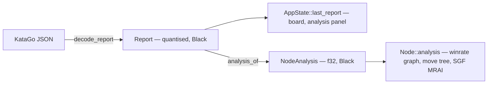
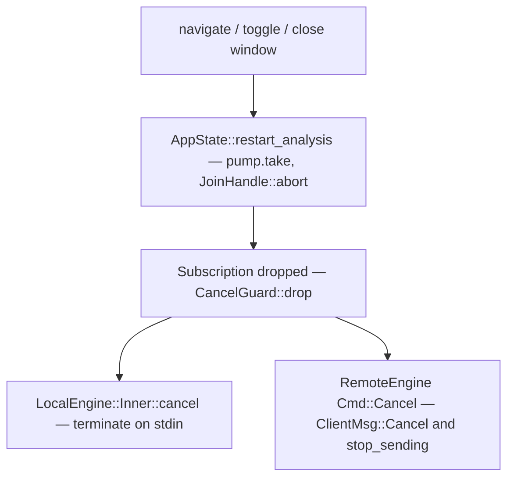
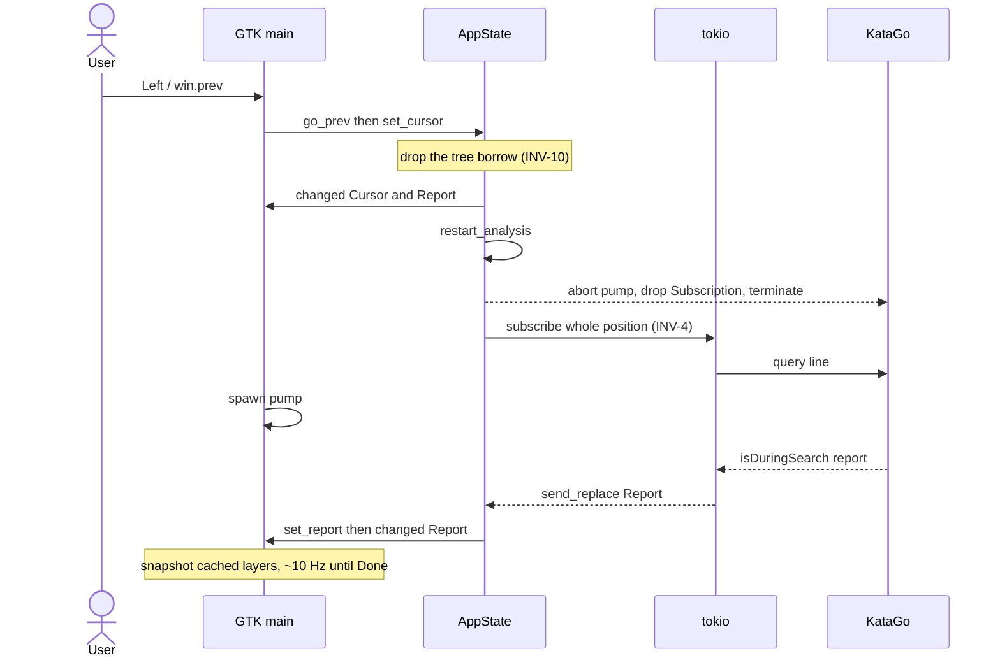

# mirai — system architecture

Contributor entry point is [`../../AGENTS.md`](../../AGENTS.md). The wire format is specified
normatively in [`PROTOCOL.md`](PROTOCOL.md); how to prove a change works is
[`TESTING.md`](TESTING.md); why the design is what it is, with the history, is
[`../archive/RETROSPECTIVE.md`](../archive/RETROSPECTIVE.md); the user's view is
[`../user/GUIDE.md`](../user/GUIDE.md). Candidate colour versus KataGo's `order` is
[`CANDIDATE_COLOUR.md`](CANDIDATE_COLOUR.md). Fox HTTP and its SGF dialect are
[`FOX_KIFU_API_SPEC.md`](FOX_KIFU_API_SPEC.md).

§3 is a task index: paths there are from the repository root, and a symbol is named only as
the entry to open. Elsewhere, citations are file plus symbol. Signatures and field lists are
not repeated here — run `cargo doc --workspace --open` for those. Point encoding, perspective
and quantisation are stated in [`../../AGENTS.md`](../../AGENTS.md) §2 and, where they cross
the wire, in PROTOCOL; §2 below keeps the reason and the cost, not a second copy of the
numbers. `[INFERENCE]` marks anything reasoned rather than read.

---

## 1. The system

mirai analyses and plays Go with KataGo. The GTK4/libadwaita application holds a game record in
memory and, for whatever position the cursor sits on, asks an *engine* for a stream of analysis
reports. An engine is anything implementing `Engine` (one method that matters, `subscribe`):
`LocalEngine` drives a `katago analysis` subprocess over its JSON stdio protocol, `RemoteEngine`
forwards the same request to a `mirai-server` over QUIC. Both yield the identical `Report` type,
so the GUI has one code path and never knows which kind of engine it holds. Every request carries
its whole position, so nothing anywhere holds engine-side session state and cancelling an
analysis is just dropping a handle.


| crate | owns | depends on | may **not** depend on |
|---|---|---|---|
| `mirai-core` | geometry, rulesets, legality, superko, scoring, game tree, SGF, time control | serde, smallvec, arrayvec, encoding_rs, base64, zstd, postcard | any workspace crate; GTK; tokio; anything doing real I/O |
| `mirai-proto` | MRP/2 value types, messages, frame codec, QUIC transport, SHA-256 for cert pins | `mirai-core`, quinn, rustls, rcgen, postcard, zstd, bitflags, tokio | `mirai-engine`, `mirai`, serde_json, **anything KataGo-specific** |
| `mirai-engine` | the `Engine` trait and its two implementations; KataGo query building and response decoding | `mirai-core`, `mirai-proto`, tokio, serde_json, quinn | GTK/glib/adw, `mirai`, `mirai-server` |
| `mirai-client` | shared application layer: analysis requests, sweep planning, play, Fox, TOFU session | `mirai-core`, `mirai-engine` (`remote` only), tokio, serde_json | GTK/glib/adw, `mirai`, `mirai-server`, KataGo JSON |
| `mirai-server` | headless host: one KataGo per configured engine, multiplexed across clients, token auth | `mirai-core`, `mirai-engine`, `mirai-proto`, clap, toml, subtle, quinn | GTK, `mirai` |
| `mirai` | `AppState`, window, custom `gsk` widgets, GTK adapters over `mirai-client`, preferences, config | all four libraries, gtk4, libadwaita, glib, tokio, toml, directories | — |

Versions are pinned once in the root `[workspace.dependencies]`; members use
`dep.workspace = true`. `mirai` and `mirai-server` are binaries; nothing depends on either.

**The layering rule** — a rule, not an observation:

- **`mirai-core` has no I/O and no GUI.** SGF reading takes a byte slice, writing returns a
  `String`; nothing in the crate opens a file or socket.
- **`mirai-proto` knows nothing about KataGo.** It defines what a `Report` *is*, never where one
  came from. The single place KataGo JSON becomes a `Report` is `decode_report` in
  `mirai-engine/src/decode.rs`.
- **`mirai-engine` knows nothing about GTK.** tokio only, `Send + Sync`, so a server, a CLI
  example and a GUI can all drive it. `mirai-engine/examples/probe.rs` runs both backends with
  no GUI at all, which is how the two paths get compared.
- **`mirai-client` has no GTK and does not open files.** Frontends supply I/O and drawing. It
  takes `mirai-engine` with `remote` only. A `use gtk::` here is the same design break.
- **Only `mirai` links GTK.** A `use gtk::` elsewhere is a design break; fix the design.

---

## 2. Design decisions that shape everything

### 2.1 The KataGo JSON analysis engine, never GTP — and stateless queries (INV-4)

One engine interface; requests are whole positions (stones, moves, rules, komi, caps). KataGo's
`analyzeTurns` is never emitted, so one request is exactly one position and exactly one report
stream.

- **Rationale.** GTP is a stateful command channel (`play`/`undo`/`clear_board`) whose board a
  client must mirror or diverge from. Analysis queries have no state to mirror.
- **Buys.** No replay/undo machinery. Arbitrary tree navigation is one new request, not a diff.
  The remote protocol is a pure request/stream forwarder, so the server keeps no per-client
  board state and can multiplex clients onto one KataGo. Cancellation is a drop.
- **Costs.** Every request re-sends the position (a 200-move `Open` frames to 500 bytes —
  [PROTOCOL §11](PROTOCOL.md#11-reference-figures)) and KataGo re-walks the move list; its NN
  cache absorbs most of that. Anything genuinely stateful — pondering that persists across
  cursor moves — is out of reach by construction.

### 2.2 mirai generates KataGo's analysis config

`katago analysis` refuses to start without a `-config` file, so a local profile that names none
gets one written for it by `EngineTuning` (`mirai-engine/src/tuning.rs`); naming a file still
uses that file as it stands.

- **Rationale.** Only three keys in that file are required — `numAnalysisThreads`,
  `numSearchThreadsPerAnalysisThread`, `nnMaxBatchSize`; drop any one and KataGo aborts with
  `Could not find key`. Everything else either travels on the query (rules, komi, board size,
  search limits, which outputs to include), is forced through `-override-config` (INV-2 and
  logging), or is better left at KataGo's own default, so an upstream improvement to those
  defaults arrives without mirai having to track it.
- **Buys.** A working local engine needs two paths, the binary and the model — no config file
  to find, write or keep in step with the query builder. The fallback is one fixed set of
  constants: 4 analysis threads, 16 search threads each, `nnMaxBatchSize` 64 and
  `nnCacheSizePowerOfTwo` 20 (about 3 GiB).
- **Measured calibration.** A managed local profile can replace the first three values by
  explicitly running **Automatic tuning** in its editor; it never runs at startup or merely
  because hardware changed. `mirai-engine::calibrate` starts an isolated KataGo for each
  candidate against the profile's real binary and model. At one analysis thread it measures
  search-thread counts 2, 4, 8, 16, 32 and 64 with fixed-visit, ownership-producing queries
  and takes the first point before a doubling buys less than 10%. It then measures 1, 2 and 4
  concurrent positions at that search width and takes the highest aggregate visits/second.
  Each process gets a short warm-up, measurement starts only after the startup handshake,
  every candidate starts with an empty NN cache, and `nnMaxBatchSize` is raised to cover the
  winning thread product. The cache size is deliberately not calibrated. On a Radeon RX 6800,
  1 → 4 analysis threads takes the cost of moving the cursor to another node from
  112 ms to 2.4 ms with no loss of single-position speed; 8 → 16 search threads is worth 14%
  on a single position, where 16 → 32 adds only 8% and worsens in-tree contention. The cache
  is the one value set for a reason beyond being required: KataGo's analysis default of 2^23
  is sized for the batch server the engine was written for, and settles near 24 GiB with
  ownership for 128 MiB of pointers up front. 2^20 — KataGo's GTP default — settles near
  3 GiB for 16 MiB, and a miss only costs a re-evaluation.
  `nnMutexPoolSizePowerOfTwo` is *not* set: its cost is a few MiB either way, so there is
  nothing to gain by disagreeing with KataGo about it.
- **Costs.** Calibration temporarily releases the window's normal engine, refuses to start
  during engine startup or whole-game analysis, requires other mirai windows to be closed and
  aborts if one opens. A second model or active search therefore cannot skew the result or exhaust
  VRAM. Dropping/aborting it still follows INV-3: the in-flight `Subscription` is dropped, then
  the temporary engine exits. mirai also owns a config file on disk, in the
  profile's log directory. Its name carries the
  four values (`katago-analysis-a4-s16-b64-c20.cfg`), so profiles tuned differently cannot race
  each other through one path — engines start concurrently, one per window — while an identical
  tuning resolves to a byte-identical file that is left alone, keeping a shared config from
  being churned under a running KataGo. And the local-engine editor has two modes: with a
  custom file the generated values are meaningless, so Preferences hides the batching and
  cache rows and only the two thread values are still passed as overrides.

### 2.3 KataGo's own point encoding (INV-1)

The ordering is INV-1. The wire statement — index, pass, and the ownership and policy array
lengths — is [PROTOCOL §7.1](PROTOCOL.md#71-inv-1-point-and-array-ordering). The board picture
is [§4](#4-data-model).

- **Rationale.** KataGo emits `ownership` and `policy` in that order. Any other convention
  means writing a remap, and remaps are where transposed heat maps come from.
- **Buys.** `report.ownership[i]` and `board.stones()[i]` are the same intersection, so overlays
  are a straight texture blit with no index arithmetic. SGF is also top-left-origin, so
  `Size::to_sgf`/`from_sgf` need no flip.
- **Costs.** GTP is bottom-left-origin and 1-based, so display coordinates flip
  (`row = h - y`). Two conventions exist; the GTP one is confined to `Size::to_gtp`/`from_gtp`.

### 2.4 Everything is stored Black-perspective (INV-2)

KataGo runs with `reportAnalysisWinratesAs=BLACK`. INV-2, and
[PROTOCOL §7.2.1](PROTOCOL.md#721-inv-2-black-perspective) on the wire: every stored, cached
and transmitted value is Black's. Conversion happens only at display time via `winrate_for` /
`score_lead_for`. The graph never converts — it is Black's series. The analysis sidebar does,
into the side to move. Those are different displays, not a second stored perspective.

- **Rationale.** A side-to-move value is only interpretable together with the node it came from.
  Black-perspective values are sign-stable, so a cached series can be plotted across a whole game
  without asking whose turn each node was.
- **Buys.** Blunder detection is a subtraction after one flip each side
  (`blunder_severity` in `crates/mirai/src/widgets/winrate.rs`, `blunders` in
  `crates/mirai-client/src/batch.rs`). SGF-persisted analysis needs no perspective metadata.
  `Color::sign()` is also KataGo's ownership sign.
- **Costs.** A double conversion is nearly invisible on screen — 45% looks as plausible as 55%.
  Every new display site must be checked; that is why no call site hand-rolls `1.0 - x`.

### 2.5 `tokio::sync::watch` for subscriptions — a lagging consumer *should* skip

A `Subscription` wraps a `watch::Receiver`; producers use `send_replace`, so an unread report is
overwritten rather than queued.

- **Rationale.** Reports arrive at ~10 Hz and each supersedes the previous one for the same
  position. A GUI busy laying out a `ColumnView` must never accumulate obsolete reports, and must
  never be the reason the engine stalls.
- **Buys.** Coalescing for free: no bounded queue, no drop policy, no backpressure design.
  `current()` is always the newest state, so a consumer that just woke up is immediately correct.
  Terminal events are safe under the same rule *because one query is one position* — the last
  value written is always the final report.
- **Costs.** Intermediate reports are genuinely lost; nothing may treat the stream as a log.
  Anything needing every value (there is nothing in-tree) needs a different channel. Across
  MRP the server's `pump` only coalesces when a write blocks, so the client's small stream
  receive window (`transport.rs` — `STREAM_WINDOW`) is part of this design: a large one lets
  stale reports queue in the transport instead. Below the watch, a subscription stream is
  compressed against itself, so the *client* still decodes every frame and only then
  coalesces ([PROTOCOL §4.1](PROTOCOL.md#41-subscription-streams-one-zstd-stream)).

### 2.6 Quantised wire values (INV-6)

Quantisation is part of the type: a candidate's win rate is a fixed-point integer, not an
`f32`. Scales, the illegal-prior sentinel and the round-trip error budget are normative in
[PROTOCOL §7.2](PROTOCOL.md#72-quantisation) (INV-6). They live in code only in
`crates/mirai-proto/src/types.rs`; `*_f32` accessors are the only way back to floats.

- **Rationale.** KataGo's JSON for one live report measured 33.6 KB
  ([PROTOCOL §11](PROTOCOL.md#11-reference-figures)). At 10 Hz per client that is the
  difference between a protocol that works on a LAN and one that does not.
- **Buys.** The framed worst case is the measured figure in
  [PROTOCOL §11](PROTOCOL.md#11-reference-figures) (`crates/mirai-proto/tests/wire_size.rs`).
  The local and remote paths quantise with the same functions, so the two engines produce
  bit-identical reports — which is what permits one GUI code path. Ownership is one byte per
  point, as that section specifies.
- **Costs.** Changing a scale is a protocol change: bump `PROTO_VERSION` and update
  `wire_size.rs` and PROTOCOL together. One sentinel is burned because KataGo reports an
  illegal prior as `-1`; the sentinel's value is in PROTOCOL, not here.

### 2.7 Custom `gsk` widgets, not `DrawingArea` + cairo (INV-9)

Board, win-rate graph and move tree are `gtk::Widget` subclasses drawing in `snapshot()`.

- **Rationale.** `snapshot` builds a retained render-node tree for the GPU; `DrawingArea`
  rasterises through cairo on the CPU every frame. At 10 Hz with dozens of candidate blobs and
  three text lines each, that is structural rather than a micro-optimisation.
- **Buys.** The static board is cached as one `gsk::RenderNode`; an ownership or policy
  buffer is uploaded as a `gdk::MemoryTexture` only while that overlay is on, and dropped
  when it is turned off — live analysis still requests ownership either way, because the
  score estimate and the stored analysis use it. The win-rate graph caches its base
  render node and redraws only the cursor marker while navigating. Widgets consume pushed
  projections, so `snapshot()` does not walk `AppState` or rebuild tree-derived data.
- **Costs.** No cairo conveniences: a circle is a colour node inside a rounded clip
  (`crates/mirai/src/widgets/paint.rs`), and text is a `pango::Layout` per label. Projection
  and cache invalidation are explicit. Text is deferred while the board is being resized,
  because GSK caches a glyph per `PangoFont` — so moving the board is free and rescaling it
  is not ([`RENDERING.md`](RENDERING.md) §6). The honest verification path is the app's own
  renderer through `crates/mirai/src/harness.rs`, plus `crates/mirai/src/render_probe.rs` for
  anything per-frame.

---

## 3. Module map

Where a change lives. This is not a symbol index: open the path and grep the entry. Paths are
from the repository root, because `play.rs` and `batch.rs` each exist twice. What a crate may
depend on is [§1](#1-the-system). User settings and shortcuts are
[GUIDE §8](../user/GUIDE.md#8-settings-reference) and
[§9](../user/GUIDE.md#9-keyboard-reference); this table is the source.

### Quick index

| I want to… | source | key entry |
|---|---|---|
| encode a point, or convert GTP / SGF | `crates/mirai-core/src/point.rs` | `Point`, `Size`. Ordering is INV-1; the wire statement is [PROTOCOL §7.1](PROTOCOL.md#71-inv-1-point-and-array-ordering) |
| choose a ruleset | `crates/mirai-core/src/rules.rs` | `RuleSet` |
| play a stone, test legality, or touch Zobrist | `crates/mirai-core/src/board.rs` | `Board::play`. The fixed seed is `SplitMix64` in `crates/mirai-core/src/lib.rs` |
| score a finished position, or place a handicap | `crates/mirai-core/src/score.rs`, `crates/mirai-core/src/handicap.rs` | `score`, `DeadSet::from_ownership`; `fixed_handicap` |
| time control or a thinking budget | `crates/mirai-core/src/clock.rs` | `TimeControl`, `think_budget` |
| the game record, position cache, or superko | `crates/mirai-core/src/tree.rs` | `GameTree`, `position` |
| an SGF property, or cached `MRAI` | `crates/mirai-core/src/sgf.rs` | `parse` / `write`. A new root property also goes in `is_root_info_prop` |
| a wire value, scale, or perspective conversion | `crates/mirai-proto/src/types.rs` | `AnalyzeReq`, `Report`, `winrate_for`. Scales and the error budget are [PROTOCOL §7](PROTOCOL.md#7-value-types-and-quantisation) |
| a protocol message | `crates/mirai-proto/src/msg.rs` | `ClientMsg`, `ServerMsg`, `SubMsg`, then [PROTOCOL](PROTOCOL.md) |
| framing, QUIC, a `mirai://` URL, or a cert pin | `crates/mirai-proto/src/frame.rs`, `crates/mirai-proto/src/transport.rs`, `crates/mirai-proto/src/endpoint.rs`, `crates/mirai-proto/src/sha256.rs` | `read_msg`, `connect`, `parse_url`, `fingerprint` |
| the engine contract | `crates/mirai-engine/src/lib.rs` | `Engine::subscribe` |
| a KataGo query field, or how a response is read | `crates/mirai-engine/src/query.rs`, `crates/mirai-engine/src/decode.rs` | `build_query`, `decode_report` — the only JSON boundary |
| the KataGo command line or its overrides | `crates/mirai-engine/src/local.rs` | `LocalEngine::spawn`, `override_config` |
| the generated analysis config, or automatic tuning | `crates/mirai-engine/src/tuning.rs`, `crates/mirai-engine/src/calibrate.rs` | `EngineTuning::render`, `calibrate`. The measured thread tradeoff is [§2.2](#22-mirai-generates-katagos-analysis-config) |
| a remote engine connection | `crates/mirai-engine/src/remote.rs` | `RemoteEngine::connect` |
| drive an engine with no GUI, or regenerate the self-play fixture | `crates/mirai-engine/examples/probe.rs`, `crates/mirai-engine/examples/sweep.rs`, `crates/mirai-client/examples/selfplay.rs` | flags in those files. How to read the result is [TESTING §4](TESTING.md#4-verifying-against-a-real-engine) |
| build an analysis request, or store a report | `crates/mirai-client/src/analysis.rs` | `request_for_node`, `analysis_of` |
| the search-speed reading | `crates/mirai-client/src/analysis.rs` | `SpeedMeter`, fed from `AppState::set_report` and reset in `restart_analysis`. Formatted by `visits_per_second` in `crates/mirai/src/util.rs` and shown only as `Headline::speed` in `crates/mirai/src/panels/analysis.rs` — live reports only, never a window readout |
| sweep a game, or decide what counts as a blunder | `crates/mirai-client/src/batch.rs` | `plan_mainline`, `sweep`, `blunders`, `BLUNDER_MIN_DROP` |
| move the cursor, undo, or remember the Save path | `crates/mirai-client/src/game/mod.rs` | `GameSession`. Differential history is `crates/mirai-client/src/game/history.rs` |
| trust a remote certificate before analysis | `crates/mirai-client/src/session.rs` | `Session` |
| choose an AI move, resign, or advance a clock, with no widgets | `crates/mirai-client/src/play.rs` | `select_move_index`, `resign_check`. GTK timers and dialogs are `PlayController` in `crates/mirai/src/play.rs` |
| Fox HTTP, or Fox's SGF dialect | [`docs/dev/FOX_KIFU_API_SPEC.md`](FOX_KIFU_API_SPEC.md) | the spec. Client calls are `lookup_user`, `list_games`, `fetch_sgf`, `normalize_fox_sgf` in `crates/mirai-client/src/fox.rs` |
| the Fox picker | `crates/mirai/src/fox.rs`, `crates/mirai/src/fox_picker.blp` | `present` |
| the headless server, or `server.toml` | `crates/mirai-server/src/main.rs`, `crates/mirai-server/src/session.rs`, `crates/mirai-server/src/config.rs`, `crates/mirai-server/server.example.toml` | `run`, `serve`, `ServerConfig::load` |
| per-window state, or which `Change` fires | `crates/mirai/src/app.rs` | `AppState`, `Change`. The projection is `handle_change` in `crates/mirai/src/window.rs` |
| share one KataGo across windows | `crates/mirai/src/engines.rs` | `EnginePool::acquire` |
| client settings on disk | `crates/mirai/src/config.rs` | `Config::load`, `AnalysisSettings` (`suggestion_limit`, live visit cap). What a key means for a user is [GUIDE §8](../user/GUIDE.md#8-settings-reference) |
| candidate colour, visit grey-out, or the rank badge | `crates/mirai/src/palette.rs` | `colour`, `GRADE_RAMP`, `TRUSTED_VISITS`. Why list order is not that colour: [`CANDIDATE_COLOUR.md`](CANDIDATE_COLOUR.md) |
| an ownership or policy heat map | `crates/mirai/src/widgets/board.rs` | `ownership_texture` / `policy_texture`, appended from `BoardView::snapshot`. Circles are `fill_disc` in `crates/mirai/src/widgets/paint.rs` |
| a shortcut, or what an action does | `crates/mirai/src/window.rs` | `install_actions`. The user table is [GUIDE §9](../user/GUIDE.md#9-keyboard-reference) |
| show or hide the editor toolbar | `crates/mirai/src/window.blp`, `crates/mirai/src/window.rs` | `editor_revealer` starts collapsed. `set_editor_visible` is the only writer; `win.toggle-editor` projects it |
| where the board menu pops up | `crates/mirai/src/window.rs`, `crates/mirai/src/widgets/board.rs` | button bounds become `BoardView` coordinates; `BoardView::show_menu` right-aligns to that rectangle. Shift+right-click anchors to the intersection. Never pass no anchor |
| the move-tree layout | `crates/mirai/src/widgets/tree.rs` | `lay_out`. Depth runs down the sidebar |
| the win-rate graph | `crates/mirai/src/widgets/winrate.rs` | `WinrateGraph::refresh`. Cursor text and tooltip are Black-perspective; the sidebar's candidate rows are side-to-move |
| blunder colour, or the list row | `crates/mirai/src/widgets/winrate.rs`, `crates/mirai/src/panels/analysis.rs` | `Severity::color`, `severity_of_drop`, `update_blunder_row`. One emoji line; the title carries the severity colour |
| the analysis sidebar | `crates/mirai/src/panels/analysis.rs`, `crates/mirai/src/panels/analysis.blp` | `refresh`, `set_detailed_columns`, `set_blunders`. Default columns are `# / Move / Win / Score / Visits`; Loss and Prior start hidden |
| the static window, or another Blueprint template | `crates/mirai/src/window.blp` | template `MiraiWindow`, bound in `crates/mirai/src/window_shell.rs`. Also `crates/mirai/src/panels/analysis.blp`, `crates/mirai/src/preferences.blp`, `crates/mirai/src/profile_editor.blp`, `crates/mirai/src/new_game.blp`, `crates/mirai/src/label_editor.blp`, `crates/mirai/src/fox_picker.blp` |
| preferences, including automatic tuning in the editor | `crates/mirai/src/prefs.rs`, `crates/mirai/src/preferences.blp` | `present`, `CalibrationRun`. Opening Preferences is `win.preferences`; a new window does not present it |
| a score, fingerprint, new-game, or label dialog | `crates/mirai/src/dialogs.rs`, `crates/mirai/src/new_game.rs`, `crates/mirai/src/label_editor.rs` | `show_score_with`, `confirm_fingerprint`, `present` |
| drive the real GUI, or count frames | `crates/mirai/src/harness.rs`, `crates/mirai/src/render_probe.rs` | `harness::install` / `parse` (debug, `MIRAI_HARNESS`); `render_probe::install`. Recipes are [TESTING §5](TESTING.md#5-testing-the-gui) |
| process lifetime, the runtime, or shutdown | `crates/mirai/src/main.rs`, `crates/mirai/src/application_shell.rs` | `MiraiApplication` — `shutdown` releases the runtime and `EnginePool` |
| whole-game analysis from the window | `crates/mirai/src/batch.rs` | `BatchAnalysis`. Planning and the drop threshold stay in `crates/mirai-client/src/batch.rs` |

Non-Rust that is not a template: `crates/mirai/resources/style.css` (`board-area`, `mirai-clock`,
`mirai-position`, `mirai-winrate`, `mirai-movetree`, `mirai-candidates`, `mirai-blunder-*` —
there is no `mirai-readout`), `crates/mirai/resources/mirai.gresource.xml` compiled by
`crates/mirai/build.rs`, and `docs/user/preview.png`. Why a frame allocates is
[`RENDERING.md`](RENDERING.md).

---

## 4. Data model

### Point, Size, Color

```
19x19, Point index          GTP name            SGF value
  0   1   2 ...  18         A19 B19 ... T19     aa ba ... sa
 19  20  21 ...  37         A18 B18 ... T18     ab bb ... sb
  .                          .                   .
342 343 ...     360         A1  B1  ... T1      as bs ... ss
```

`Size` owns every conversion, so no caller does index arithmetic; `Neighbors` yields the four
orthogonal neighbours in a fixed order, skipping off-board ones. GTP is the only
bottom-left-origin representation in the tree; SGF shares our origin. `Point::PASS` is a sentinel
`u16`, not a separate variant, so a move is always one `u16` — anything indexing an array must
first check `is_pass()` or `Size::contains` (which rejects `PASS`).

### Board: Zobrist and ko

One `[[u64; 361]; 2]` table (colour-major, then point index) seeded from a fixed constant through
`SplitMix64`. The fixed seed is a contract, not a detail: hashes must be reproducible across runs
and machines. The private `put` XORs the old stone out and the new one in, so the hash is
incremental and `Board::play` never rehashes. Turn parity is folded in at read time —
`situational_hash(to_play)` is the positional hash, XOR `WHITE_TO_MOVE_HASH` for White — so both
superko histories come off one hash pipeline.

Superko is split deliberately across two levels:

| ko rule | enforced by | how |
|---|---|---|
| `Ko::Simple` | `Board` | `ko_ban`, set only when a move captures exactly one stone leaving a single-stone, single-liberty chain; checked in `is_legal` and `play` |
| `Ko::Positional` | `GameTree` | candidate board's Zobrist looked up in `Position::hash_history` |
| `Ko::Situational` | `GameTree` | candidate's `situational_hash(other colour)` looked up in `Position::situational_history` |

`Board::is_legal` cannot see superko — that needs a whole game's history — so a legality check
outside the tree is incomplete by design. A pass cannot repeat a position by itself and is exempt.
Suicide is legal only under `multi_stone_suicide` and only for chains larger than one stone.

### GameTree: arena, tombstones, revision, position cache

Nodes are addressed by `NodeId`, never by reference — no `Rc`, no lifetimes — so an id can be
parked in a widget, a `Cell` or a `Blunder` without borrowing the tree. `detach_branch` unlinks a
subtree and tombstones its nodes without cloning; `restore_branch` puts the same ids and sibling
index back. `delete_branch` is detach-and-drop. Consequences:

- `node(id)` panics on a tombstone; use `get`/`contains` wherever deletion is possible.
- `len()` counts live nodes, so it diverges from the arena's length after a delete.
- Deleting the root is a no-op; the cached position is dropped if it pointed into the subtree.
- `revision()` is bumped by every mutation so a view can test staleness in O(1) — `MoveTreeView`
  relayouts only when it moves. A mutating method that forgets to bump it silently freezes that
  widget.

`Position` is derived state, never stored on a node: board, side to move, move number, and the two
hash histories. `position(id)` has three cases:

```
cache is (id, pos)            -> return it, zero work
cache is (parent(id), pos)    -> apply one node                <- O(1): the arrow-key path
otherwise                     -> replay path_to(id) from empty
```

Forward navigation is therefore one `Board::play` plus two hash pushes rather than a replay.
Backwards is a full replay: `Board::play` records nothing that could reverse a capture, and making
positions undoable would cost more than the few hundred microseconds a replay takes. `position`
takes `&mut self`, which is why `AppState` exposes `with_tree_cached` for read-only callers.

The private `step` applies setup stones, the handicap turn flip, the move, then the `PL`/`MN`
overrides, and appends both hashes. A non-empty setup is a rules-history boundary: both superko
histories are dropped and the ko ban is cleared (`Board::clear_ko`); a pure `PL` override only
changes `to_play`. Replay never rejects an illegal move: a stored line is history, not a legality
question. `Node` is all-public data — the tree owns structure, not content — and `children[0]`
is the main line. `has_content` is true for a move, setup stone, mark, explicit `PL`, or a
non-whitespace comment — that is what autosave and crash restore consult.

### NodeAnalysis and Candidate

`NodeAnalysis` is the *stored* form of an evaluation: dequantised, Black-perspective, truncated to
`AnalysisSettings::stored_suggestion_limit` (at most 50 even when the display shows all), produced
only by `mirai_client::analysis_of`, with ownership left
quantised at one byte per point. It exists so the win-rate graph and move tree can draw a whole
game after the live report for a node is gone. Live analysis writes it only when `generation`
matches and `set_analysis_at(cursor, analysis_revision, …)` succeeds — `analysis_revision` is
the `position_revision` captured at `restart_analysis` — and the new report has more visits
than what is already stored, so a finished sweep is not replaced by the first handful of
pondering visits. The live `Report` — all fields, still quantised —
lives separately in `AppState::last_report()` and is discarded the moment the cursor or
position moves. Marks and comments do not bump `position_revision`.



### SGF mapping

Read in `build`, written in `write_node` (`mirai-core/src/sgf.rs`).

| SGF | model | note |
|---|---|---|
| `SZ` | `GameInfo::size` | `n` or `w:h`; absent means 19x19 |
| `RU` | `GameInfo::rules` | via `RuleSet::from_katago_name`; unknown falls back to the default ruleset |
| `KM` `HA` `RE` `DT` `EV` `TM` `OT` `PB`/`PW` `BR`/`WR` | `GameInfo` fields | — |
| `B` / `W` | `Node::mv` | an empty value, or `tt` on boards ≤ 19, is a pass |
| `AB` / `AW` / `AE` | `Node::setup` | point lists; `aa:cc` rectangles expanded on read |
| `C` `PL` `MN` | `comment`, `to_play_override`, `move_number_override` | — |
| `LB` | `Marks::labels` | composed `coord:text`, so `:` is escaped on write |
| `TR` `SQ` `CR` `MA` | `Marks` shape lists | — |
| `MRAI` | every node's `analysis` | mirai's own, see below |
| anything else | `Node::unknown_props` | verbatim |

**Unknown-property preservation** is why there is no SGF crate here. Any property mirai does not
model is kept on its node and written back at the end of that node, escaped but byte-preserved, so
a round trip does not destroy another program's analysis blobs (LizzieYzy's `LZ`/`LZOP`/`DZ`). The
one exception is deliberate: root properties mirai models or regenerates must not be echoed back
or they appear twice. `is_root_info_prop` is that list, applied only at the root; **a new root
property must be added there.**

**`MRAI`** carries cached analysis on one root property:

```
MRAI[ base64( zstd( MRAI_VERSION ++ postcard(Vec<(u32, NodeAnalysis)>) ) ) ]
                                     └─ u32 = the node's index in document order
```

The index contract is load-bearing: `collect_analysis` walks in exactly the order `write_sequence`
emits and `build` creates nodes in document pre-order, so the recorded index is the `NodeId` a
reload assigns. Decoding is best-effort — foreign, truncated or future-versioned blobs mean "no
analysis", and a vanished index is skipped — and writing is opt-in via
`UiSettings::save_analysis_in_sgf`, off by default. Two parser facts worth knowing before touching
it: the charset is a collection root's `CA`, found by `sgf::root_property`'s scan of the raw
bytes — the first game's root wins, a later game's root is used only if that one has none, and a
`CA[` inside a comment or a variation is not a property — because the text cannot be decoded until
it is known; and nesting is capped by `MAX_DEPTH` against hostile files.

---

## 5. Concurrency and threading

### Two schedulers, one process

| | GTK main context (main thread) | tokio multi-thread runtime (`mirai-rt` threads) |
|---|---|---|
| owns | every widget; `AppState` (a `glib::Object`, not `Send`); the `GameTree` in a `RefCell` | `LocalEngine`'s writer/reader/supervisor/stderr tasks; `RemoteEngine`'s connection task, control reader, stream acceptor and per-subscription readers |
| futures | `glib::spawn_future_local`: the analysis pump, batch workers, the score pump, the play thinker | everything else |

One runtime is built in `main` and never rebuilt; only its `Handle` is stored, in `AppState`
(`AppState::runtime()`). After `application.run()` returns, `main` calls `shutdown_timeout` so
dropped engines get a moment to let their KataGo processes exit. Nothing on a tokio thread ever
touches `AppState` or the tree.

### The two crossings

**GUI → runtime for a one-shot result:** `runtime().spawn` + a `oneshot` +
`glib::spawn_future_local` to land the result back on the main context. The canonical instance is
`AppState::activate_profile`. Its `activation` counter is mandatory, not decorative: a local
KataGo takes seconds to load its net, so an older activation can complete *after* a newer one and
would otherwise install itself over it. Copy the whole pattern, counter included, for any new
slow operation that installs state.

**Runtime → GUI for a stream:** `Engine::subscribe` is synchronous — it returns a handle
immediately and the engine's own tasks do the work — and the GUI then awaits
`Subscription::next()` inside a `glib::spawn_future_local`, so every report is handled on the main
thread.

### What must not happen on the main thread

- **No `block_on`, no `blocking_recv`, no thread joins.** There are none in `crates/mirai`; the
  oneshot pattern above is the replacement.
- **No engine startup inline.** `LocalEngine::spawn` waits for KataGo's handshake, which on a cold
  OpenCL install includes autotuning and is allowed minutes.
- **No blocking on a `Subscription`.** `finish()` is async and is used by the probe and the
  server, never by the GUI.
- SGF parsing *is* inline and fast enough for real records; a multi-megabyte collection would
  stutter. `[INFERENCE]`

### The cancellation chain (INV-3)

There is one cancellation mechanism — **drop the `Subscription`** — and everything else is
plumbing that leads to that drop.



`AppState`'s `generation` counter is a belt-and-braces guard so a pump already inside
`next().await` exits instead of writing a stale report; it is not the cancellation mechanism.
The same chain is what makes server-side cleanup free: `session.rs`'s `pump` returning drops its
`Subscription`, so a client that simply disappears stops KataGo. Measured: a client SIGINT makes
the server drop the subscription in under a millisecond and KataGo falls to 0% CPU.

Other participants follow the same ownership rule: score and play tasks, plus the batch
coordinator's runtime task, are aborted by their owning window/controller. Dropping those tasks
drops every in-flight `Subscription`; there is no parallel query-cancellation API.

### One live-analysis cycle: pressing Left



Two properties to internalise: the board never asks an engine for anything — it reads `AppState`
— and a report that arrives after the cursor moved cannot be drawn, because the pump that would
deliver it was aborted and its generation no longer matches. A setup or `PL` edit also bumps
`position_revision`, so a late `set_analysis_at` for the old board is refused; whole-game
analysis and score estimate use the same gate.

---

## 6. Engine layer

`Engine` has two methods, `subscribe` and `describe`, plus a blanket impl for `Arc<T>` so the GUI
can hold `Arc<dyn Engine>`. `subscribe` is deliberately **not** async — the caller gets a handle
at once and the engine's own tasks do the work, which is what lets a GTK signal handler start an
analysis without awaiting; errors detected before dispatch come back as an already-failed
subscription rather than a `Result`, so callers have one code path.

`SubEvent` is `Pending` (the `watch` channel's initial value), `Report`, and the terminal `Done`
and `Failed`. `current` never awaits and is always meaningful; `next` awaits a change and yields
`None` once the engine side is gone; `finish` checks `current` first so an already-finished
subscription cannot hang. `CancelGuard` holds the boxed closure that `Drop` runs — that closure
*is* INV-3. `EngineError` variants are acted on: `Startup` and `EngineExited` make the GUI clear
the active engine, the rest are reported and survivable.

### LocalEngine

The command line is built in `LocalEngine::spawn`:

```
<katago> analysis -model <model> -config <config> -quit-without-waiting
                  -override-config <k=v,k=v,…>
```

stdio piped, `kill_on_drop` set. `override_config` always sets:

| override | value | why |
|---|---|---|
| `reportAnalysisWinratesAs` | `BLACK` | **INV-2**; everything downstream assumes it |
| `logDir` | the profile's log directory | one KataGo log file per run |
| `logToStderr` | `false` | stderr is ours — we tail it for diagnostics |
| `logAllRequests`, `logAllResponses` | `false` | detail stays in KataGo's own log |

plus `numAnalysisThreads`, `numSearchThreadsPerAnalysisThread` and `nnCacheSizePowerOfTwo` when
the caller set them — which the GUI does only for a custom config file; with mirai's generated
config (§2.2) that file is the single source of those values and no thread override is passed.
KataGo splits this value on commas, so a value containing one is rejected up front with a
`Startup` error rather than producing a mangled config.

**Handshake as readiness probe.** Two action queries (`query_version`, `query_models`) are written
before anything else and `handshake` reads until both are answered; KataGo only answers once its
model is loaded, so "handshake done" *is* "ready". Non-JSON banner lines are ignored. A
`query_models` rejection is tolerated with a warning (the action is newer than the rest of the
protocol); any other query error or engine fault aborts the start. `has_human_model` is derived
here and gates the Human-like strength option. The timeout is `LocalEngineConfig::startup_timeout`
— minutes by default, because a cold OpenCL install tunes itself — and on failure the child is
killed and the error carries the tail of stderr.

**Three tasks plus a stderr drain.** The *writer* drains an unbounded channel of query lines and
flushes once per batch; returning closes KataGo's stdin, which with `-quit-without-waiting` asks
it to quit. The *reader* line-splits stdout into `Inner::handle`, holding only a `Weak`, so it
exits when the engine handle drops. The *supervisor* selects on process exit and a shutdown
oneshot: on handle drop it waits a short grace period and then kills, and on exit it marks the
engine dead and fails every live subscription. The *stderr drain* logs each line and keeps a
bounded ring for error messages.

**Routing.** A `Mutex<HashMap>` from a monotonic query id to the `watch::Sender` plus the three
facts needed to decode that query's responses (size, turn, side to move). The id is stringified
into the query and echoed back by KataGo. The table is shared across threads — `subscribe` and
`cancel` run on the GTK thread or a runtime worker while the reader task delivers — but holds a
handful of entries, is read about ten times a second per live query and written once per query
start and end, and no lock spans an `.await`. Measured that way, a lookup costs about 18 ns
under a plain mutex against 20 ns in a sharded `DashMap`, with writers at up to 1000/s; the
sharded map only wins under a writer that never stops, which nothing here is, and a whole
report line takes tens of microseconds to parse. A terminal event removes the entry before sending; `cancel`
instead *keeps* the entry and marks it terminating, so the tail of a terminated search is still
routed and discarded correctly, and a response for an unknown id is a trace, not an error. A
terminated query that never searched still terminates cleanly, as an empty `Done`.

### RemoteEngine

Same trait, same reports, over QUIC. One background task owns the connection, the control stream
and the subscription table; the handle only sends commands down an unbounded channel, which is how
`subscribe` stays synchronous. Per-connection reader tasks feed the owner: one for the control
stream, one acceptor for server-opened unidirectional streams, and one per subscription that reads
the 4-byte id preamble and then `SubMsg` frames. Dropping the handle drops a oneshot, which is what
stops the task.

`handshake` connects (TOFU-verified), sends `Hello`, awaits `Welcome`, then resolves the requested
engine name against the server's list. Its error classification is load-bearing:
`EngineError::Protocol` means reconnecting cannot help (bad token, version mismatch, fingerprint
mismatch), `Disconnected` means retry. Backoff is 0.5 s, 1 s, 2 s, 4 s then capped; while waiting,
commands are still answered so the handle never deadlocks. `RemoteStatus::Failed` is sticky for
unfixable causes so the UI can say something truthful instead of spinning, while the task keeps
retrying at maximum backoff in case the server is fixed and restarted.

**No subscription replay.** On connection loss every live subscription fails with `Disconnected`
and is forgotten, and requests made while the link is down fail immediately rather than queueing.
That is INV-4 again: the GUI knows which node the user is looking at *now* and re-requests that
one when the banner clears, whereas a queued stale query would only burn the server's search
threads. Reconnects reuse the accepted fingerprint and the *resolved* engine name, so a server
that gains engines later cannot silently switch the client to a different one.

### Local vs remote

| | LocalEngine | RemoteEngine |
|---|---|---|
| transport | subprocess stdio, one JSON line per message | QUIC: one bidi control stream + one uni stream per subscription |
| routing | `Mutex<HashMap>` keyed by query id | `HashMap` owned by the connection task, keyed by subscription id |
| cancel | `terminate` action | `Cancel` message **and** `stop_sending` |
| one query fails | KataGo per-query error | `SubMsg::Failed` / `ServerMsg::Error` with a sub id |
| engine fails | process exit → fail all | connection loss → fail all, then reconnect |
| recovery | none; the GUI clears the engine | automatic with backoff, never replayed |
| `describe()` | from the startup handshake | from `Welcome`, narrowed to the picked engine |

---

## 7. GUI architecture

### AppState is the only source of truth (INV-7)

`AppState` is a `glib::Object` subclass holding the `GameSession` (tree, cursor, differential
undo, document-state dirty token), the config, the runtime handle, the active engine, the last
report and the live-analysis pump. Widgets never hold pointers
to each other: they take an `AppState` clone (a GObject ref), read from it, and subscribe to its
notifications. Anything that looks like widget-to-widget coupling is either a hook installed once
by `window::present` (board ↔ analysis panel PV preview, play → batch)
or a bug.

Two implications: a new piece of shared state belongs on `AppState`, not on a widget; and a widget
that needs to *cause* something calls an `AppState` method or activates a `win.*` action.

**Properties** (bindable, `notify::`-observable):

| property | fires when | notes |
|---|---|---|
| `live-analysis` | toggled by the user or an action | custom setter; also calls `restart_analysis` |
| `ownership-overlay` | toggled | custom setter; turns `policy-overlay` off, notifying it |
| `policy-overlay` | toggled | custom setter; turns `ownership-overlay` off and restarts analysis, because the policy array is only requested when the overlay is on |
| `show-coordinates`, `show-move-numbers` | toggled | derive-generated setters |
| `engine-label`, `status`, `busy`, `file-path`, `modified` | set by the code that owns the state | derive-generated setters |

`explicit_notify` belongs **only** on the three properties with hand-written setters that emit
`notify_*()` themselves. On a derive-generated setter it silently disables notification and breaks
every `notify::` handler and `bind_property` target that depends on it.

**Change dispatcher.** `AppState` has one `ChangeHook`, installed once by `window::present`.
Mutations call `changed(Change::…)`; `window::handle_change` performs the complete ordered UI
refresh. This avoids several independently ordered signal callbacks observing half-updated state.

| change | emitted by | dispatcher work |
|---|---|---|
| `BeforeEdit` | `with_edit_session`, `set_cursor`, `navigate`, `adopt_record` / `adopt_unsaved` | flush the comment so it is one history item before the next edit |
| `Edit { positions_changed, structure_changed }` | `with_session_mut` when the record actually changed | cancel batch, and abort score if the position moved, before the Tree/Cursor refresh; update undo/redo sensitivity |
| `Editor` | `set_editor_tool`; adopt forces Play and emits this too | if the tool is not Play, reveal `editor_revealer`; project toolbar state; clear the PV preview when leaving Play. Collapsing the revealer forces Play first. Returning to Play does not hide a toolbar the user opened |
| `Tree` | `with_session_mut`; the batch coordinator when a sweep lands, cancels or fails | close the board menu; update the board-local position label; choose the analysis page; rebuild board, tree and graph projections; recompute blunders; refresh the analysis panel and editor actions |
| `Cursor` | `set_cursor`, and `moved_cursor` after `play_move` or a cursor-changing edit | load the comment (does not flush); update the board-local position label and clocks; choose the analysis page; refresh cursor projections. Does not refresh the subtitle |
| `Report` | `set_report`, and `moved_cursor` after the live report is cleared | refresh board textures, graph data and analysis rows; choose the analysis page. Does not move the slider or the position label |
| `Engine` | engine-state transitions and profile edits | rebuild the engine menu, choose the analysis page, refresh the panel, update the subtitle |
| `Toast(String)` | `AppState::toast` | add one `adw::Toast` |
| `Play` | `notify_play_changed` | refresh clocks and play controls. Active play forces the editor revealer closed and disables its toggle |
| `BatchProgress` | `notify_batch_progress` | the banner count is already current. The graph and blunder list refresh at most once per 250 ms while results land. Completion, cancel and failure emit `Tree`, which is the final refresh |

Ordering remains explicit: cursor state is current before `Report`, and every tree borrow is
released before `changed` enters window code.

### Surfaces, rows and native controls

Equivalent Adwaita controls stay native. `Adw.ButtonRow` adds a profile and restores a
preferences page. `Adw.InlineViewSwitcher` is the inspector switcher. `Adw.ViewStack` is the
sidebar and the analysis/empty stack. `Adw.SpinnerPaintable` is the Fox picker's loading
state. The Appearance overlay is one `Adw.ComboRow` projecting the mutually exclusive
`ownership-overlay` and `policy-overlay` booleans; the menu, defaults and undo must stay in
sync with it (`overlay_row` in `crates/mirai/src/prefs.rs`).

Three surfaces, and no custom colour literals for them. `Adw.OverlaySplitView` supplies the
sidebar colour for the inspector header, the analysis summary (plain labels, not a list) and
the Blunders expander title. The board surround is `.board-area` → `@window_bg_color`; the
graph draws no background of its own, so the content pane shows through. Candidate
`ColumnView` rows and blunder `ListBox` rows use the view background. The three follow focus
and light/dark mode.

Candidate objects are mutated in place and bound with `gtk::Expression`, so a report does not
replace the model or drop hover. Default columns are `# / Move / Win / Score / Visits`. Loss
and Prior start hidden; `set_detailed_columns` shows them, and if the primary sort is one of
those columns it sorts by rank before hiding. The rank badge's number is KataGo's `order`;
its colour is the row's grade (`palette::grade_css`).

A blunder row is one `Adw.ActionRow` line: a black or white stone emoji, the move number, the
loss, and the played point, plus the best point when the sweep has one.
`update_blunder_row` puts that on the title. `mirai-blunder-*` tints only `label.title` —
tinting the row would also tint GTK's `show-separators` borders through `currentColor`.
Existing rows are updated in place; only the tail is appended or removed, so hover and
activation survive a refill.

The graph is always Black-perspective: the cursor reads `Black {:.1}%`, and the tooltip names
Black win rate and Black score lead. It is the only root readout. The Analysis panel's status
line is the side-to-move stone, visits, and speed while a live search runs, with the score
spread in its tooltip; its rows are side-to-move. Showing the root again in the panel would
put one number in two perspectives on screen at once, which is what used to need a paragraph
explaining it.

### Widget tree

Static layout is [`crates/mirai/src/window.blp`](../../crates/mirai/src/window.blp). The user's
map of regions and mouse behaviour is [GUIDE §3](../user/GUIDE.md#3-the-interface).

The outer `Adw.ToolbarView` has only a header. Board navigation is the `[bottom]` bar of the
content `Adw.ToolbarView` (`nav`): first/prev/next/last, branch prev/next, the slider,
`move_position`, the editor toggle and the board menu. Clocks and Undo/Pass/Resign are a
separate `play_bar` in that same bottom box, hidden unless a game is in progress or the clocks
are showing. The sidebar therefore runs to the window bottom. There is no window-level analysis
readout.

`editor_revealer` starts collapsed (`reveal-child: false`). `set_editor_visible` is the only
writer. A non-Play tool reveals it; returning to Play does not hide a toolbar the user opened.
Active play forces it closed and disables `win.toggle-editor`.

`present` does not open Preferences. With no profile, no live report and no cached analysis on
the current node, the analysis `Adw.ViewStack` shows `no_engine_status_page()`; otherwise it
shows the panel (`update_analysis_page`, also after Tree, Cursor, Report and Engine). Cached
`MRAI` is enough. Speed is not invented for a cache hit.

The graph `Paned` sets `resize-end-child: false` and does not shrink either child. Extra space
goes to the board. There is no hardcoded paned position: a paned with no position sizes the
graph by its *minimum* request (and would clip a shrinkable child rather than lay it out
smaller), so `WinrateGraph` starts *pinned*, requesting `ui.graph_height` as its minimum,
and after its first allocation `release` fixes the divider where it landed and drops the
minimum to 80 px, so the handle drags both ways. The graph records every allocated height;
`Ui`'s drop writes it back to `ui.graph_height`. `fit_default_size` measures the header,
the board toolbar and that graph height against the shortest monitor (85 %, at most 960 px
tall) and makes the window exactly board + sidebar wide, so a floating first window has no
bare background; a remembered graph too tall for this screen is capped so the board keeps
the sidebar docked. While a game is in progress or being scored, `sync_play_layout` hides the
graph, the `nav` row and the sidebar (a `show-sidebar` notify keeps it shut through
breakpoint changes, and its toggle is disabled), and restores them — sidebar as it was, graph
re-pinned at its remembered height — when the game is over. Graph visibility is one rule,
`sync_graph`: `ui.show_graph` (`win.toggle-graph`, View menu, <kbd>g</kbd>) and no game; a
hidden graph drops out of `fit_default_size`. The sidebar header must keep `show-title` at its
default: clearing it hides the title widget, which is the `Adw.InlineViewSwitcher`. Sidebar
width follows `win.toggle-candidate-details` (View menu, and every candidate column's header
menu): 300 sp for the five common columns, 386 sp
with Loss and Prior, including when the split collapses at 926 sp. The rank badge keeps
its natural width; the visible data columns share the rest equally unless resized by hand.
Cell width requests stay pinned so new engine numbers do not remeasure the list on every report.

Every user-triggerable operation is a `win.*` action registered in `install_actions`, so the
menu, the buttons, the accelerators, the shortcuts window and the debug harness all drive the
same code. Add an action there, with its accelerator in the same table; never wire a button's
`clicked` directly to logic.

### Window ownership rule (INV-8)

`MiraiWindow` is the sole owner of one plain `Ui` value in its GObject implementation. Every
long-lived callback captures `glib::WeakRef<MiraiWindow>` and enters through
`MiraiWindow::with_ui`; no callback owns the window state. Stateful controllers (`PlayController`
and `BatchAnalysis`) are also unique fields of `Ui` and use the same weak-window route. The
custom widgets do not: `BoardView`, `WinrateGraph`, `MoveTreeView` and `AnalysisPanel` are
constructed with their window's `AppState` and hold it directly, which is sound because nothing
in them points back at the window, and it keeps a weak upgrade plus a `RefCell` borrow off every
refresh.

`close-request` calls `MiraiWindow::shutdown`, `ObjectImpl::dispose` calls it as a backstop, and
`ApplicationImpl::shutdown` calls it for every window the application still holds — so a `quit`,
the harness `quit` step and a termination signal all release exactly like closing the window.
`begin_shutdown` makes it idempotent and `take_ui` is the single release point, but the release
itself is `Ui`'s `Drop`: it flushes the comment, stops the timers, stops play and batch work,
cancels AppState startup/analysis tasks, saves config, clears the engine, and drops an
`AutosaveFile` which deletes the file it names. Expressing it as `Drop` is what makes a
forgotten exit path impossible. Nothing in it can reach back at the window: `take_ui` runs
first, so an `AppState` hook re-entering through `with_ui` finds no state, and `Ui::window`
returns an `Option` — `None` by the time `dispose` has cleared the weak reference — rather
than the `expect` it used to be. Anything that needs the widget tree belongs at the call site,
ahead of the drop. That is also why `connect_close` and `install_actions` take the window as an
argument: `present` has it, and neither wants a second route to it.

Transient futures may retain GTK objects only when their finite lifetime is explicit. Calibration
uses a single `CalibrationRun` owner taken by either completion or cancellation; its window-added
signal handler, runtime task, controls and engine restoration are torn down together.

### More than one window

`activate` and `open` both call `window::present`, and `open` calls it once per file, so several
windows in one process is a normal state, not an edge case. Each owns a complete `AppState`
(INV-7 is per window); three things are process-wide and each had to be made safe for it:

| Shared | Rule |
|---|---|
| Engines | `EnginePool` in `MiraiApplication`, keyed on the whole `EngineProfile`. A window adopts a running engine synchronously through `running`, or joins an in-flight start through `acquire`; entries are `Weak`, so KataGo exits with the last window using it. The start is owned by the pool: dropping one waiter (a superseded `activate_profile`) does not leave the entry pending, and a start that finishes with no waiter left drops the engine so the next acquire starts again. Dropping the pool aborts an in-flight coordinator before the runtime stops, so quit during startup closes KataGo's stdin instead of killing the child. The application owns the pool and runtime and releases both from its `shutdown` vfunc, with GObject disposal as the backstop |
| `config.toml` | Each window holds the `Config` it loaded, so writing the whole thing back would revert another window's edits. `Config::save_merged` applies only this window's own diff onto the file as it stands. A missing file is an empty merge base; any other read or parse error is returned and the file is left untouched. `engine_profile` is merged by `name`: a profile this window did not touch keeps the file's copy, including one only the other window added. If both edited the same profile, the save being written wins for that name |
| Autosave | One file per window, `autosave-<pid>-<start>-<n>.sgf`. A clean close deletes it, waiting out an in-flight write first; anything found at startup is therefore a crash leftover, and each new window is offered one, most recent first. The scan, the write and opening an SGF run on the runtime's blocking pool so they do not stall the GTK thread. This replaced the single `autosave.sgf` plus `clean-exit` flag, which could not say which window had exited |

### RefCell and identity discipline (INV-10)

`AppState` keeps the `GameSession` (and thus the tree) in a `RefCell`. A borrow must be released
before `changed`, `set_cursor`, `set_report` or `toast` enters window code; the dispatcher
immediately reads the tree again. `with_session_mut`, `adopt_record` / `adopt_unsaved`, report
caching and navigation helpers scope or explicitly drop their borrows before dispatch.

`NodeId` is stable only within one `GameTree` arena. Every node reference that can outlive a
borrow is therefore a `NodeRef { epoch, id }`. Replacing the record (`GameSession::adopt` /
`restore`, in `crates/mirai-client/src/game/mod.rs`) increments the epoch; `resolve_node`
rejects references from the previous tree. Comments, batch results, play snapshots
and async score/analysis work must carry `NodeRef` and, for in-tree edits, the
`position_revision` they started with — never a naked long-lived `NodeId`.

Widgets receive projections when `Change` is dispatched. `snapshot()` borrows only widget-local
projection/cache state; it does not borrow `AppState` or replay the game tree.

---

## 8. Invariants — the detailed reference

[`../../AGENTS.md`](../../AGENTS.md) §2 states each rule. Where the same rule crosses the wire,
[PROTOCOL](PROTOCOL.md) is normative. This table is only where the rule is enforced.

| INV | enforced in |
|---|---|
| **INV-1** | `crates/mirai-core/src/point.rs` (`Point`, `Size`); consumed unremapped by `BoardView::snapshot` in `crates/mirai/src/widgets/board.rs` |
| **INV-2** | `override_config` in `crates/mirai-engine/src/local.rs`; the only converters in `crates/mirai-proto/src/types.rs`; stored values via `analysis_of` in `crates/mirai-client/src/analysis.rs` |
| **INV-3** | `CancelGuard` in `crates/mirai-engine/src/lib.rs`; drop sites `AppState::restart_analysis` in `crates/mirai/src/app.rs` and `pump` in `crates/mirai-server/src/session.rs` |
| **INV-4** | `AnalyzeReq` in `crates/mirai-proto/src/types.rs`; built by `request_for_node` in `crates/mirai-client/src/analysis.rs`; `build_query` in `crates/mirai-engine/src/query.rs` |
| **INV-5** | `AnalyzeReq::komi_x2` in `crates/mirai-proto/src/types.rs`. The wire rule is [PROTOCOL §7.4](PROTOCOL.md#74-komi) |
| **INV-6** | `crates/mirai-proto/src/types.rs`; both engine paths; the budget is pinned by `crates/mirai-proto/tests/wire_size.rs` and [PROTOCOL §7.2](PROTOCOL.md#72-quantisation) |
| **INV-7** | `Change` in `crates/mirai/src/app.rs`; `handle_change` in `crates/mirai/src/window.rs` |
| **INV-8** | `with_ui`, `take_ui`, `shutdown` in `crates/mirai/src/window_shell.rs`; `Drop for Ui` in `crates/mirai/src/window.rs` |
| **INV-9** | `crates/mirai/src/widgets/` |
| **INV-10** | `changed`, `resolve_node`, `set_analysis_at` in `crates/mirai/src/app.rs`; the epoch bump is `GameSession::adopt` / `restore` in `crates/mirai-client/src/game/mod.rs` |

---

## 9. Extension recipes

### A new engine backend

1. Implement `Engine` in a new module of `mirai-engine`; return `Subscription::new(rx, guard)`
   where the guard performs your cancellation (INV-3), and `Subscription::failed(..)` for
   pre-dispatch errors.
2. Produce `Report`s through `mirai-proto`'s quantisers, or reuse `decode_report` if the source is
   KataGo JSON. Do not invent a second report type (INV-6).
3. Re-export the type from `mirai-engine/src/lib.rs`.
4. Add a `ProfileKind` variant in `mirai/src/config.rs` (`#[serde(tag = "kind")]`, so the variant
   name is the on-disk discriminant).
5. Handle that variant in `build` in `mirai/src/engines.rs`, and check that `key` still tells
   two profiles of the new kind apart — an over-broad key shares the wrong engine.
6. Add an editor subpage in `mirai/src/prefs.rs` alongside the local and remote ones.
7. Verify with `examples/probe.rs` before touching the GUI — it exercises the trait with no GTK.

### A new sidebar panel

1. Create `mirai/src/panels/<name>.rs`; a `gtk::Box` subclass built from stock widgets is enough
   (INV-9 applies only to the custom-drawn widgets).
2. Re-export it from `panels/mod.rs`.
3. Construct it in `window::present` with the `AppState`, and add it to the sidebar `ViewStack`
   with `add_titled_with_icon`.
4. Add its refresh call to the appropriate arm of `window::handle_change`; do not install a
   second AppState dispatcher or accept references to sibling widgets (INV-7). Widget-internal
   selection hooks still route through the window.
5. Store any user-visible option in `UiSettings` in `mirai/src/config.rs` and mirror it in
   `AppState::save_config`.

### A new board overlay

1. If the overlay needs extra engine data, add the flag to `Want` in `mirai-proto/src/types.rs`,
   map it in `build_query`, and decode it in `decode_report` into a new `Report` field.
2. Add a `bool` property to `AppState`. If enabling it changes the request, give it a hand-written
   setter that calls `restart_analysis` and `notify_*()` itself, and mark it `explicit_notify` —
   copy `policy_overlay` exactly. Otherwise use the derive-generated setter and **do not** add the
   flag.
3. Add the request bit in `AppState::restart_analysis`.
4. Build the per-point RGBA8 premultiplied texture only while the overlay is on: when the
   report projection refreshes, and when the toggle turns on (its notify already rebuilds
   the projection). Drop it when the toggle turns off. Index directly by `Point` with no
   remapping (INV-1). `snapshot()` should only append the cached texture. Do not stop
   requesting data that another surface still reads.
5. Add the property name to `BoardView::observe` so toggling rebuilds the projection.
6. Add a `win.toggle-*` action and accelerator in `install_actions`, and a `UiSettings` field so it
   survives a restart.

### A new protocol message

1. **Read [`PROTOCOL.md`](PROTOCOL.md) first** — it is normative, and it must be updated in the
   same change.
2. Add the variant to `ClientMsg`, `ServerMsg` or `SubMsg` in `mirai-proto/src/msg.rs`. Postcard
   encodes an enum by declaration index, so **append**; inserting or reordering renumbers every
   later variant and breaks every existing peer.
3. Handle it server-side in `session_loop` (`mirai-server/src/session.rs`) and client-side in
   `handle_int`/`handle_cmd` (`mirai-engine/src/remote.rs`). An unknown message must be an error
   with an `ErrCode`, never a panic.
4. Bump `PROTO_VERSION` if an old peer would misread the stream; the handshake rejects a mismatch
   with `ErrCode::BadVersion`.
5. If the message carries a report or a large payload, check `MAX_FRAME` and extend
   `tests/wire_size.rs`.

### A new SGF property

1. Decide where it lives: whole-game metadata goes on `GameInfo`, per-node data on `Node`
   (`mirai-core/src/tree.rs`).
2. Parse it in `build` in `mirai-core/src/sgf.rs`, next to the existing arm for its shape (single
   value, point list, or composed value).
3. Write it in `write_node`, before the `unknown_props` loop so ordering stays stable.
4. **If it is a root property, add it to `is_root_info_prop`.** Otherwise it will be captured into
   `unknown_props` as well and written twice.
5. Add a round-trip test: parse a file containing it, write, parse again, compare — and keep an
   unknown property in the same fixture so the preservation contract stays covered.

---

## 10. Known simplifications

Deliberate. Each is commented at the source; do not "fix" one by accident.

| simplification | where | why it is right |
|---|---|---|
| **Territory scoring counts territory plus the prisoners you hold** — captures made during the game and the opponent's dead stones in your area — rather than subtracting the prisoners you lost | the `Scoring::Territory` arm of `score` | Both formulations give the same margin, but the mirror one displays totals lower than any Japanese scorer would show. This one reproduces conventional totals |
| **Seki detection is narrower than the rules describe.** A chain counts as being in seki only if it shares an empty region with the enemy *and* owns no region bigger than eye space | the `in_seki` computation in `score`, with `MAX_EYE` | The bare "adjacent to a shared region" test also catches every settled group standing next to an unfilled dame, and would then tax ordinary territory |
| **`Tax::All` (stone scoring) is approximated** with the `Tax::Seki` result and reports `approximate = true` | `score`, `ScoreResult::approximate` | Full stone-scoring tax is rarely used; the UI labels the result an estimate rather than pretending to exactness |
| **`has_button` is a flat +0.5 to White** | end of `score` | mirai never plays the button, so there is no game state that could decide who takes it |
| **Dead stones are decided per chain by majority vote** over an ownership threshold, not per stone | `DeadSet::from_ownership` | Per-stone marking produces speckled half-dead groups on unsettled boundaries |
| **A mid-record setup/`PL` node is a reconstruction boundary** for `AnalyzeReq`: snapshot that board as unique row-major `initialStones`, send only later real moves, and under territory scoring fold the *boundary* prisoner counts into `komi_x2` (never rewriting `KM`). Ordinary move-only games keep an unadjusted move list | `mirai_client::request_for_node` | KataGo cannot express a setup in the middle of a move list; a later setup must not discard the moves after it either |
| **Replay never rejects an illegal move** | the private `step` in `mirai-core/src/tree.rs` | A stored line is history. Refusing to display a file because it contains an illegal move would be worse than showing it |
| **`max_board` is fixed at 19x19** | `LocalEngine::spawn`'s `EngineDesc` | Stock KataGo builds cap `MAX_LEN` at 19; a larger board would need a custom build, and nothing else in the tree assumes otherwise |
| **SHA-256 is implemented in-tree** | `mirai-proto/src/sha256.rs` | ~60 lines on no hot path, versus a dependency and its API churn. Pinned by the standard test vectors |
