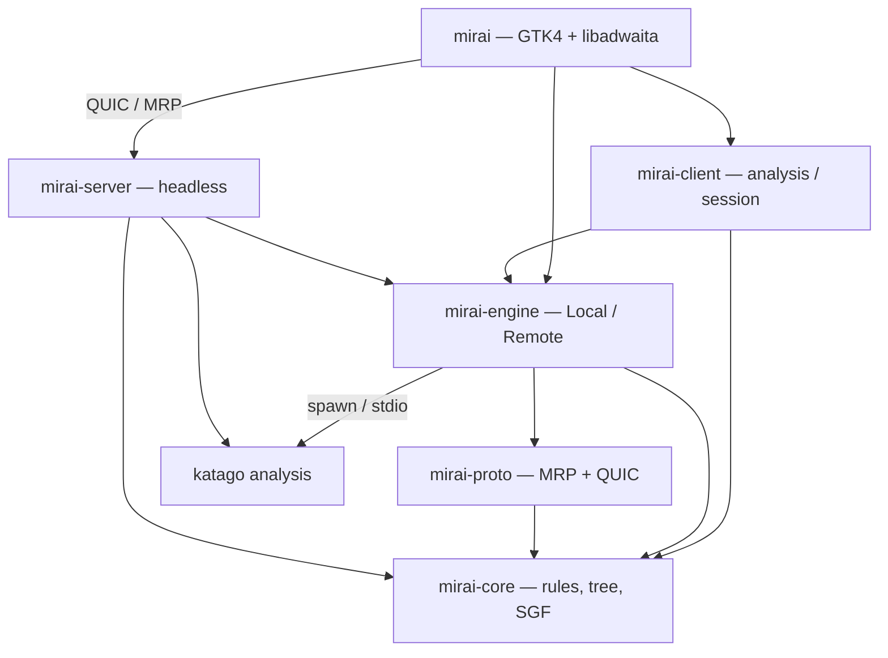
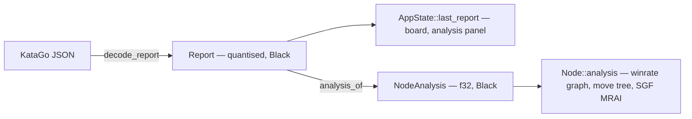
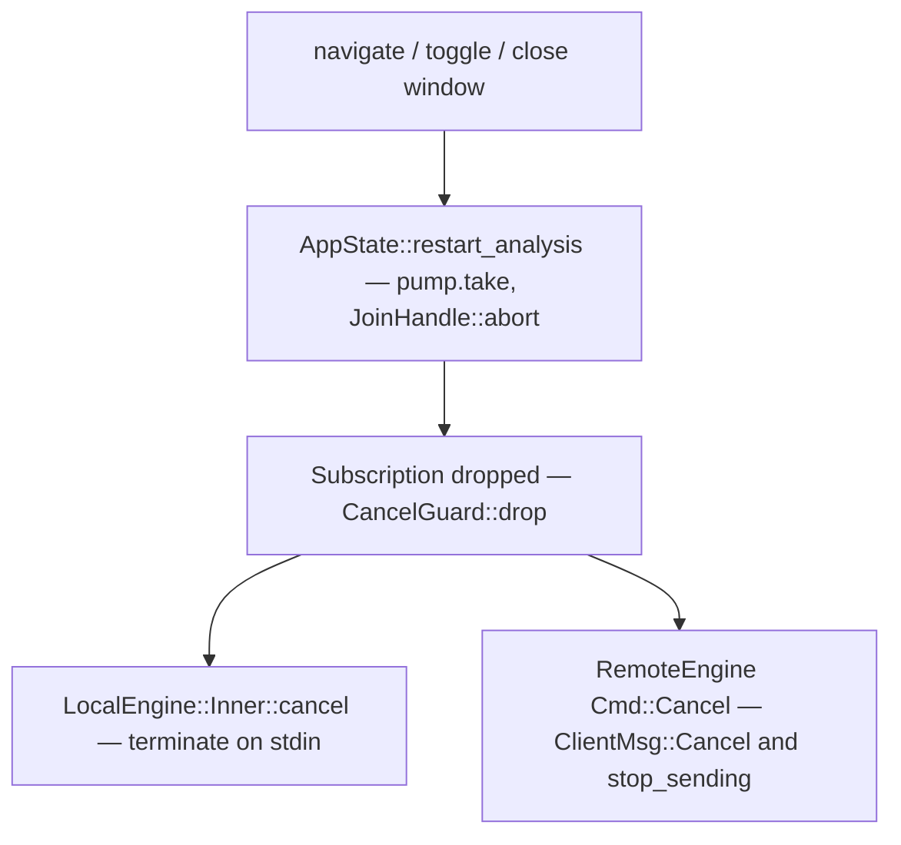
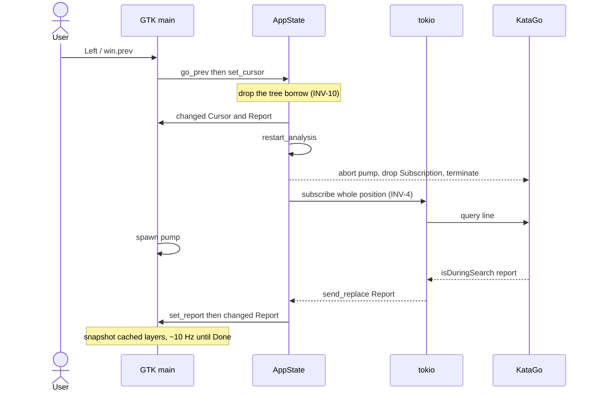

# mirai — system architecture

Contributor entry point is [`../../AGENTS.md`](../../AGENTS.md).

§3 maps tasks to files; paths there are from the repository root. Signatures and field lists
live in code. Invariants are defined in [`../../AGENTS.md`](../../AGENTS.md) §2; wire rules
live in [`PROTOCOL.md`](PROTOCOL.md).

---

## 1. The system

mirai holds a Go game record in memory and streams KataGo analysis for the current position.
`LocalEngine` drives KataGo over JSON stdio; `RemoteEngine` forwards the same request over QUIC
to `mirai-server`. Both implement `Engine` and yield `Report`; each request carries the whole
position (INV-4), so the GUI needs no engine-specific path or mirrored engine board.


```mermaid
flowchart TB
    gtk["mirai — GTK4 + libadwaita"]
    client["mirai-client — analysis / session"]
    engine["mirai-engine — Local / Remote"]
    proto["mirai-proto — MRP + QUIC"]
    core["mirai-core — rules, tree, SGF"]
    server["mirai-server — headless"]
    katago["katago analysis"]

    gtk --> client
    gtk --> engine
    client --> engine
    client --> core
    engine --> proto
    engine --> core
    proto --> core
    server --> engine
    server --> core
    engine -->|"spawn / stdio"| katago
    gtk -->|"QUIC / MRP"| server
    server --> katago
```

| crate | owns | workspace crates it uses | may **not** depend on |
|---|---|---|---|
| `mirai-core` | geometry, rulesets, legality, superko, scoring, game tree, SGF, time control | — | any workspace crate; GTK; tokio; anything doing real I/O |
| `mirai-proto` | MRP value types, messages, frame codec, QUIC transport, SHA-256 for cert pins | `mirai-core` | `mirai-engine`, `mirai`, serde_json, **anything KataGo-specific** |
| `mirai-engine` | the `Engine` trait and its two implementations; KataGo query building and response decoding | `mirai-core`, `mirai-proto` | GTK/glib/adw, `mirai`, `mirai-server` |
| `mirai-client` | shared application layer: analysis requests, sweep planning, play, record search on Fox, eWeiqi and Yike, TOFU session, stone sounds | `mirai-core`, `mirai-engine` (`remote` feature) | GTK/glib/adw, `mirai`, `mirai-server`, KataGo JSON |
| `mirai-server` | headless host: one KataGo per configured engine, multiplexed across clients, token auth | `mirai-core`, `mirai-engine`, `mirai-proto` | GTK, `mirai` |
| `mirai` | `AppState`, window, custom `gsk` widgets, GTK adapters over `mirai-client`, preferences, config | all four libraries | — |

Third-party dependencies are each crate's `Cargo.toml`, with versions pinned in the root
`[workspace.dependencies]`. `mirai` and `mirai-server` are binaries; nothing depends on either.

---

## 2. Design decisions that shape everything

### 2.1 The KataGo JSON analysis engine, never GTP — and stateless queries (INV-4)

JSON analysis, never GTP or `analyzeTurns`: each query is the whole position (INV-4), so
navigation and multiplexing need no mirrored board. Search does not persist across cursor moves.

### 2.2 mirai generates KataGo's analysis config

mirai owns the managed config, using static defaults rather than unasked hardware detection
(`EngineTuning::render` in `crates/mirai-engine/src/tuning.rs`).
A user-supplied file is left unchanged; only its two thread counts get tuning overrides
(`LocalEngineConfig::apply_config_overrides` in `crates/mirai-engine/src/local.rs`).

Calibration is opt-in (`crates/mirai-engine/src/calibrate.rs`). Preferences releases the
usual engine and refuses calibration while another window, startup or whole-game analysis
could compete for the GPU (`crates/mirai/src/prefs.rs`).

### 2.3 `tokio::sync::watch` for subscriptions — a lagging consumer *should* skip

`Subscription` uses `watch` and `send_replace` so an unread report is superseded rather than
queued. A lagging consumer skips intermediate reports; do not treat this stream as a log.

### 2.4 Ownership independent of overlays

Ownership is still requested when its overlay is off: score estimates and stored analysis
use it. Rendering decisions and measurements live in [`RENDERING.md`](RENDERING.md).

---

## 3. Module map

Paths are from the repository root; `play.rs` and `batch.rs` each exist in two crates. Crate
boundaries are [§1](#1-the-system). User settings and shortcuts are in
[GUIDE §§8–9](../user/GUIDE.md#8-settings-reference).

### Quick index

| I want to… | source | key entry |
|---|---|---|
| encode a point, or convert GTP / SGF | `crates/mirai-core/src/point.rs` | `Point`, `Size` (INV-1) |
| choose a ruleset | `crates/mirai-core/src/rules.rs` | `RuleSet` |
| play a stone, test legality, or touch Zobrist | `crates/mirai-core/src/board.rs` | `Board::play` |
| score a finished position, or place a handicap | `crates/mirai-core/src/score.rs`, `crates/mirai-core/src/handicap.rs` | `score`, `DeadSet::from_ownership`; `fixed_handicap` |
| time control or a thinking budget | `crates/mirai-core/src/clock.rs` | `TimeControl`, `think_budget` |
| the game record, position cache, or superko | `crates/mirai-core/src/tree.rs` | `GameTree`, `position` |
| an SGF property, or cached `MRAI` | `crates/mirai-core/src/sgf.rs` | `parse`, `write`, `is_root_info_prop` |
| a wire value, scale, or perspective conversion | `crates/mirai-proto/src/types.rs` | `AnalyzeReq`, `Report`, `winrate_for`; [wire spec](PROTOCOL.md#7-value-types-and-quantisation) |
| a protocol message | `crates/mirai-proto/src/msg.rs` | `ClientMsg`, `ServerMsg`, `SubMsg`, then [PROTOCOL](PROTOCOL.md) |
| framing, QUIC, a `mirai://` URL, or a cert pin | `crates/mirai-proto/src/frame.rs`, `crates/mirai-proto/src/transport.rs`, `crates/mirai-proto/src/endpoint.rs`, `crates/mirai-proto/src/sha256.rs` | `read_msg`, `connect`, `parse_url`, `fingerprint` |
| the engine contract | `crates/mirai-engine/src/lib.rs` | `Engine::subscribe` |
| a KataGo query field, or how a response is read | `crates/mirai-engine/src/query.rs`, `crates/mirai-engine/src/decode.rs` | `build_query`, `decode_report` |
| the KataGo command line or its overrides | `crates/mirai-engine/src/local.rs` | `LocalEngine::spawn`, `apply_config_overrides`, `override_config` |
| the generated analysis config, or automatic tuning | `crates/mirai-engine/src/tuning.rs`, `crates/mirai-engine/src/calibrate.rs` | `EngineTuning::render`, `calibrate` |
| a remote engine connection | `crates/mirai-engine/src/remote.rs` | `RemoteEngine::connect` |
| drive an engine with no GUI, or regenerate the self-play fixture | `crates/mirai-engine/examples/probe.rs`, `crates/mirai-engine/examples/sweep.rs`, `crates/mirai-client/examples/selfplay.rs` | [TESTING §4](TESTING.md#4-verifying-against-a-real-engine) |
| build an analysis request, or store a report | `crates/mirai-client/src/analysis.rs` | `request_for_node`, `analysis_of` |
| the search-speed reading | `crates/mirai-client/src/analysis.rs`, `crates/mirai/src/util.rs`, `crates/mirai/src/panels/analysis.rs` | `SpeedMeter`, `visits_per_second`, `Headline::speed` |
| sweep a game, or decide what counts as a blunder | `crates/mirai-client/src/batch.rs` | `plan_mainline`, `sweep`, `blunders`, `BLUNDER_MIN_DROP` |
| move the cursor, undo, or remember the Save path | `crates/mirai-client/src/game/mod.rs`, `crates/mirai-client/src/game/history.rs` | `GameSession` |
| trust a remote certificate before analysis | `crates/mirai-client/src/session.rs` | `Session` |
| choose an AI move, resign, or advance a clock | `crates/mirai-client/src/play.rs`, `crates/mirai/src/play.rs` | `select_move_index`, `resign_check`, `PlayController` |
| search a server for public records: the steps, and the row every server's list becomes | `crates/mirai-client/src/kifu.rs` | `Fetch`, `players`, `games`, `download`, `Record`; a numeric query is an id, and only Yike can name several players |
| one server's HTTP or SGF dialect | `crates/mirai-client/src/fox.rs`, `crates/mirai-client/src/eweiqi.rs`, `crates/mirai-client/src/yike.rs` | `normalize_fox_sgf`, `eweiqi::parse_record` (GIB), `yike::result_text`; the [Fox](FOX_KIFU_API_SPEC.md), [eWeiqi](EWEIQI_KIFU_API_SPEC.md) and [Yike](YIKE_KIFU_API_SPEC.md) specs |
| the record picker | `crates/mirai/src/kifu.rs`, `crates/mirai/src/kifu_picker.rs`, `crates/mirai/src/kifu_picker.blp` | `present`, `KifuPickerDialog::show_page`, `SearchHistory`, `Soup` (the libsoup `Fetch`) |
| the headless server, or `server.toml` | `crates/mirai-server/src/main.rs`, `crates/mirai-server/src/session.rs`, `crates/mirai-server/src/config.rs`, `crates/mirai-server/server.example.toml` | `run`, `serve`, `ServerConfig::load` |
| per-window state, or which `Change` fires | `crates/mirai/src/app.rs`, `crates/mirai/src/window.rs` | `AppState`, `Change`, `handle_change` |
| share one KataGo across windows | `crates/mirai/src/engines.rs` | `EnginePool::acquire` |
| client settings on disk | `crates/mirai/src/config.rs` | `Config::load`, `AnalysisSettings`; [user reference](../user/GUIDE.md#8-settings-reference) |
| candidate colour, visit grey-out, or the rank badge | `crates/mirai/src/palette.rs` | `colour`, `GRADE_RAMP`, `TRUSTED_VISITS`; [rationale](CANDIDATE_COLOUR.md) |
| an ownership or policy heat map | `crates/mirai/src/widgets/board.rs`, `crates/mirai/src/widgets/paint.rs` | `ownership_texture`, `policy_texture`, `fill_disc` |
| a shortcut, or what an action does | `crates/mirai/src/window.rs` | `install_actions`; [user reference](../user/GUIDE.md#9-keyboard-reference) |
| show or hide the editor toolbar | `crates/mirai/src/window.blp`, `crates/mirai/src/window.rs` | `editor_revealer`, `set_editor_visible` |
| the move-tree layout | `crates/mirai/src/widgets/tree.rs` | `lay_out` |
| the move-tree node menu (main line, delete branch) | `crates/mirai/src/widgets/tree.rs` | `MoveTreeView::show_menu_at` |
| the win-rate graph | `crates/mirai/src/widgets/winrate.rs` | `WinrateGraph::refresh` |
| blunder colour, or the list row | `crates/mirai/src/widgets/winrate.rs`, `crates/mirai/src/panels/analysis.rs` | `severity_of_drop`, `update_blunder_row` |
| the analysis sidebar | `crates/mirai/src/panels/analysis.rs`, `crates/mirai/src/panels/analysis.blp` | `refresh`, `set_detailed_columns`, `set_blunders` |
| the static window, or another Blueprint template | `crates/mirai/src/window.blp`, `crates/mirai/src/window_shell.rs` | `MiraiWindow` template |
| preferences, including automatic tuning in the editor | `crates/mirai/src/prefs.rs`, `crates/mirai/src/preferences.blp`, `crates/mirai/src/profile_editor.rs` | `present`, `CalibrationRun` |
| a score, fingerprint, new-game, or label dialog | `crates/mirai/src/dialogs.rs`, `crates/mirai/src/new_game.rs`, `crates/mirai/src/label_editor.rs` | `show_score_with`, `confirm_fingerprint`, `present` |
| drive the real GUI, or count frames | `crates/mirai/src/harness.rs`, `crates/mirai/src/render_probe.rs` | [TESTING §5](TESTING.md#5-testing-the-gui) |
| process lifetime, the runtime, or shutdown | `crates/mirai/src/main.rs`, `crates/mirai/src/application_shell.rs` | `MiraiApplication` |
| the GTK thread's clock floor, or fonts loaded ahead of CJK text | `crates/mirai/src/ui_thread.rs`, `crates/mirai/src/font_warmup.rs` | `request_clock_floor`, `schedule`; [RENDERING §8](RENDERING.md#8-dialogs-lists-and-a-160-hz-budget) |
| a dialog's open and close animation | `crates/mirai/src/widgets/sheet_texture.rs` | `install`; [RENDERING §8](RENDERING.md#8-dialogs-lists-and-a-160-hz-budget) |
| the stone click or capture sound | `crates/mirai-client/src/sound.rs` (what sounds, the clips), `crates/mirai/src/sound.rs` (playback) | `stone_sound`, `render`, `StoneSounds::cursor_moved` |
| whole-game analysis from the window | `crates/mirai/src/batch.rs` | `BatchAnalysis` |
| mark a string for translation, or word a value the GTK-free crates keep in English | `crates/mirai/src/i18n.rs`, `po/`, `tools/i18n/update-po.sh` | `gettext_f`, `rules_label`, `result_phrase`; [TRANSLATING](TRANSLATING.md) |

Other resources: `crates/mirai/resources/style.css`, `mirai.gresource.xml` and
`crates/mirai/build.rs`, which also compiles `po/`. The desktop entry and metainfo are
templates in `data/`. README images are release assets, not tracked files:
`tools/docs/upload-readme-assets.sh`. Rendering decisions are in
[`RENDERING.md`](RENDERING.md).

---

## 4. Data model

### Board: Zobrist and ko

One `[[u64; 361]; 2]` table (colour-major, then point index) seeded from a fixed constant through
`SplitMix64`. The fixed seed is a contract, not a detail: hashes must be reproducible across runs
and machines. The private `put` XORs the old stone out and the new one in, so the hash is
incremental and `Board::play` never rehashes. Turn parity is folded in at read time —
`situational_hash(to_play)` is the positional hash, XOR `WHITE_TO_MOVE_HASH` for White — so both
superko histories come off one hash pipeline.

Superko is split deliberately across two levels:

| ko rule | enforced by | how |
|---|---|---|
| `Ko::Simple` | `Board` | `ko_ban`, set only when a move captures exactly one stone leaving a single-stone, single-liberty chain; checked in `is_legal` and `play` |
| `Ko::Positional` | `GameTree` | candidate board's Zobrist looked up in `Position::hash_history` |
| `Ko::Situational` | `GameTree` | candidate's `situational_hash(other colour)` looked up in `Position::situational_history` |

`Board::is_legal` cannot see superko — that needs a whole game's history — so a legality check
outside the tree is incomplete by design. A pass cannot repeat a position by itself and is exempt.
Suicide is legal only under `multi_stone_suicide` and only for chains larger than one stone.

### GameTree: arena, tombstones, revision, position cache

`NodeId` addresses nodes in an arena without borrowing the tree. `detach_branch` tombstones a
subtree without cloning; `restore_branch` restores the same ids and sibling index.
`delete_branch` drops a detached branch. Use `get`/`contains` when an id may be tombstoned:
`node(id)` panics. `len()` counts live nodes, not arena slots. Mutations bump `revision()`;
changes to the shape of the tree also bump `structure_revision()`, which `MoveTreeView` keys
its layout on so a comment or mark does not relayout it.

`Position` is derived state: board, side to move, move number and superko histories.
`position(id)` returns a cached position for the same id, applies one node if the cache is
at its parent (the O(1) forward-navigation path), or replays `path_to(id)` from the root.
Backwards navigation replays because `Board::play` cannot reverse captures; undoable positions
would cost more than the few hundred microseconds a replay takes. `position` takes `&mut self`,
so `AppState` offers `with_tree_cached` to read-only callers.

`step` applies setup, the handicap turn flip, the move, then `PL`/`MN` overrides and hashes.
Non-empty setup clears the superko histories and ko ban; a pure `PL` changes only `to_play`.
The tree owns structure, not public `Node` content; `children[0]` is the main line.
`has_content` includes moves, setup, marks, explicit `PL` and non-whitespace comments, which
autosave and crash restore use. Stored lines are displayed even if a move is illegal.

### NodeAnalysis and Candidate

`NodeAnalysis` is stored, dequantised Black-perspective evaluation with at most 50 candidates
(`AnalysisSettings::stored_suggestion_limit`); ownership remains quantised. It keeps the graph
and move tree available after the live `Report` is gone. `analysis_of` converts a `Report`;
`AppState::set_report` stores the result only when it has more visits than what the node holds
(`replaces_stored_analysis`), so early pondering cannot overwrite a finished sweep, and
`GameSession::set_analysis_at` refuses it if the `position_revision` it was requested at is
stale. `last_report` remains quantised and is discarded on cursor or position changes. Marks
and comments do not bump `position_revision`.


```mermaid
flowchart LR
    json["KataGo JSON"] -->|"decode_report"| report["Report — quantised, Black"]
    report --> live["AppState::last_report — board, analysis panel"]
    report -->|"analysis_of"| stored["NodeAnalysis — f32, Black"]
    stored --> node["Node::analysis — winrate graph, move tree, SGF MRAI"]
```

### SGF mapping

`build` reads SGF into `GameInfo` and `Node`; `write_node` writes it
(`crates/mirai-core/src/sgf.rs`). `B`/`W` empty values and `tt` on boards ≤ 19 are passes;
`AB`/`AW`/`AE` rectangles expand on read, and composed `LB` labels escape `:` on write.
`MRAI` carries cached analysis as described below.

Unmodelled properties stay on `Node::unknown_props` and survive a round trip, including
other tools' analysis. Root properties that mirai models or regenerates must instead be
excluded by `is_root_info_prop`, or writing echoes them twice. Add new root properties there.

**`MRAI`** carries cached analysis on one root property:

```
MRAI[ base64( zstd( MRAI_VERSION ++ postcard(Vec<(u32, NodeAnalysis)>) ) ) ]
                                     └─ u32 = the node's index in document order
```

`collect_analysis` walks in the order `write_sequence` emits and `build` creates nodes in
document pre-order, so the recorded index is the `NodeId` assigned on reload. Decoding
ignores foreign, truncated or future-versioned blobs and vanished indices, and drops
off-board candidate/PV points. Writing is opt-in via `AnalysisSettings::save_in_sgf`
(off by default). `sgf::root_property` must find `CA` in raw collection-root bytes before
decoding text: the first game's root wins, or a later root if it has no `CA`; comments and
variations do not count. `MAX_DEPTH` caps nesting in hostile files.

---

## 5. Concurrency and threading

### Two schedulers, one process

GTK owns widgets and `AppState` (including the `RefCell<GameTree>`); tokio runs engine I/O and
blocking work. A single runtime is built in `main`; `AppState` holds its `Handle`. Once
`application.run()` returns, `shutdown_timeout` lets dropped engines exit. Tokio threads
never touch `AppState` or the tree.

### The two crossings

**GUI → runtime for a one-shot result:** `runtime().spawn` + a `oneshot` +
`glib::spawn_future_local` to land the result back on the main context. The canonical instance is
`AppState::activate_profile`. Its `activation` counter is mandatory, not decorative: a local
KataGo takes seconds to load its net, so an older activation can complete *after* a newer one and
would otherwise install itself over it. Copy the whole pattern, counter included, for any new
slow operation that installs state.

**Runtime → GUI for a stream:** `Engine::subscribe` is synchronous — it returns a handle
immediately and the engine's own tasks do the work — and the GUI then awaits
`Subscription::next()` inside a `glib::spawn_future_local`, so every report is handled on the main
thread.

### What must not happen on the main thread (INV-11)

- **No `block_on`, `blocking_recv`, thread joins or engine startup.** A cold KataGo OpenCL
  handshake can take minutes; use the oneshot crossing above.
- **No waiting synchronously for a subscription.** `finish()` belongs to the probe and server,
  not GUI handlers.
- **No synced write, directory scan or `PATH` search.** Config save, autosave, opening an
  SGF file (read and parse), KataGo discovery, the saved record searches, the TLS trust store
  the first lookup would load, and crash-leftover scanning run on `spawn_blocking` and
  return through the weak window. A pasted record is already in memory and is parsed in
  place. `write_atomic*` syncs the file and directory (50–100 ms on an ordinary
  disk). `flush_config` on close and user-initiated Save remain synchronous: a subsequent
  reader must see the former, while moving Save would need autosave's document-token snapshot
  and exit gate to avoid being overtaken by quit.

### The cancellation chain (INV-3)

For a consumer there is one cancellation mechanism — **drop the `Subscription`** — and
everything else is plumbing that leads to that drop.


```mermaid
flowchart TB
    trigger["navigate / toggle / close window"]
    restart["AppState::restart_analysis — pump.take, JoinHandle::abort"]
    dropSub["Subscription dropped — CancelGuard::drop"]
    local["LocalEngine::Inner::cancel — terminate on stdin"]
    remote["RemoteEngine Cmd::Cancel — ClientMsg::Cancel and stop_sending"]

    trigger --> restart --> dropSub
    dropSub --> local
    dropSub --> remote
```

`AppState`'s `generation` counter is a belt-and-braces guard so a pump already inside
`next().await` exits instead of writing a stale report; it is not the cancellation mechanism.
Server-side `session.rs` drops its `Subscription` when the pump exits. A graceful disconnect
can trigger this promptly; an abruptly killed client sends no close, so cleanup waits until
QUIC detects the loss at its idle timeout (`mirai-proto/src/transport.rs`).

Other participants follow the same ownership rule: score and play tasks, plus the batch
coordinator's runtime task, are aborted by their owning window/controller. Dropping those tasks
drops every in-flight `Subscription`; there is no parallel query-cancellation API.

The engine also reaches its internal cancel on its own when it ends a subscription whose search
may still be running: `RemoteEngine` for a report it rejects (`Routed::Reject`), `LocalEngine`
for a response it cannot decode. That is not a second mechanism — it is the same `terminate` /
`Cancel`, not reachable by consumers — and it is required: a subscription the consumer sees as
failed would otherwise leave KataGo searching to its visit cap.

### One live-analysis cycle: pressing Left


```mermaid
sequenceDiagram
    actor User
    participant GTK as GTK main
    participant App as AppState
    participant Tokio as tokio
    participant KG as KataGo

    User->>GTK: Left / win.prev
    GTK->>App: go_prev then set_cursor
    Note over App: drop the tree borrow (INV-10)
    App->>GTK: changed Cursor and Report
    App->>App: restart_analysis
    App-->>KG: abort pump, drop Subscription, terminate
    App->>Tokio: subscribe whole position (INV-4)
    Tokio->>KG: query line
    GTK->>GTK: spawn pump
    KG-->>Tokio: isDuringSearch report
    Tokio-->>App: send_replace Report
    App->>GTK: set_report then changed Report
    Note over GTK: snapshot cached layers, ~10 Hz until Done
```

Two properties to internalise: the board never asks an engine for anything — it reads `AppState`
— and a report that arrives after the cursor moved cannot be drawn, because the pump that would
deliver it was aborted and its generation no longer matches. A setup or `PL` edit also bumps
`position_revision`, so a late `set_analysis_at` for the old board is refused; whole-game
analysis and score estimate use the same gate.

---

## 6. Engine layer

`Engine::subscribe` returns a handle immediately; asynchronous errors become failed
subscriptions, giving GTK handlers one code path. `SubEvent` coalesces reports but preserves
terminal `Done`/`Failed`. `Subscription::finish` checks the current state first to avoid
waiting forever on an already-finished query. `CancelGuard` performs INV-3 on drop.
`Startup` and `EngineExited` clear the GUI's active engine; other errors are survivable.

### LocalEngine

The command line is built in `LocalEngine::spawn`:

```
<katago> analysis -model <model> -config <config> -quit-without-waiting
                  -override-config <k=v,k=v,…>
```

stdio is piped, with `kill_on_drop` set. Forced overrides live in `override_config`
(`crates/mirai-engine/src/local.rs`). Profile tuning follows
[§2.2](#22-mirai-generates-katagos-analysis-config).

**Handshake as readiness probe.** Two action queries (`query_version`, `query_models`) are written
before anything else and `handshake` reads until both are answered; KataGo only answers once its
model is loaded, so "handshake done" *is* "ready". Non-JSON banner lines are ignored. A
`query_models` rejection is tolerated with a warning (the action is newer than the rest of the
protocol); any other query error or engine fault aborts the start. `has_human_model` is derived
here and gates the Human-like strength option. The timeout is `LocalEngineConfig::startup_timeout`
— minutes by default, because a cold OpenCL install tunes itself — and on failure the child is
killed and the error carries the tail of stderr.

**Three tasks plus a stderr drain.** The *writer* drains an unbounded channel of query lines and
flushes once per batch; returning closes KataGo's stdin, which with `-quit-without-waiting` asks
it to quit. The *reader* line-splits stdout into `Inner::handle`, holding only a `Weak`, so it
exits when the engine handle drops. The *supervisor* selects on process exit and a shutdown
oneshot: on handle drop it waits a short grace period and then kills, and on exit it marks the
engine dead under the subscription mutex and fails every live subscription. The *stderr drain*
logs each line and keeps a bounded ring for error messages.

**Routing.** One mutex guards a map from monotonic query ids to report senders and decode
parameters; no lock spans `.await`. At about ten reports/s per live query, a plain mutex
lookup measured ~18 ns versus ~20 ns with sharded `DashMap` (writers up to 1000/s);
parsing a report takes tens of microseconds. `subscribe` checks `dead` under the same lock
the supervisor uses to mark exit and fail all entries, so none remain `Pending`.
Terminal reports and cancellation remove the entry before delivering the event or sending
`terminate`. A decode failure must also terminate explicitly: its entry is gone, so dropping
the consumer would otherwise leave KataGo running to the visit cap. Final lines from
terminated queries, including `noResults`, may then arrive with an unknown id.

### RemoteEngine

Same trait, same reports, over QUIC. One background task owns the connection, the control stream
and the subscription table; the handle only sends commands down an unbounded channel, which is how
`subscribe` stays synchronous. Per-connection reader tasks feed the owner: one for the control
stream, one acceptor for server-opened unidirectional streams, and one per subscription that reads
the 4-byte id preamble and then `SubMsg` frames. Dropping the handle drops a oneshot, which is what
stops the task.

`handshake` connects only with a pin the user has already accepted, sends `Hello`, awaits
`Welcome`, then resolves the requested engine name against the server's list. There is no
unpinned connect: `probe_fingerprint` does the TLS handshake, returns the leaf fingerprint
and closes with application code 0, and the token is sent only on the later pinned
connection. Its error classification is load-bearing: `EngineError::Protocol` means
reconnecting cannot help (bad token, version mismatch, fingerprint mismatch), `Disconnected`
means retry. Backoff doubles from 0.5 s to a cap of 8 s (`MAX_BACKOFF_MS`); while waiting,
commands are still answered so the handle never deadlocks. `RemoteStatus::Failed` is sticky for
unfixable causes so the UI can say something truthful instead of spinning, while the task keeps
retrying at maximum backoff in case the server is fixed and restarted.

**No subscription replay.** On connection loss every live subscription fails with `Disconnected`
and is forgotten, and requests made while the link is down fail immediately rather than queueing.
That is INV-4 again: the GUI knows which node the user is looking at *now* and re-requests that
one once `RemoteStatus::Connected` returns, whereas a queued stale query would only burn the
server's search threads. `EnginePool` keeps a remote engine's status receiver beside it, and
each window's `AppState` follows the one for its own engine: on a return it restarts live
analysis and emits `Change::Reconnected`, which retries a stalled play turn. Reconnects reuse
the accepted fingerprint and the *resolved* engine name, so a server that gains engines later
cannot silently switch the client to a different one.

---

## 7. GUI architecture

### AppState is the only source of truth (INV-7)

`AppState` owns each window's `GameSession`, config, engine, last report and analysis pump.
Widgets consume its state and notifications; they do not own sibling widgets. A shared value
belongs on `AppState`, and widget operations go through its methods or `win.*` actions (INV-7).

`live-analysis`, `ownership-overlay` and `policy-overlay` have hand-written setters that call
`notify_*()`; only these setters use `explicit_notify`. Applying it to a derive-generated setter
silences `notify::` handlers and property bindings. The overlays exclude each other, and
enabling policy restarts analysis to request the policy array.

**Change dispatcher.** `AppState` has one `ChangeHook`, installed once by `window::present`.
Mutations call `changed(Change::…)`; `window::handle_change` performs the complete ordered UI
refresh. This avoids several independently ordered signal callbacks observing half-updated state.

| change | emitted by | dispatcher consequence |
|---|---|---|
| `BeforeEdit` | cursor movement or edit | flush comment into its own history item before mutation |
| `Edit { positions_changed, structure_changed }` | changed record | cancel batch; abort score on position change; update undo/redo |
| `Editor` | tool change, record adoption | reveal non-Play tool; update toolbar and board preview |
| `Tree` | position/structure edit or completed/cancelled sweep | rebuild board, tree, graph, blunders and analysis projections |
| `Marks` | mark edit or metadata undo/redo | refresh board marks only |
| `Cursor { project }` | navigation or play | load comment/clocks; refresh board and graph cursor only if `Tree` did not already project them |
| `Report` | live report or cursor clearing it | refresh board textures and analysis rows, not graph or navigation |
| `Samples` | stored analysis changed | refresh graph samples, retaining unchanged GSK base |
| `StoneVolume` | Stone Sounds slider | mute at once; otherwise rebuild the clips 250 ms after the slider rests |
| `Engine` | engine or profile change | refresh engine menu, panel and subtitle; retry play if ready |
| `Reconnected` | remote link restored | retry stalled play turn |
| `Toast(String)` | toast request | show one toast |
| `Play` | play state changed | refresh clocks and controls; lock editor during play |
| `BatchProgress` | sweep progress | throttle graph/blunder refresh to 250 ms; final `Tree` refresh on exit |

Ordering remains explicit: cursor state is current before `Report`, and every tree borrow is
released before `changed` enters window code.

### Surfaces, rows and native controls

Keep native Adwaita surfaces and theme colours rather than custom literals. The sidebar
comes from `Adw.OverlaySplitView`, the board surround from `.board-area`/
`@window_bg_color`, and the graph leaves its background transparent. The General page's
`Adw.ComboRow` must project the mutually exclusive overlay booleans so preferences, menu
and undo stay in sync (`overlay_row` in `crates/mirai/src/prefs.rs`).

Candidate objects are updated in place with `gtk::Expression` bindings: replacing the
model on each report drops hover and triggers relayout. Hiding Loss/Prior resets a sort on
either column to rank. The badge number is KataGo `order`, but its colour is the separate
grade ([`CANDIDATE_COLOUR.md`](CANDIDATE_COLOUR.md)), cut to the same level
(`palette::colour_level`, eight per segment) its blob is drawn at, so the two are one colour.
Blunder rows likewise update in place. The title stays in the list's ink; the loss is a
`mirai-rank` badge in the grade class of its `Severity::ramp_stop` (`palette::stop_level`), the
graph tick's hex.

The graph is the sole Black-perspective root readout; candidate rows and the analysis
status line use side-to-move values (INV-2). Duplicating root figures in the panel would
show one value in two perspectives.

### Widget tree

Static layout is [`crates/mirai/src/window.blp`](../../crates/mirai/src/window.blp). The user's
map of regions and mouse behaviour is [GUIDE §3](../user/GUIDE.md#3-the-interface).

A Blueprint file is a template when it has a widget class carrying Rust state
(`CompositeTemplate`). A fixed dialog with no class of its own — the restore and tuning
alerts — is listed in `BUILDER_UI` in `crates/mirai/build.rs`, compiled to `$OUT_DIR/ui`, and
built on demand with `gtk::Builder::from_string`. Values that come from Rust constants or
enums (spin ranges, the rule list) and the keyboard shortcuts dialog, which reads
`window::SHORTCUTS`, stay in Rust.

Board navigation and the play bar sit beneath the board, not across the window; the
sidebar reaches the bottom. `editor_revealer` starts revealed. `set_editor_visible` is
its only writer: a non-Play tool reveals it, returning to Play does not undo a user's
manual expansion, and active play closes it and disables its toggle.

`update_analysis_page` shows an empty-state page only with no configured profile, live
report or cached analysis on the node; cached `MRAI` can populate the panel, but cannot
supply a live search-speed figure.

The graph `Paned` does not shrink either child. An unset divider would size the graph
from its minimum request, so `WinrateGraph` pins its remembered `ui.graph_height` until
first allocation, fixes the divider there, then releases its minimum to 80 px so users
can drag it both ways. `Ui::drop` persists the last allocated height. `fit_default_size`
makes a new window 85% of the shortest monitor's height, at most 1080 px, and exactly as wide
as the square board that leaves plus the sidebar, so no bare background shows beside it;
the editing tools start revealed, so their row is part of the measured chrome. Play/scoring
hides the graph, navigation and sidebar; finishing restores their prior state. `sync_graph`
combines the user's `ui.show_graph` preference with whether play is active.

Keep the sidebar header's default `show-title` (otherwise its switcher disappears).
Sidebar widths are 300 sp normally and 386 sp with Loss/Prior. Candidate cell width
requests stay fixed so changing figures do not remeasure the list on every report.

### Actions and shortcuts

Every user-triggerable operation is a `win.*` action registered in `install_actions`, so the
menu, the buttons, the shortcuts, the shortcuts window and the debug harness all drive the
same code. Add an action there and its key to `SHORTCUTS` in `window.rs`; never wire a
button's `clicked` directly to logic.

A shortcut's `KeyScope` decides who sees the key first. GTK runs application accelerators
globally in the window's capture phase, ahead of the focused widget, so `Global` is only for
combinations no text field uses (Ctrl+S, Ctrl+O, F9). Everything else is `View`: a local
`GtkShortcutController` on the window in the bubble phase, which a comment, label or search
field pre-empts by using the key. Ctrl+Z and Ctrl+Shift+Z are swallowed while a text field
has focus even when its own history is empty, so undo never falls through to the record. A
menu item whose shortcut is `View` names it with an `accel` attribute in `window.blp`, since
no accelerator exists for the menu to find. Pressing the board, graph or move tree clears the
window's focus (`widgets::release_focus`), handing the keys back after typing; they are not
Tab stops, having no keys of their own.

### Dialog lifetime

Preferences, New Game and the record picker are kept in `Ui` because rebuilding them dominated
opening cost ([RENDERING §8](RENDERING.md#8-dialogs-lists-and-a-160-hz-budget)). They go on
`destroy`, with the window, and reset or reload their rows at each presentation.

### More than one window

`activate` and `open` may create multiple windows in one process, each with its own
`AppState` (INV-7). Three shared resources need coordination:

| Shared | Rule |
|---|---|
| Engines | `EnginePool` keys entries by full `EngineProfile` and owns starts. Windows join an in-flight start; dropping one waiter cannot strand the entry. Entries are weak so KataGo exits after the last user. Remote entries retain a status receiver for every window following reconnect. Application shutdown drops the pool before the runtime, aborting in-flight starts cleanly. |
| `config.toml` | `Config::save_merged` applies only the window's diff to the current file, avoiding stale writes over another window's changes. A missing file is an empty base; other read/parse errors leave it untouched. `engine_profile` merges by name; an untouched profile keeps the file's copy, and for simultaneous edits of one name the last save wins. Debounced saves run on `spawn_blocking`; `flush_config` runs synchronously on close and before another window loads config. |
| Autosave | Each window uses `autosave-<pid>-<start>-<n>.sgf`. Clean close waits for writes then deletes it; startup offers remaining crash files most recent first. Scans, writes and SGF opening/parsing use the blocking pool. |

### Async result identity

Async work targeting the tree must carry the starting `position_revision` as well as `NodeRef`,
so an in-tree edit invalidates results even when the node still exists (INV-10).

Widgets receive projections when `Change` is dispatched. `snapshot()` borrows only widget-local
projection/cache state; it does not borrow `AppState` or replay the game tree.

---

## 8. Invariants

[`../../AGENTS.md`](../../AGENTS.md) §2 states each rule; where it crosses the wire,
[PROTOCOL](PROTOCOL.md) is normative. This table is only where each is enforced.

| INV | enforced in |
|---|---|
| **INV-1** | `crates/mirai-core/src/point.rs` (`Point`, `Size`); consumed unremapped by `BoardView::snapshot` in `crates/mirai/src/widgets/board.rs` |
| **INV-2** | `override_config` in `crates/mirai-engine/src/local.rs`; the only converters in `crates/mirai-proto/src/types.rs`; stored values via `analysis_of` in `crates/mirai-client/src/analysis.rs` |
| **INV-3** | `CancelGuard` in `crates/mirai-engine/src/lib.rs`; drop sites `AppState::restart_analysis` in `crates/mirai/src/app.rs` and `pump` in `crates/mirai-server/src/session.rs`; the engine-internal cancel in `LocalEngine::deliver` and `Routed::Reject` |
| **INV-4** | `AnalyzeReq` in `crates/mirai-proto/src/types.rs`; `request_for_node` in `crates/mirai-client/src/analysis.rs`; `build_query` in `crates/mirai-engine/src/query.rs`; re-request on reconnect in `AppState::replace_engine` |
| **INV-5** | `AnalyzeReq::komi_x2` in `crates/mirai-proto/src/types.rs` |
| **INV-6** | `crates/mirai-proto/src/types.rs`; the budget is pinned by `crates/mirai-proto/tests/wire_size.rs` |
| **INV-7** | `Change` in `crates/mirai/src/app.rs`; `handle_change` in `crates/mirai/src/window.rs` |
| **INV-8** | `with_ui`, `take_ui`, `shutdown` in `crates/mirai/src/window_shell.rs`; `Drop for Ui` in `crates/mirai/src/window.rs` |
| **INV-9** | `crates/mirai/src/widgets/` |
| **INV-10** | `changed`, `resolve_node`, `set_analysis_at` in `crates/mirai/src/app.rs`; the epoch bump is `GameSession::adopt` / `restore` in `crates/mirai-client/src/game/mod.rs` |
| **INV-11** | `runtime().spawn_blocking` at each I/O site: `AppState::save_config`, autosave and SGF open in `crates/mirai/src/window.rs`, the record search history and `warm_tls` in `crates/mirai/src/kifu.rs`, discovery in `crates/mirai/src/prefs.rs` |

---

## 9. Extension recipes

### A new engine backend

1. Implement `Engine` in a new module of `mirai-engine`; return `Subscription::new(rx, guard)`
   where the guard performs your cancellation (INV-3), and `Subscription::failed(..)` for
   pre-dispatch errors.
2. Produce `Report`s through `mirai-proto`'s quantisers, or reuse `decode_report` if the source is
   KataGo JSON. Do not invent a second report type (INV-6).
3. Re-export the type from `mirai-engine/src/lib.rs`.
4. Add a `ProfileKind` variant in `mirai/src/config.rs` (`#[serde(tag = "kind")]`, so the variant
   name is the on-disk discriminant).
5. Handle that variant in `build` in `mirai/src/engines.rs`, and check that `key` still tells
   two profiles of the new kind apart — an over-broad key shares the wrong engine.
6. Add an editor subpage in `mirai/src/prefs.rs` alongside the local and remote ones.
7. Verify with `examples/probe.rs` before touching the GUI — it exercises the trait with no GTK.

### A new sidebar panel

1. Create `mirai/src/panels/<name>.rs`; a `gtk::Box` subclass built from stock widgets is enough
   (INV-9 applies only to the custom-drawn widgets).
2. Re-export it from `panels/mod.rs`.
3. Add an `Adw.ViewStackPage` to `sidebar_stack` in `window.blp` (name, title, icon). Construct
   the panel in `window::present` with the `AppState` and, if it is a Rust widget, insert it
   into that page — the analysis panel is added to `analysis_stack` with `add_named`.
4. Add its refresh call to the appropriate arm of `window::handle_change`; do not install a
   second AppState dispatcher or accept references to sibling widgets (INV-7). Widget-internal
   selection hooks still route through the window.
5. Store any user-visible option in `UiSettings` in `mirai/src/config.rs` and copy it back in
   `AppState::capture_display_settings`, which every `save_config` runs first.

### A new board overlay

1. If the overlay needs extra engine data, add the flag to `Want` in `mirai-proto/src/types.rs`,
   map it in `build_query`, and decode it in `decode_report` into a new `Report` field.
2. Add a `bool` property to `AppState`. If enabling it changes the request, give it a hand-written
   setter that calls `restart_analysis` and `notify_*()` itself, and mark it `explicit_notify` —
   copy `policy_overlay` exactly. Otherwise use the derive-generated setter and **do not** add the
   flag.
3. Add the request bit in `AppState::restart_analysis`.
4. Build the per-point RGBA8 premultiplied texture only while the overlay is on: when the
   report projection refreshes, and when the toggle turns on (its notify already rebuilds
   the projection). Drop it when the toggle turns off. Index directly by `Point` with no
   remapping (INV-1). `snapshot()` should only append the cached texture. Do not stop
   requesting data that another surface still reads.
5. Add the property name to `BoardView::observe` so toggling rebuilds the projection.
6. Add a `win.toggle-*` action and accelerator in `install_actions`, and a `UiSettings` field so it
   survives a restart.

### A new protocol message

1. **Read [`PROTOCOL.md`](PROTOCOL.md) first** — it is normative, and it must be updated in the
   same change.
2. Add the variant to `ClientMsg`, `ServerMsg` or `SubMsg` in `mirai-proto/src/msg.rs`. Postcard
   encodes an enum by declaration index, so **append**; inserting or reordering renumbers every
   later variant and breaks every existing peer.
3. Handle it server-side in `session_loop` (`mirai-server/src/session.rs`) and client-side in
   `handle_int`/`handle_cmd` (`mirai-engine/src/remote.rs`). An unknown message must be an error
   with an `ErrCode`, never a panic.
4. Peers must match `PROTO_VERSION` exactly; the handshake rejects a mismatch with
   `ErrCode::BadVersion`. Version policy is [PROTOCOL §10](PROTOCOL.md#10-version).
5. If the message carries a report or a large payload, check `MAX_FRAME` and extend
   `tests/wire_size.rs`.

### A new SGF property

1. Decide where it lives: whole-game metadata goes on `GameInfo`, per-node data on `Node`
   (`mirai-core/src/tree.rs`).
2. Parse it in `build` in `mirai-core/src/sgf.rs`, next to the existing arm for its shape (single
   value, point list, or composed value).
3. Write it in `write_node`, before the `unknown_props` loop so ordering stays stable.
4. **If it is a root property, add it to `is_root_info_prop`.** Otherwise it will be captured into
   `unknown_props` as well and written twice.
5. Add a round-trip test: parse a file containing it, write, parse again, compare — and keep an
   unknown property in the same fixture so the preservation contract stays covered.

---

## 10. Known simplifications

Deliberate. Each is commented at the source; do not "fix" one by accident.

| simplification | where | why it is right |
|---|---|---|
| **Territory scoring counts territory plus the prisoners you hold** — captures made during the game and the opponent's dead stones in your area — rather than subtracting the prisoners you lost | the `Scoring::Territory` arm of `score` | Both formulations give the same margin, but the mirror one displays totals lower than any Japanese scorer would show. This one reproduces conventional totals |
| **Seki detection is heuristic.** A chain counts as in seki when it cannot live independently (fewer than two owned eyes, and no owned region bigger than eye space) and shares an unowned region with an enemy chain that also cannot live independently. Any eye-sized owned region counts as an eye, a false one included, so a seki with one real and one false eye goes untaxed | the `independent` and `in_seki` computations in `score`, with `MAX_EYE` | Sharing a dame alone would mis-tax the small eyes of independently alive groups under Japanese and Korean rules; telling false eyes apart is not worth its complexity for so rare a shape |
| **`Tax::All` (stone scoring) is approximated** with the `Tax::Seki` result and reports `approximate = true` | `score`, `ScoreResult::approximate` | Full stone-scoring tax is rarely used; the UI labels the result an estimate rather than pretending to exactness |
| **`has_button` is a flat +0.5 to White** | end of `score` | mirai never plays the button, so there is no game state that could decide who takes it |
| **Dead stones are decided per chain by majority vote** over an ownership threshold, not per stone | `DeadSet::from_ownership` | Per-stone marking produces speckled half-dead groups on unsettled boundaries |
| **A mid-record setup/`PL` node is a reconstruction boundary** for `AnalyzeReq`: snapshot that board as unique row-major `initialStones`, send only later real moves, and under territory scoring fold the *boundary* prisoner counts into `komi_x2` (never rewriting `KM`). Ordinary move-only games keep an unadjusted move list | `mirai_client::request_for_node` | KataGo cannot express a setup in the middle of a move list; a later setup must not discard the moves after it either |
| **Replay never rejects an illegal move** | the private `step` in `mirai-core/src/tree.rs` | A stored line is history. Refusing to display a file because it contains an illegal move would be worse than showing it |
| **`max_board` is fixed at 19x19** | `LocalEngine::spawn`'s `EngineDesc` | Stock KataGo builds cap `MAX_LEN` at 19; a larger board would need a custom build, and nothing else in the tree assumes otherwise |
| **SHA-256 is implemented in-tree** | `mirai-proto/src/sha256.rs` | under 100 lines on no hot path, versus a dependency and its API churn. Pinned by the standard test vectors |
