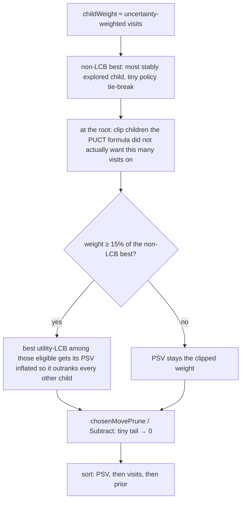

<!--
SPDX-License-Identifier: GPL-3.0-or-later
Copyright (C) 2026 Huang Zhaobin
-->

# Candidate order versus candidate colour

Why the analysis list can go cyan, yellow, green, yellow, red — and why that is
not a bug in the ramp, not always a visits problem, and not something colouring
by rank would honestly fix.

[architecture](ARCHITECTURE.md) · [testing](TESTING.md) · [user guide](../user/GUIDE.md) ·
[AGENTS.md](../../AGENTS.md).

**Current behavior:** candidates remain in KataGo's `order`; colour represents the
side-to-move utility lost relative to its pick, not visits or rank. Below ten visits a
candidate is grey; the pick is always known. Opacity represents search confidence.
The measured final decision is [§5](#5-what-shipped); §§3–4 retain the examples and
historical alternatives that led to it.

KataGo citations are against the tree at `~/KataGo` (`cpp/search/searchresults.cpp`
and friends). mirai does not vendor that code; this note is the ledger of what we
read out of it.

---

## 1. Four numbers, four jobs

For each candidate KataGo reports (and mirai stores on `MoveInfo`):

| Field | What it is | What it is for |
|---|---|---|
| `order` | 0-based rank after sorting on `playSelectionValue` | The engine's play menu. `moves[0]` is what it would play. The list is this order. |
| `winrate` / `scoreLead` | MCTS **means** of the child (Black-perspective on the wire) | "If this move is played, what does the position read?" Display columns. |
| `utility` / `utilityLcb` | KataGo's blended value, and its lower confidence bound | Live colour uses mean `utility` loss against the pick; `utilityLcb` was tried and rejected (§6). |
| `visits` / `edgeVisits` | How much search actually went here | Opacity, labels, play-mode temperature sampling's cousin. Not the sort key. |
| `playSelectionValue` | Visit-like weight, then clipped and LCB-boosted | The quantity `order` is computed from. Play mode samples `play_value ^ (1/T)`. |

Both `utility` and `utilityLcb` travel on MRP/2 (`crates/mirai-proto/src/types.rs`);
MRAI v2 caches `utility` on the tree, because that is the one the colour reads.

Colour (`crates/mirai/src/palette.rs` — `colour`) is **loss of `utility`
against `moves[0]`**, side-to-move — except below `TRUSTED_VISITS` (10), where
it is grey. Rank is still not that: `order` is play-selection value, which
reads neither the utility nor the means. So the badge number and the badge
colour disagree by design, and §3 is what that looks like.

---

## 2. How KataGo computes `order`

`Search::getAnalysisData` (`searchresults.cpp`) fills one `AnalysisData` per
child, copies `playSelectionValue` from `getPlaySelectionValues`, then
`std::stable_sort`s with `operator<` (`analysisdata.cpp`). After the sort,
`order = i`.

The comparator, in order:

1. Any move with visits > 0 beats a 0-visit policy fill.
2. Higher `playSelectionValue` wins.
3. Higher visits.
4. Higher raw policy prior.

Nothing in that comparator reads `winrate` or `scoreLead`.

### 2.1 `playSelectionValue` itself

`Search::getPlaySelectionValues` (`searchresults.cpp`). Defaults when the
analysis config is silent (`setup.cpp`): `useLcbForSelection = true`,
`lcbStdevs = 5`, `minVisitPropForLCB = 0.15`. mirai's generated config does not
set these (`mirai-engine/src/tuning.rs`), so those defaults are what we run.



More precisely:

**Start from weight, not from the mean.** Each child begins as
`child->stats.getChildWeight(edgeVisits)` — visits scaled by how confident the
net was in those playouts. Illegal moves and a suppressed pass are zero.

**The "best child" for pruning is not the best mean.** It is the maximum of
`weight * max(0, edgeVisits-1) / max(1, edgeVisits) + 2 * policy`. That prefers
a well-explored high-prior move over a one-visit spike.

**Over-visited children are clipped back.** `getReducedPlaySelectionWeight`
(`searchexplorehelpers.cpp`) asks: given this child's utility, how much weight
would PUCT have wanted relative to the best child? If the search poured more
than that, PSV is the smaller number. High-prior moves keep more weight;
low-prior moves that lucked into a hot mean get clipped. This is why a 59 %
policy move with a worse win rate still sits above a 3 % policy move with a
better one: the search *intended* to spend more on the policy favourite, and
PSV remembers that.

**LCB is a bonus on at most one move, and only if it was searched enough.**
`getSelfUtilityLCBAndRadius` (`searchhelpers.cpp`) computes, from the
side-to-move's perspective:

```
ess     = weightSum² / weightSqSum          (effective sample size)
radius = lcbStdevs * sqrt(utilityVariance / ess)
lcb     = utility - radius
```

A child is eligible only if its (already clipped) weight is at least
`minVisitPropForLCB` of the non-LCB-best's weight — **15 %** by default. Among
the eligible, the best LCB has its PSV raised until it dominates every other
child, by a factor of `(radius + excess)² / (radius + 0.2·excess)²`. Everyone
else is left alone. A thinly-searched move with a sparkling mean cannot steal
rank this way: it fails the 15 % gate, and its own LCB is wide anyway.

The JSON field `lcb` is **not** this value. `PlayUtils::getHackedLCBForWinrate`
rescales the utility radius into win-rate units for LZ-style consumers.
`utilityLcb` is the real thing.

**Zero children fall back to raw policy.** Analysis also pads with unsearched
policy moves so the list can be long; those sort last because of the visits > 0
rule.

### 2.2 What the displayed win rate *is*

`getAnalysisDataOfSingleChild` copies the child's MCTS averages
(`winLossValueAvg`, `leadAvg`, `utilityAvg`). The analysis JSON then reports
`winrate = 0.5 * (1 + winLossValue)` and `scoreLead = lead`, flipped to
`reportAnalysisWinratesAs` (mirai forces `BLACK`). Those are point estimates of
the position *after* the move. They are not what the sort used.

Root `winrate` is an average over **all** visits, so it is smoother than
`moves[0]` and can disagree with it. The graph plots the root; the panel's first
row is the pick. The panel shows no root win rate of its own.

---

## 3. The position that made this note

White to play, root 44.0 % / −0.9, 5.4k visits. First twenty candidates, loss
against D8:

| # | move | win | lead | visits | prior | Δ win vs #1 | Δ lead vs #1 | colour (loss vs #1) |
|---|---|---|---|---|---|---|---|---|
| 1 | D8 | 44.6 % | −0.8 | 4.8k | 24.7 % | 0 | 0 | cyan |
| 2 | C8 | 36.2 % | −1.5 | 404 | **59.5 %** | −8.4 % | −0.7 | yellow |
| 3 | Q4 | **38.8 %** | **−1.2** | 113 | 2.8 % | −5.8 % | −0.4 | green |
| 4 | M17 | 32.4 % | −1.6 | 31 | 3.8 % | −12.2 % | −0.8 | yellow |
| 5 | C10 | 18.0 % | −4.5 | 17 | 7.1 % | −26.6 % | −3.7 | red |
| 6 | O8 | 37.0 % | −1.6 | 12 | 0.6 % | −7.6 % | −0.8 | yellow |

Two different mismatches, stacked.

**C8 vs Q4 is not a visits-cap problem.** Both are well above 20 visits, so the
old hue ceiling would have left this pair alone. Q4's *mean* is closer to the
pick on both channels, so it paints greener. KataGo still ranks C8 above it
because C8 is the policy favourite (59 % vs 3 %) and received 3.6× the visits;
its PSV is that intended spend, not the mean. LCB did not even get a vote:
15 % of D8's weight is ~720 visits, and neither C8 (404) nor Q4 (113) qualifies.
Among everyone but the pick, order on this board *is* clipped visit-weight.

**The rainbow from #6 down was the visits-cap removal.** A 1-visit 22 % is not
a colour: those numbers move several points if the search is left running
(`TESTING.md` §4: a 1-visit score loss jumped 3.5 points between 1k and 5k root
visits at the 90th percentile). Painting them as a real loss overclaims;
painting them green under the old ceiling looked like praise. They are grey.

### 3.1 The sharper case: a lower rank that wins every visible column

Black to play, 13k visits. `#7 G12` reads 26.2 % / −1.3 on 56 visits; `#8 K3`
reads 32.6 % / −0.9 on **158** visits. K3 is ahead on win rate, on score *and*
on search, and KataGo still ranks it below G12. Nothing in the visible columns
explains it, and the colours make it louder: K3 green under G12's yellow.

The invisible column is the policy prior — G12 3.1 %, K3 0.9 %. PSV is not the
visit count; it is the visit count **clipped to what PUCT would retrospectively
have wanted** given that child's utility and prior
(`getReducedPlaySelectionWeight` → `getExploreSelectionValueInverse`,
`searchexplorehelpers.cpp`, root only). A 0.9 %-prior move that drifted to 158
visits is clipped hard; a 3.1 %-prior move at 56 visits is close to its
entitlement and keeps most of them. `order` is "how much search this move
deserved", not "how good it looks now".

This is not a rarity. Over the §6 sweep there are 381 pairs where a
lower-ranked move beats a higher-ranked one on win rate, score lead *and*
visits at once. In **all 381** the higher-ranked move has the larger prior,
median ratio 3.4×. Any colour that is a loss will disagree with `order` on
every one of them, whichever loss it is; the badge number and the badge colour
are answering two different questions and only the list order is KataGo's.

---

## 4. Options

Historical comparison: D plus E is the current choice. F was briefly shipped before
the measured sweep in §6 rejected it; the options below are not alternate UI modes.

Do not sort the list by colour. `order` is what play mode obeys
(`mirai-client/src/play.rs` — `select_move_index`) and what "the engine's
choice" means. Recolouring is the lever.

| | Scheme | List monotonic? | C8 vs Q4 | 1-visit tail | Cost |
|---|---|---|---|---|---|
| A | Rank / PSV ratio | yes, by construction | same colour family (rank 2 ≈ rank 3) | follows rank, i.e. still a colour | Hides that C10 is a 26-point-estimate collapse. This is the scheme `analysis/loss-colours` replaced. |
| B | Loss of the means vs pick, no floor | no | Q4 greener, correctly for the means | full ramp, overclaims | Honest about the columns. Weird-looking list. |
| C | Restore the visits ceiling on hue | no | unchanged (both > 20) | forced green | The complaint that opened this branch: green read as "this is fine". |
| D | Neutral colour below a visit floor (grey / wood) **(shipped)** | among the searched, still no | unchanged | "unknown", not fine and not a blunder | Opacity already faints them; grey makes the *hue* match that story. Board and list stay one table: `UNKNOWN_RGB` / `mirai-grade-unknown`. |
| E | Loss of `utility` vs pick **(shipped, behind D)** | no | Q4 still greener, correctly: it is better on both means | grey (D) | One channel, KataGo's own blend (`winLossUtilityFactor=1`, `staticScoreUtilityFactor=0.1`, `dynamicScoreUtilityFactor=0.3`). Replaces `max(wr, score)`, which was a stand-in for exactly this. Measured: the stops land on the anchors the old tables were fitted to (§6). |
| F | Loss of candidate `utilityLcb` vs pick `utilityLcb` | more often yes | Q4's extra 2.6 % fights a ~1.9× wider radius (`sqrt(404/113)`), so it stops out-greening C8 | grey (D) | Shipped first, then measured and reverted (§6): it warms a move for being thin as well as for being bad, and the grey floor already says "thin" without pretending to know by how much. |

A is the wrong question: colour would again mean "how far down the menu", which
the badge *number* already says. C is the wrong unsearched colour. E is worth
doing regardless of the list, because the two-channel `max` is an approximation
of utility. F attacks C8-vs-Q4 with a quantity KataGo actually uses, and that is
what made it tempting; the sweep it needed is §6, and it did not survive it.

---

## 5. What shipped

The list stays in KataGo's `order`. Colour is a **loss** signal, not a rank
signal, and the two are allowed to disagree.

The tail is **unknown**: below 10 visits the blob and the badge are grey
(`UNKNOWN_RGB`, class `mirai-grade-unknown`). The engine's pick is exempt —
`palette::is_known` takes the rank, so no caller can paint the reference grey.

Among searched moves the loss is **pick `utility` − candidate `utility`**,
side-to-move (`Color::utility_for`, which flips like score lead and not like a
win rate). That is scheme D in front of E. `UTILITY_AT` is in KataGo utility
(0.04 = `wideRootNoise`, 0.20 = `fpuReductionMax`, 0.50 = half a win), not a
win-rate table, and §6 measures those stops against the two tables they replace.
MRAI v2 stores `utility` on `Candidate`; v1 records still load and fall back to
`grade_means`.

Two channels, two jobs: **hue is how much the move loses, opacity is how much
search stands behind that**, and uncertainty is not allowed into the hue — that
is what `search_depth_does_not_move_the_hue_of_a_searched_move` pins.

There is exactly one search threshold. `TRUSTED_VISITS` (10) decides grey
against a colour, figures against no figures, and where the opacity ramp tops
out, so a blob earns all three at the same visit and the fade only ever applies
to a move that has no colour yet. The second constant this branch inherited —
full opacity at twenty — belonged to the hue *cap* that came off; measured
afterwards it separated 4 % of a twenty-move list and said nothing the Visits
column did not.

**Not shipped.** F (`utilityLcb`) — see §6. Do not mix D and C:
unsearched-as-green is the reading this branch already rejected.

---

## 6. The sweep that picked E over F

§4 chose F and took the thresholds from KataGo's constants without measuring
either. Measured afterwards: 42 positions from the two SGF fixtures at 5 000
root visits, 2 211 candidates, b10 net; reproduce with `examples/sweep.rs`
(`dutil` / `dlcb`) and the recipe in [`TESTING.md`](TESTING.md) §4.

**The stops land where the fitted tables already were.** `UTILITY_AT` was
argued from `wideRootNoise` / `fpuReductionMax` / half a win, but on real
positions it reproduces the win-rate and score anchors it replaced:

| Loss against the pick | Median utility loss | Stop | Old table's stop |
|---|---|---|---|
| 0.25 points | 0.034 | mint | mint (`POINTS_AT[1]`) |
| 0.75 points | 0.090 | green | green (`POINTS_AT[2]`) |
| 2 points | 0.207 | yellow | yellow (`POINTS_AT[3]`) |
| 10 % win rate | 0.193 | yellow | yellow (`WINRATE_AT[3]`) |

So orange ≈ 17 % win rate and red ≈ 25 %, against 18 % and 30 % before: the
ramp is the old one, mildly harsher at the top, in one channel instead of two.

**The confidence radius is small except at the grey line.** `utility − utilityLcb`
is `lcbStdevs * stdev / sqrt(ess)`, and it collapses fast: median 3.5 at one visit,
0.21 at 4-9, **0.063 at 10-19**, 0.037 at 20-49, 0.016 at 200-999, 0.006 above
1 000. Against the mean-utility loss of the same move that is a median +0.67 stops
at 10-19 visits, +0.38 at 20-49, +0.14 at 200-999. The first coloured band is
therefore the one to watch: **21 % of candidates at 10-19 visits paint orange or
red under F, and none of them do on their means** — a move that has only just
crossed `TRUSTED_VISITS` can enter at the warm end on uncertainty alone and cool
as the search fills it in. At 20-49 visits that is 3 %, and by 50 it is gone.
That is why the hue is the mean and not the bound. The warm end has to mean
"this move loses", and under F a fifth of the first coloured band meant "nobody
knows yet" — which the grey floor one visit earlier had just finished saying.

**F earns its keep only on the pattern it was built for.** Counting pairs where a
lower-ranked move is painted *cooler* than a higher-ranked one, among candidates
that are coloured at all (top 20):

| | all pairs | pairs where the higher rank has ≥2× the visits | ≥3× |
|---|---|---|---|
| old means + visit cap | 8.9 % | 1.4 % | 0.7 % |
| E (mean utility) | 9.1 % | 1.5 % | 0.6 % |
| **F (`utilityLcb`)** | 9.3 % | **0.7 %** | **0.2 %** |

F halves the C8-vs-Q4 pattern and is a wash everywhere else — over all pairs it
removes 111 inversions and introduces 118. It also costs stability: between 1 000
and 5 000 root visits, 23.9 % of top-10 colours move, against 21.4 % for E and
18.8 % for the old scheme, and F's changes skew *cooler* (45 against 29) because
the radius shrinks, so a board painted with F cools as the search runs without
anything having been learned. Halving a 1.5 % case is not worth buying that, nor
worth a hue that means two things at once.

**Grey is doing most of the work.** At 5 000 visits it covers 32 % of the default
ten suggestions and 45 % of twenty; at 1 000 visits, 37 % and 51 %. Every measured
improvement over the old scheme survives with E in place of F, but none of it
survives without D.
