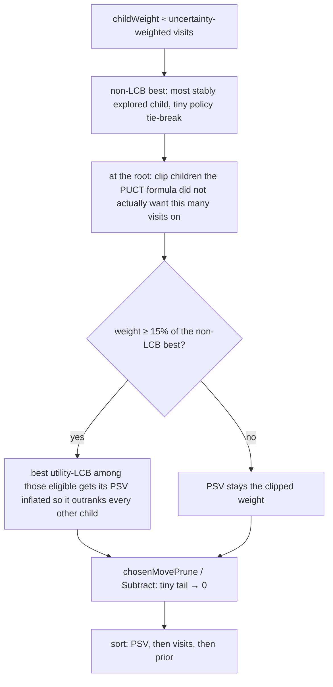

<!--
SPDX-License-Identifier: GPL-3.0-or-later
Copyright (C) 2026 Huang Zhaobin
-->

# Candidate order versus candidate colour

Why the analysis list can go cyan, yellow, green, yellow, red: KataGo ranks
moves for play, while colour measures the loss of each move's mean utility.

[architecture](ARCHITECTURE.md) · [testing](TESTING.md) · [user guide](../user/GUIDE.md) ·
[AGENTS.md](../../AGENTS.md).

Candidates remain in KataGo's `order`; colour represents side-to-move utility
lost relative to its pick. Below ten visits a candidate is grey; the pick is
always known. Opacity reflects search depth. The measurements behind the choice
are in [§6](#6-why-mean-utility-beat-the-bound).

KataGo's `cpp/search/searchresults.cpp`, `analysisdata.cpp` and
`searchexplorehelpers.cpp` are the sources for the ordering rules below; mirai
does not vendor KataGo.

---

## 1. What the list and colour measure

`order` is KataGo's rank by `playSelectionValue`, not by visits or the displayed
`winrate` and `scoreLead`. Those columns are MCTS means for the position after
the move; the graph instead plots the root mean. Mirai stores and transmits these
as Black-perspective values (INV-2). The list follows `order` because that is
KataGo's play menu; play mode also uses its play-selection weights.

The board and list colour each searched move by its side-to-move **mean utility
loss against `moves[0]`**. Below `TRUSTED_VISITS` (10), the loss is too uncertain
to colour, so the move is grey. Search depth controls opacity, not hue. See
[§5](#5-what-shipped) for the shipped rule and the MRAI v1 fallback.

---

## 2. How KataGo computes `order`

`Search::getAnalysisData` (`searchresults.cpp`) fills one `AnalysisData` per
child, copies `playSelectionValue` from `getPlaySelectionValues`, then
`std::stable_sort`s with `operator<` (`analysisdata.cpp`). After the sort,
`order = i`.

The comparator, in order:

1. Any move with visits > 0 beats a 0-visit policy fill.
2. Higher `playSelectionValue` wins.
3. Higher visits.
4. Higher raw policy prior.

Nothing in that comparator reads `winrate` or `scoreLead`.

### 2.1 `playSelectionValue` itself

`Search::getPlaySelectionValues` (`searchresults.cpp`). Defaults when the
analysis config is silent (`setup.cpp`): `useLcbForSelection = true`,
`lcbStdevs = 5`, `minVisitPropForLCB = 0.15`. mirai's generated config does not
set these (`mirai-engine/src/tuning.rs`), so those defaults are what we run.


```mermaid
flowchart TD
    W["childWeight ≈ uncertainty-weighted visits"] --> Best["non-LCB best: most stably explored child, tiny policy tie-break"]
    Best --> Clip["at the root: clip children the PUCT formula did not actually want this many visits on"]
    Clip --> LCB{"weight ≥ 15% of the non-LCB best?"}
    LCB -->|yes| Boost["best utility-LCB among those eligible gets its PSV inflated so it outranks every other child"]
    LCB -->|no| Keep["PSV stays the clipped weight"]
    Boost --> Prune["chosenMovePrune / Subtract: tiny tail → 0"]
    Keep --> Prune
    Prune --> Sort["sort: PSV, then visits, then prior"]
```

More precisely:

**Start from weight, not from the mean.** Each child begins as
`child->stats.getChildWeight(edgeVisits)` — visits scaled by how confident the
net was in those playouts. Illegal moves and a suppressed pass are zero.

**The "best child" for pruning is not the best mean.** It is the maximum of
`weight * max(0, edgeVisits-1) / max(1, edgeVisits) + 2 * policy`. That prefers
a well-explored high-prior move over a one-visit spike.

**Over-visited children are clipped back.** `getReducedPlaySelectionWeight`
(`searchexplorehelpers.cpp`) asks: given this child's utility, how much weight
would PUCT have wanted relative to the best child? If the search poured more
than that, PSV is the smaller number. High-prior moves keep more weight;
low-prior moves that lucked into a hot mean get clipped. This is why a 59 %
policy move with a worse win rate still sits above a 3 % policy move with a
better one: the search *intended* to spend more on the policy favourite, and
PSV remembers that.

**LCB is a bonus on at most one move, and only if it was searched enough.**
`getSelfUtilityLCBAndRadius` (`searchhelpers.cpp`) computes, from the
side-to-move's perspective:

```
ess     = weightSum² / weightSqSum          (effective sample size)
radius = lcbStdevs * sqrt(utilityVariance / ess)
lcb     = utility - radius
```

A child is eligible only if its (already clipped) weight is at least
`minVisitPropForLCB` of the non-LCB-best's weight — **15 %** by default. Among
the eligible, the best LCB has its PSV raised until it dominates every other
child, by a factor of `(radius + excess)² / (radius + 0.2·excess)²`. Everyone
else is left alone. A thinly-searched move with a sparkling mean cannot steal
rank this way: it fails the 15 % gate, and its own LCB is wide anyway.

The JSON field `lcb` is **not** this value. `PlayUtils::getHackedLCBForWinrate`
rescales the utility radius into win-rate units for LZ-style consumers.
`utilityLcb` is the real thing.

**Zero children fall back to raw policy.** Analysis also pads with unsearched
policy moves so the list can be long; those sort last because of the visits > 0
rule.

### 2.2 Displayed means versus the root

`getAnalysisDataOfSingleChild` copies each child's MCTS averages; `winrate` and
`scoreLead` describe the position after that move. Root win rate averages
**all** visits, so the graph can differ from the pick in the first list row.
Neither mean is the sort key.

---

## 3. An observed inversion

White to play, root 44.0 % / −0.9 at 5.4k visits:

| rank | move | win | lead | visits | prior | colour |
|---|---|---|---|---|---|---|
| 1 | D8 | 44.6 % | −0.8 | 4.8k | 24.7 % | cyan |
| 2 | C8 | 36.2 % | −1.5 | 404 | **59.5 %** | yellow |
| 3 | Q4 | **38.8 %** | **−1.2** | 113 | 2.8 % | green |
Q4's mean is closer to the pick on both visible channels, but KataGo ranks C8
higher: its 59.5 % prior drew more search and its play-selection weight reflects
that spend. Neither move qualifies for the LCB boost: 15 % of D8's weight is
about 720 visits. Raising the old visit ceiling on hue would not change this
inversion; both exceed 20 visits. At the other end, a one-visit reading can
move several points with more search ([`TESTING.md`](TESTING.md) §4), so an
unsearched tail is grey rather than green or red.

### 3.1 The sharper case: a lower rank that wins every visible column

Black to play, 13k visits. `#7 G12` reads 26.2 % / −1.3 on 56 visits; `#8 K3`
reads 32.6 % / −0.9 on **158** visits. K3 is ahead on win rate, on score *and*
on search, and KataGo still ranks it below G12. Nothing in the visible columns
explains it, and the colours make it louder: K3 green under G12's yellow.

The invisible column is the policy prior — G12 3.1 %, K3 0.9 %. PSV is not the
visit count; it is the visit count **clipped to what PUCT would retrospectively
have wanted** given that child's utility and prior
(`getReducedPlaySelectionWeight` → `getExploreSelectionValueInverse`,
`searchexplorehelpers.cpp`, root only). A 0.9 %-prior move that drifted to 158
visits is clipped hard; a 3.1 %-prior move at 56 visits is close to its
entitlement and keeps most of them. `order` is "how much search this move
deserved", not "how good it looks now".

This is not a rarity. Over the §6 sweep there are 381 pairs where a
lower-ranked move beats a higher-ranked one on win rate, score lead *and*
visits at once. In **all 381** the higher-ranked move has the larger prior,
median ratio 3.4×. Any colour that is a loss will disagree with `order` on
every one of them, whichever loss it is; the badge number and the badge colour
are answering two different questions and only the list order is KataGo's.

---

## 4. Alternatives rejected

Do not sort by colour: `order` is the engine's play menu, including in
[`select_move_index`](../../crates/mirai-client/src/play.rs). Colouring by rank
would only repeat the badge number and hide genuine loss. Colouring low-visit
moves green read as praise, while colouring their raw means overclaimed
uncertain estimates. Hence the neutral grey floor.

Mean utility replaced the older maximum of win-rate and score-lead loss: it is
KataGo's own blend in one channel. `utilityLcb` initially looked attractive
because it can make colour agree with rank where one move has much less
search. The [measured sweep](#6-why-mean-utility-beat-the-bound) rejected it:
uncertainty alone warms freshly coloured moves. Hue must describe loss, not
confidence.

---

## 5. What shipped

The list stays in KataGo's `order`. Colour is a **loss** signal, not a rank
signal, and the two are allowed to disagree.

The tail is **unknown**: below 10 visits the blob and the badge are grey
(`UNKNOWN_RGB`, class `mirai-grade-unknown`). The engine's pick is exempt —
`palette::is_known` takes the rank, so no caller can paint the reference grey.

Among searched moves the loss is **pick `utility` − candidate `utility`**,
side-to-move (`Color::utility_for`, which flips like score lead and not like a
win rate). `UTILITY_AT` uses KataGo utility (0.04 = `wideRootNoise`, 0.20 =
`fpuReductionMax`, 0.50 = half a win), not a win-rate table. §6 compares these
stops to the earlier tables. MRAI v2 stores `utility` on `Candidate`; v1 records
still load and fall back to `grade_means`.

**Hue measures loss; opacity measures search depth.** `TRUSTED_VISITS` (10) is
also the threshold for figures and full opacity, so faded candidates are grey
and coloured candidates have earned full opacity. A second threshold at twenty
visits covered just 4 % of a twenty-move list and duplicated the Visits column.
Do not restore the old visit-based hue cap: it made low-search moves look
reassuringly green.

---

## 6. Why mean utility beat the bound

Across 42 positions from two SGF fixtures at 5 000 root visits (2 211
candidates, b10 net), [`sweep.rs`](../../crates/mirai-engine/examples/sweep.rs)
produced the `dutil` / `dlcb` columns; the reproduction recipe is in
[`TESTING.md`](TESTING.md) §4. The utility stops, chosen from KataGo constants,
also fit the earlier user-visible anchors:

| Loss against the pick | Median utility loss | Stop | Old table's stop |
|---|---|---|---|
| 0.25 points | 0.034 | mint | mint (`POINTS_AT[1]`) |
| 0.75 points | 0.090 | green | green (`POINTS_AT[2]`) |
| 2 points | 0.207 | yellow | yellow (`POINTS_AT[3]`) |
| 10 % win rate | 0.193 | yellow | yellow (`WINRATE_AT[3]`) |

Orange is about 17 % win-rate loss and red about 25 %, compared with 18 % and
30 % before: one channel, mildly harsher at the top.

**The LCB bound would colour uncertainty as loss.** Median
`utility − utilityLcb` falls from 3.5 at one visit and 0.21 at 4–9 visits
to 0.063 at 10–19, 0.037 at 20–49, 0.016 at 200–999 and 0.006 above
1 000. At 10–19 visits, **21 %** of candidates would be orange or red under
the bound, and none are under their means. At 20–49 visits this falls to 3 %.
A candidate crossing the grey floor must not appear bad purely for being
thinly searched, then cool as visits accumulate.

**LCB barely reduces rank/colour inversions.** Among coloured top-20 pairs
where the lower rank is cooler:

| loss signal | all pairs | higher rank has ≥2× the visits | ≥3× |
|---|---|---|---|
| old means + visit cap | 8.9 % | 1.4 % | 0.7 % |
| mean utility | 9.1 % | 1.5 % | 0.6 % |
| `utilityLcb` | 9.3 % | 0.7 % | 0.2 % |

The bound removes 111 inversions but introduces 118. Between 1 000 and 5 000
root visits, 23.9 % of top-10 colours change with the bound versus 21.4 % with
mean utility (18.8 % with the old scheme). It halves a 1.5 % case at the price
of changing what hue means. Grey instead covers 32 % of ten suggestions and
45 % of twenty at 5 000 visits (37 % / 51 % at 1 000), without claiming to
know their loss.
