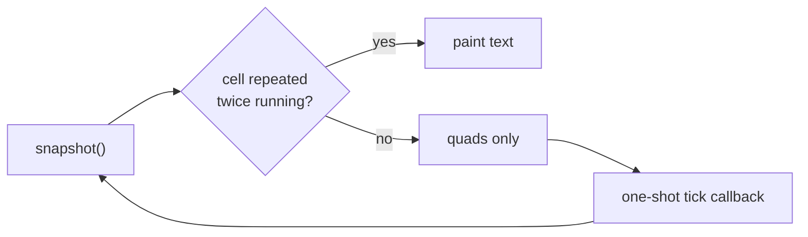

<!--
SPDX-License-Identifier: GPL-3.0-or-later
Copyright (C) 2026 Huang Zhaobin
-->

# Rendering performance

Why mirai's custom widgets draw with quads and not with paths, and the measurements that
settled it.
[architecture](ARCHITECTURE.md) · [testing](TESTING.md) ·
[retrospective](../archive/RETROSPECTIVE.md) · [AGENTS.md](../../AGENTS.md).

**The rule, if you read nothing else:** in `snapshot()`, never hand GSK a `fill` or `stroke`
node for a shape a colour node, a border node or a rounded clip can draw. Paths are for ink
that is genuinely curved or diagonal — the win-rate curve, the triangle and cross marks — and
only where the node's bounds stay small. The helpers in
[`crates/mirai/src/widgets/paint.rs`](../../crates/mirai/src/widgets/paint.rs) exist so this
costs nothing to obey.

---

## 1. The symptom

Folding the sidebar (<kbd>F9</kbd>) visibly stuttered. The animation is time-based and about
300 ms long, so it should be ~18 frames at 60 Hz; it was drawing 3–7.

The same cost was there all along in a much worse place: stepping through a *late-game*
position repainted the board in 90–120 ms, which is 8–11 fps for ordinary review work. The
sidebar animation only made it obvious, because it is the one interaction that needs many
consecutive frames.

## 2. How it was measured

`perf` is not installed on the development machine and external screen capture is black under
Wayland, so the application measures itself. The instrument lives in the tree rather than on a
branch, because it gets reused:

- **`crates/mirai/src/render_probe.rs`** — `frame-dt` lines (the frame clock's own cadence:
  `16.67` is a hit on a 60 Hz output, `50.00` means two frames were missed) and
  `frame-phases` lines, which split each frame into GTK's phases: `update` (animations),
  `layout` (measure and allocate), `paint` (snapshot the widget tree, then GSK renders it).
  `Timer` brackets one drawing pass and `trace` records a scalar beside it. Everything is
  behind `cfg!(debug_assertions)`, so a release build folds the module away.
- **Ablation flags** — `MIRAI_NO_BOARD`, `MIRAI_NO_GRAPH`, `MIRAI_NO_LABEL_DEFER` (§6),
  `MIRAI_COLLAPSED`, `MIRAI_SPIN`, `MIRAI_DUMP_NODE` (writes the window's render node for
  `gtk4-rendernode-tool`).
- **`tools/perf/frame-stats.py`** — aggregates the stderr into a per-action table.
- **`tools/perf/dense-board.py`** — the 285-stone position used as the worst case.
- **`tools/perf/numbered-game.py`** — 190 real moves, the worst case for move numbers;
  setup stones carry no numbers, so `dense-board.py` cannot exercise the text passes.

Runs use an isolated `XDG_CONFIG_HOME`/`XDG_DATA_HOME`, whose `[ui]` block has to be reset
between runs because the view toggles are persisted. §3–§5 ran with no engine, so nothing in
those numbers is KataGo's — and, it turned out, nothing in them is analysis labels either (§6).
The window is whatever niri gives it, ~1486×1634 on a 6016×3384@60 Hz output at scale 2;
`niri msg action set-window-width/-height` is how it was resized for the sweep, and there is
deliberately no in-process size knob because a tiling compositor ignores `set_default_size`.
Pin the output before comparing runs: a second monitor at 160 Hz moves the deadline from
16.7 ms to 6.2 ms. Check `/proc/loadavg` too — a busy machine coarsens the animation into fewer,
larger steps, which is enough to hide a whole class of defect (§6).

```sh
tools/perf/dense-board.py /tmp/dense.sgf
MIRAI_FRAMES=1 MIRAI_HARNESS="wait:2000,action:win.toggle-sidebar,wait:800,\
action:win.toggle-sidebar,wait:800,quit" ./target/debug/mirai /tmp/dense.sgf 2>frames.log
tools/perf/frame-stats.py frames.log
```

## 3. What the numbers said

**The time is in `paint`, not in layout or in our own code.** Per animation frame, before the
fix: `layout` 0.1–0.3 ms, our `snapshot()` implementations 0.04 ms (board) and 0.3 ms (graph),
`paint` **10–36 ms** on an empty board and **89–125 ms** on a full one. So the cost sat between
handing GSK a render node and the frame being done.

**It is not the renderer, and not the pixels.** Every renderer was equally slow, and a size
sweep (285 stones, before the fix) shows the cost is flat against window area — so it is not
fill rate:

| renderer (empty board) | paint median | | window | area | paint median |
|---|---|---|---|---|---|
| `vulkan` (default) | 29.1 ms | | 560×480 | 0.27 Mpx | 100.3 ms |
| `ngl` | 49.6 ms | | 800×680 | 0.54 Mpx | 83.6 ms |
| `cairo` | 27.8 ms | | 1100×940 | 1.03 Mpx | 98.8 ms |
| | | | 1400×1200 | 1.68 Mpx | 72.7 ms |

**Removing one drawing pass at a time finds the cost.** Sidebar animation, empty board, before
the fix:

| build | slow frames per animation | paint median |
|---|---|---|
| unchanged | 19 | 29.6 ms |
| `MIRAI_NO_WOOD` | 28 | 20.1 ms |
| `MIRAI_NO_GRID` | 31 | 17.5 ms |
| both | **0** | 4.9 ms |
| `MIRAI_NO_BOARD` (graph only) | 4 | 9.2 ms |
| `MIRAI_NO_BOARD` + `MIRAI_NO_GRAPH` | 0 | — (max 1.5 ms) |

Every expensive item is an `append_fill` or an `append_stroke`: the wood rounded-rect fill
(~10 ms), the grid and border strokes (~12 ms), the stone shadow path and one circle fill plus
one circle stroke per stone (the 90–120 ms of a full board). The rest of the window — header
bar, view switcher, `ColumnView`, text — never showed up at all.

**The last experiment names the mechanism.** `MIRAI_SPIN` redraws an *unchanging* scene every
frame:

| scene, before the fix | paint median | frame interval |
|---|---|---|
| empty board, same nodes re-rendered | **0.26 ms** | 16.7 ms |
| 285 stones, nodes rebuilt each snapshot | **58.0 ms** | 68.1 ms |

Re-rendering the *same* fill node is free, so GSK caches the rasterisation. Reading
`gsk/gpu/gskgpucachedfill.c` in GTK confirms the key and explains why the cache never helped
us: it is the `GskPath` **pointer**, the scale and the subpixel offset. A path built fresh in
every `snapshot()` can only miss. Rebuilding the node is the whole cost: the stones are built
fresh each snapshot, and the board's cached static layer is rebuilt whenever the allocation
changes — which is exactly what a sidebar animation does, frame after frame.
`gtk4-rendernode-tool benchmark` agrees from outside the process, and shows the same asymmetry
because it replays one identical node: 13 ms per render for the old full board against 4 ms
for the new one.

That is the root cause: **GSK rasterises a fill or stroke node the first time it sees that
path, and mirai handed it a new one every frame.**

## 4. The fix

`crates/mirai/src/widgets/paint.rs` — `fill_disc` (rounded clip + colour node), `stroke_disc`
and `stroke_rect` (border nodes), `hline`/`vline` (colour nodes), and `over` for pre-blending
translucent ink. Then:

| was | is now |
|---|---|
| wood: rounded-rect path fill | colour node in a rounded clip |
| grid: one stroked path, 38 segments across the board | one colour-node rectangle per line |
| board border: stroked rectangle path | border node |
| star points, stones, shadows, last-move dot, candidate blobs, label discs, tree nodes | `fill_disc` |
| stone rims, candidate rings, circle and square marks, territory outlines, tree outlines | `stroke_disc` / `stroke_rect` |
| move tree: one stroked path of right-angle elbows | one rectangle per run, one trunk per parent |
| graph: horizontal guides as a stroked path | `hline` per guide |

Two details that keep the pixels honest:

- Translucent ink drawn as overlapping rectangles blends twice. The grid ink is therefore
  pre-blended against the wood with `over()` and drawn opaque, and the move tree draws one
  trunk rectangle per parent instead of one per child.
- Stones are 0.96 cells across, so per-stone shadow discs never overlap and blend exactly like
  the single combined path they replaced.

Still paths, deliberately: the win-rate and score-lead curves, the dashed 50 % line, and the
triangle and cross marks. Curves are not quads, the dash pattern is not a rectangle, and the
marks each cover one stone, so the bounds GSK has to rasterise are a cell rather than a board.

## 5. After

Same machine, same scenes, same instrument:

| scene | before | after |
|---|---|---|
| sidebar fold, empty board | paint 29.6 ms, 6–8 frames missed per animation | paint 1.8–4.1 ms, **0 missed** |
| sidebar fold, 285 stones | paint 89–125 ms, 3 frames drawn per animation | paint 7.7 ms, **15 frames, 0 missed** |
| `MIRAI_SPIN`, 285 stones | paint 58.0 ms, clock at 68 ms | paint 3.5 ms, clock at 16.7 ms |
| stepping a real game record (`win.next`) | — | paint 0.9–2.6 ms |

Visual verification: the app screenshots itself (`shot:` steps) before and after, with the same
scripts, on an empty board with coordinates, the 285-stone position, a real record at move 10
with and without move numbers, and the move tree. Differences are confined to antialiasing on
the edges of stones and grid lines — at 8× magnification the two are indistinguishable, and
outside the board the only differing pixels are header text that depends on run timing.

## 6. Candidate labels

The probe above ran with no engine, so the quad rewrite never saw analysis numbers. Those are
pango glyphs sized to `Layout::cell`, and they are not a fourth kind of path — GSK keeps a
separate cache for them with a different key. Three caches, three keys, and the difference is
the whole of this section:

| node | cache key (GTK `gsk/gpu/`) | consequence for us |
|---|---|---|
| fill / stroke | `GskPath` pointer + scale + subpixel offset | a path rebuilt per frame always misses (§3) |
| text | `PangoFont` + glyph + subpixel flags + render scale | **position is not in the key**; the font size is |
| colour / border / rounded clip | none — one shader each | nothing to miss |

So a board that only *moves* keeps every digit for free, and a board whose `cell` *changed*
re-rasterises all of them. Measured on one fold, in the same run: the candidate pass costs
**0.68 ms** on a frame whose `cell` was unchanged and **13.6 ms** (worst 27.8) on a frame whose
`cell` moved.

`cell` is `min(width/units_x, height/units_y)`, so it tracks the sidebar only while the board
is width-limited. That makes the two directions of one animation behave differently, and it is
why the first attempt at this looked right: it *was* inside budget, it just hid text that cost
nothing to keep.

| fold, ~15 animation frames | frames where `cell` changed |
|---|---|
| hiding the sidebar (board grows, becomes height-limited) | 2–5 |
| showing it (board shrinks, stays width-limited) | 11–13 |

**The rule: defer text while `cell` is moving, and only then.** Blobs, stones and marks are
quads and always paint. "Moving" needs one qualification, below: a single repeated value is not
a stop.



Two GTK details decide the shape of that loop:

- **The allocation is not the signal.** `gtk_widget_allocate` returns early when
  `!alloc_needed && !size_changed && !baseline_changed`, so `size_allocate` goes quiet exactly
  on the plateau frames a spring produces near its end — while a fold that leaves `cell` alone
  still allocates on every frame. Keying on it therefore suppressed frames that were already
  cheap, and can fall silent on frames that are not. The over-suppression was measured; the
  silence follows from the code path and was never reproduced here, so treat it as unsound
  rather than as a bug that bit.
- **`queue_draw` inside `snapshot` is lost.** `gtk_widget_do_snapshot` clears `draw_needed`
  *after* the vfunc returns, so the deferral needs *some* cross-frame hop — the first version
  was right about that. A GLib idle is the wrong one: it runs between frames at a priority the
  frame clock outranks, so its repaint can land mid-animation. A tick callback runs in the next
  frame's update phase, ahead of layout and paint, and is served by that same frame.

No timeout, in either version: libadwaita's split-view animation is a spring, not a duration,
and `show-sidebar` flips when F9 is pressed rather than when the pixels settle.

Measured with `tools/perf/dense-board.py`, live analysis on (20 candidates, 10 Hz), six folds
per run, debug build, 6016×3384@60 Hz at scale 2. `over` counts animation frames past the
16.7 ms deadline:

| rule | text on … of 89–93 animation frames | frame median | over |
|---|---|---|---|
| never defer (`MIRAI_NO_LABEL_DEFER=1`) | 100 % | 7.4 ms | **29 %** |
| defer whenever `size_allocate` ran | 12 % | 4.3 ms | 1 % |
| defer while `cell` moves | **44 %** | 4.0 ms | 2 % |

The deferral is worth having — 29 % of frames miss without it. Keying it on `cell` then keeps
the numbers on screen about four times as often for the same frame cost: 1 % against 2 % is one
frame either way out of ninety, and the machine was not idle. What makes the fold smooth is the
quad rewrite of §4; this section only decides how much of the board's text survives it.

### One repeat is not a stop

`cell` can repeat *mid*-animation: width is an integer, and a spring near its end moves less
than a pixel per frame. Taking one repeat as "settled" therefore paints text on a plateau
frame — and that paint is always a cold one, because the previous frame skipped it, so it
rasterises glyphs at a size the next frame throws away again. Measured on a 29-frame fold:
`...NNNNN.....................N.N`, where the lone `N` cost 19.3 ms and blew its frame at
30 ms. `745da27` predicted exactly this and was dismissed on the grounds that painting at an
unchanged `cell` is cheap; it is cheap only when the *previous* frame painted too.

So text waits for `CELL_SETTLED = 2` repeats. Same binary, six folds each, 60 Hz, move numbers
on a 190-move record and no engine:

| repeats required | frames where text came back and then vanished | frames over 1.6 × the interval |
|---|---|---|
| 1 | 3, in 2 of 6 folds | 3 |
| **2** | **0** | 1 |

The remaining one is the settle frame: the first paint at a size never seen before has to
rasterise the glyphs, 16.5–21.8 ms, against 2.6 ms when that size is still cached (folding back
to a width already visited). No rule avoids it — it is one frame at the end of an animation.
A plateau long enough to fool two repeats is one the eye cannot tell from a stop, so treating
it as a stop is the intended behaviour rather than a hole.

**A loaded machine hides this.** The first six folds measured for this section produced 13–16
animation frames each and never plateaued; the same folds on an idle machine produce 22–31, and
that is where the flicker appears. Frames per animation is the variable to watch — it rises
with idle CPU and with refresh rate, and a coarse animation simply cannot land on a repeat.

Verified with `tools/perf/numbered-game.py` and **no engine at all**, so that nothing but the
tick callback could bring the text back: numbers vanish while `cell` moves and return two
frames after it stops. A `shot:` screenshot cannot see any of this — capturing re-enters
`snapshot()` at the current `cell`, which by definition matches, so the capture always has its
text. The frame timeline is the instrument here, not the screenshot.

Not done, deliberately: quantising the font size so that a fold visits three sizes instead of
twelve would keep the text up throughout, at the cost of type that steps while the board
scales. The measured 2 % is not worth that. Coordinate labels live in the static layer and are
rebuilt whenever the allocation changes; they were left alone because a board missing its
letters mid-fold reads as broken, and at 0.68 ms for the whole text pass they are not the
problem.

## 7. A report cost a layout, and it was never the GPU

Folding the sidebar during a search missed frames. KataGo has the GPU at 99 % while it thinks,
which makes "the GPU is saturated" the obvious reading. It was the wrong one.

Same dense board (285 stones, 20 candidates), same ~1486×1634 window, six folds per run, debug
build. `over` counts frames past the 16.7 ms deadline in the 900 ms after each toggle; `layout`
is the frame clock's layout→paint span, which is GTK measuring and allocating the window:

| condition | GPU | reports | frames per fold | over | layout max |
|---|---|---|---|---|---|
| engine searching (3 runs) | 99 % | 10 Hz | 42–57 | **25–31 %** | 15.7–17.6 ms |
| its search finished, same scene (2 runs) | 7 % | — | 60–62 | 2 % | 0.74 ms |
| **another process** pinning the GPU, own search finished | **99 %** | — | 61–62 | **1 %** | 1.55 ms |
| engine searching, `report_interval_ms = 1000` | 99 % | 1 Hz | 57–60 | 5 % | 16.0 ms |

Row three settles the GPU question: a second mirai hammering the same card costs this one
nothing. Row four says the cost scaled with the report *rate*. Nor was it CPU starvation —
KataGo sat at ~2.2 of 16 cores and `/proc/loadavg` read 4 in every run above, the smooth ones
included.

It was the candidate list. `AnalysisPanel::refresh` replaced the whole model on every report
(`store.splice(0, n, &objects)`), and a `GtkColumnView` handed different objects rebuilds every
row widget: one full window measure-and-allocate, 7–17 ms, once per report. Ablating that single
call — everything else untouched — took the folds from 26–29 % over and 8–10 layouts past 5 ms
down to 2–10 % and **zero**. The wrong first guess is instructive: removing the board and the
graph (`MIRAI_NO_BOARD=1 MIRAI_NO_GRAPH=1`) and hiding the sidebar left the cost in place, which
looked like proof that the bottom-bar readout was to blame. A hidden `AdwOverlaySplitView` child
is still in the tree, and its splice still relayouts the window.

The same churn was visible without any instrument: a row under the pointer lost its `:hover`
shading ten times a second, because the widget carrying that state was thrown away and rebuilt.

The fix is the GTK list pattern rather than a throttle: **stable objects, mutated in place.**
`Row::apply` writes only the properties that moved, cells are bound with
`gtk::ListItem::this_expression("item").chain_property::<CandidateObject>(…)` so a `notify`
updates one label, and `width_chars`/`max_width_chars` pin each numeric cell so changing digits
cannot re-measure its column. Row widgets are now created once — 120 for 20 rows × 6 columns,
counted over ~100 reports — the selection survives without being restored by hand, and a fold
during a search sits at 2–7 % over with no layout past 5 ms, which is the engine-idle baseline.

What remains is worth knowing: **the animation was never the bug.** 22 % of frames missed in
*steady state*, with nothing animating; a fold is simply the one interaction that needs fifty
frames in a row, so a hitch every 100 ms is where the eye catches it. Anything else that wants to
update at report rate — a new sidebar list, a new readout — has to follow the same rule.

## 8. Keeping it

- `paint.rs` is the only place these primitives are defined; use them.
- If a new widget needs a path, keep the node's bounds small and its segment count low, then
  measure it with `MIRAI_FRAMES=1` before assuming it is fine.
- Pango on the board is sized to `cell`. Text may be deferred while `cell` moves, never merely
  because the widget was reallocated; "stopped" means two repeats, not one; and the redraw that
  brings it back belongs on a tick callback. A new overlay that draws per-intersection text has
  to do the same.
- `MIRAI_SPIN` on a dense board is the cheapest regression check: it should stay a
  single-digit millisecond paint. `MIRAI_NO_LABEL_DEFER=1` is the check for §6 — with an engine
  running, folding the sidebar should go from 0–2 % missed frames to about 30 %.
- Measure a *drawing* change with the search **finished**, not running: §7 shows a fold during
  a search missing 25–31 % of its frames on the report's own layout, which swamps anything a
  new pass in `snapshot()` can do. Cap `live_max_visits` low, let the search end, then fold.
- There is deliberately no unit test for any of this: a headless test cannot see a frame, and
  asserting on node types would pin the implementation rather than the behaviour.
